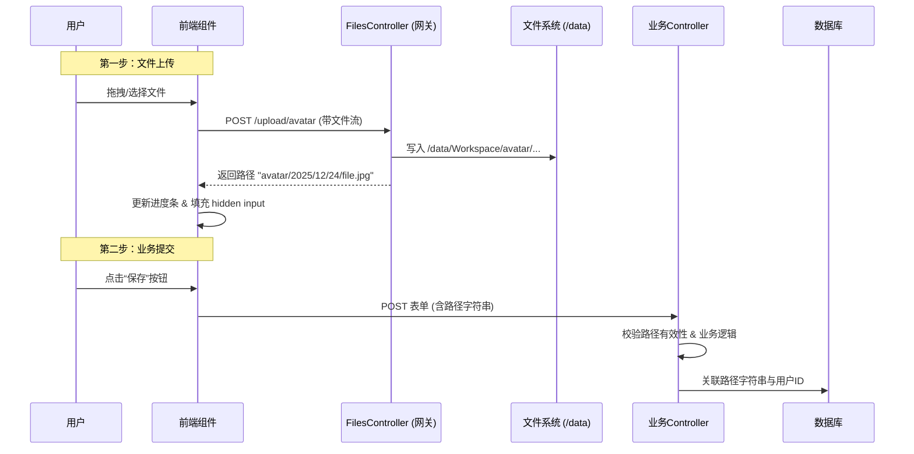

这是为您整合了所有更新内容（包括**存储架构**与新的**ViewModel安全校验**最佳实践）的完整开发文档。

文档结构已重新梳理，以保证逻辑连贯性（后端集成顺延至第 5 章节）。

---

# 文件存储与上传模块开发文档

## 1. 设计哲学

本框架采用 **“两步走（Two-Step）”** 的上传策略，将“文件传输”与“业务提交”解耦，并内置了自动化的隐私清洗和分级存储机制。

* **隔离性**：上传动作与业务逻辑分离。文件上传后仅作为“孤儿资源”存在，只有提交业务表单后才产生关联。
* **安全性**：默认去除图片 EXIF 隐私信息，防止路径遍历攻击，文件名自动哈希/重命名。
* **扩展性**：通过 URL 路由动态定义存储桶（Subfolder），无需修改后端代码即可支持新的业务场景。

---

## 2. 核心流程图解



---

## 3. 存储架构与部署 (Storage Architecture)

本系统对文件系统的利用高度结构化，支持 Docker 容器化部署的数据持久化。

### 3.1 磁盘目录布局

无论是在开发环境（默认 `/tmp/data`）还是生产环境（Docker 默认 `/data`），文件系统都遵循以下树状结构：

```text
/data (存储根目录)
├── appsettings.json          # [配置] 持久化的运行时配置 (由 Docker Entrypoint 自动管理)
├── app.db                    # [数据] SQLite 数据库文件 (如果是 SQLite 模式)
│
├── Workspace/                # [区域 A: 原始区] 存放用户上传的原始文件
│   └── avatar/               #   └── 对应 upload-endpoint 中的 {subfolder}
│       └── 2025/12/24/       #       └── 自动按 年/月/日 分片
│           └── user_raw.jpg  #           └── 原始文件
│
├── ClearExif/                # [区域 B: 清洗区] 存放去除 GPS/相机信息后的副本
│   └── avatar/               #   └── 目录结构与 Workspace 保持完全一致
│       └── ...               #       └── 下载时实际上访问的是这里的文件
│
└── Compressed/               # [区域 C: 缓存区] 存放压缩或裁剪后的缩略图
    └── avatar/               #   └── 目录结构与 Workspace 保持完全一致
        └── ...               #       └── 文件名带后缀，如 user_raw_w256_square.jpg

```

### 3.2 动态存储桶 (Subfolder) 机制

**设计亮点**：`FilesController` 本身不包含任何业务逻辑（如“头像”、“相册”），它通过路由参数 `subfolder` 实现通用的存储桶隔离。

* **前端定义**：
```html
<vc:file-upload upload-endpoint="/upload/avatar" ... />
<vc:file-upload upload-endpoint="/upload/proofs" ... />

```


* **后端处理**：
Controller 接收路由 `[Route("upload/{subfolder}")]`，并将其直接透传给存储服务。这意味着增加新的业务类型（如上传“发票”），**不需要修改后端 C# 代码**，只需前端修改 Endpoint 即可。

### 3.3 Docker 持久化策略

在 Dockerfile 中，我们定义了特殊的启动逻辑以确保配置和数据的持久性：

1. **路径映射**：生产环境强制修改配置，将 `Storage:Path` 指向 `/data`。
2. **配置文件持久化**：
* 容器启动时，会检查 `/data/appsettings.json` 是否存在。
* 如果不存在（首次启动），将镜像内的默认配置复制到 `/data`。
* 如果存在（重启），则使用 `/data` 中的配置（软链接回 app 目录）。


**优势**：运维人员可以直接修改宿主机挂载目录下的 `appsettings.json` 来热更配置（如修改数据库连接串），重启容器即可生效。

---

## 4. 前端集成 (UI层)

本框架封装了 `FileUpload` ViewComponent，无需编写 JavaScript 即可实现完整的上传交互。

### 4.1 基础用法

```html
<form asp-action="ChangeAvatar" method="post">
    <div asp-validation-summary="All" class="text-danger"></div>

    <label asp-for="AvatarUrl">上传新头像</label>
    <vc:file-upload 
        asp-for="@Model.AvatarUrl" 
        upload-endpoint="/upload/avatar" 
        allowed-extensions="png bmp jpg" 
        max-size-in-mb="10">
    </vc:file-upload>
    <span asp-validation-for="AvatarUrl" class="text-danger"></span>

    <button type="submit" class="btn btn-primary">保存修改</button>
</form>

```

### 4.2 参数说明

| 参数 | 必填 | 说明 | 对应后端逻辑 |
| --- | --- | --- | --- |
| `asp-for` | 是 | 绑定 ViewModel 的字符串属性。 | 存储返回的相对路径。 |
| `upload-endpoint` | 是 | 上传接口地址。格式：`/upload/{桶名}` | 映射到磁盘 `/Workspace/{桶名}/...` |
| `allowed-extensions` | 否 | 允许的后缀名（空格分隔）。 | 前端校验 + 后端双重校验。 |
| `max-size-in-mb` | 否 | 最大体积 (MB)。 | 防止大文件 DoS 攻击。 |

---

## 5. 后端集成 (业务层)

业务 Controller 仅需接收路径字符串，但必须进行严格的安全校验。

### 5.1 Controller 基础逻辑

```csharp
[HttpPost]
public async Task<IActionResult> ChangeAvatar(ChangeAvatarViewModel model)
{
    if (!ModelState.IsValid) return View(model);

    // 1. (可选) 二次安全检查：确认物理文件确实是图片
    // GetFilePhysicalPath 包含防路径遍历检查
    var path = storageService.GetFilePhysicalPath(model.AvatarUrl);
    if (!await imageService.IsValidImageAsync(path))
    {
        ModelState.AddModelError("", "Invalid image file.");
        return View(model);
    }

    // 2. 业务存储 (只存字符串)
    var user = await GetCurrentUserAsync();
    user.AvatarRelativePath = model.AvatarUrl; // 存入如 "avatar/2025/12/24/xxx.jpg"
    await userManager.UpdateAsync(user);

    return RedirectToAction(nameof(Index));
}

```

### 5.2 ViewModel 最佳实践：安全校验

由于业务 Controller 接收的仅仅是一个字符串路径（而非实体文件流），强类型验证变得尤为重要。通过在 ViewModel 上使用 Data Annotations，我们可以在请求进入 Controller 逻辑之前，构建第一道安全防线。

**推荐代码模式：**

```csharp
public class ChangeAvatarViewModel : UiStackLayoutViewModel
{
    public ChangeAvatarViewModel()
    {
        PageTitle = "Change Avatar";
    }

    [NotNull]
    [Display(Name = "Avatar file")]
    [Required(ErrorMessage = "The avatar file is required.")]
    // 核心安全逻辑：锁定存储桶
    [RegularExpression(@"^Workspace/avatar.*", ErrorMessage = "The avatar file is invalid. Please upload it again.")]
    [MaxLength(150)]
    [MinLength(2)]
    public string? AvatarUrl { get; set; }
}

```

**设计意图说明：**

1. **存储桶隔离 (Bucket Isolation) - `[RegularExpression]**`
* **场景**：假设系统有一个 `/upload/chat`（私密聊天图）和 `/upload/avatar`（公开头像）。
* **攻击向量**：恶意用户可能先上传一张私密照片到聊天系统，获得路径 `Workspace/chat/secret.jpg`，然后试图通过修改表单，将这个路径提交给“修改头像”接口，导致私密图片被作为头像公开。
* **防御**：通过正则 `^Workspace/avatar.*`，强制要求提交的路径必须位于 `avatar` 目录下。这防止了**跨桶引用（Cross-Bucket Reference）**，确保用户只能使用专门为该业务场景上传的文件。


2. **防止空指针与脏数据 - `[Required]**`
* 由于前端上传是异步的，用户可能在未等待上传完成或上传失败的情况下点击提交。`[Required]` 确保了只有拿到有效 Token（路径）的请求才能进入业务流程。


3. **数据库防护 - `[MaxLength]**`
* 虽然是一个路径字符串，但在设计数据库字段时通常有长度限制（如 `VARCHAR(150)`）。在 ViewModel 层限制长度，可以防止超长恶意字符串导致的数据库写入异常。


**校验层级 (Defense in Depth)：**

* **L1 (ViewModel)**: 正则校验路径格式与归属桶（由 .NET 自动完成，速度最快）。
* **L2 (Controller)**: `storageService.GetFilePhysicalPath` 校验路径是否存在且未越权。
* **L3 (Service)**: `imageService.IsValidImageAsync` 校验文件头内容（Magic Number）是否为真实图片。

---

## 6. 文件展示与下载 (API 参考)

所有图片均通过 `StorageService` 生成链接，且强制通过 `FilesController` 进行隐私处理。

### 6.1 获取链接

使用 `StorageService` 将相对路径转换为 URL：

```html
@inject Aiursoft.Template.Services.FileStorage.StorageService Storage


```

### 6.2 图片动态处理与隐私保护

本框架对图片资源实施 **强制隐私保护** 策略。通过在 URL 后追加参数，可触发服务器端的即时处理（On-the-fly Processing）。

| 参数 | 说明 | 示例 | 内部行为 |
| --- | --- | --- | --- |
| **无参数** | 获取原图 | `img.jpg` | **自动清除 EXIF**，从 `ClearExif` 目录返回无 GPS 信息的纯净图片。 |
| `w` | 指定宽度 | `?w=256` | 宽度自动向上取整至 2 的幂次方（防止缓存击穿），高度按比例缩放。 |
| `square` | 正方形裁剪 | `?w=256&square=true` | 以中心为基准裁剪正方形，通常配合 `w` 使用。 |

**示例代码：**

```html


```

---

## 7. 内置服务说明 (Reference)

如果你需要扩展功能，可以注入以下核心服务：

### StorageService

负责底层的磁盘操作和路径管理。

* `Save(path, file)`: 保存上传的文件流。
* `GetFilePhysicalPath(relativePath)`: 安全地获取物理磁盘路径（含越权检测）。
* `RelativePathToInternetUrl(relativePath)`: 生成前端可用的 URL。

### ImageProcessingService

负责图像的分析与处理。

* `IsValidImageAsync(path)`: 校验文件头是否为图片。
* `ClearExifAsync(path)`: **隐私保护**，清除照片中的 GPS 等敏感信息。

---

## 8. 最佳实践与注意事项

1. **Exif 清理机制**：
* 不要绕过 `FilesController` 直接使用静态文件服务（StaticFileMiddleware）暴露 `/data` 目录。
* 只有通过 Controller 这一层，才能保证所有流出的图片数据流均已被剥离元数据（Metadata）。


2. **存储冗余**：
* 由于“原图”、“无EXIF版”、“缩略图版”是分开存储的，磁盘占用会略多于文件大小本身。这是为了换取极致的读取性能（以空间换时间）。


3. **孤儿文件清理**：
* 由于采用了先上传后提交的策略，如果用户上传后未提交表单，会产生“孤儿文件”。建议部署定时任务（BackgroundService），定期清理 `Workspace` 中超过24小时且未在数据库中引用的文件。


4. **开发环境配置**：
* 在非 Docker 环境下，默认存储路径为 `/tmp/data`。确保您的开发机有此目录的读写权限，或在 `appsettings.json` 中修改 `Storage:Path`。