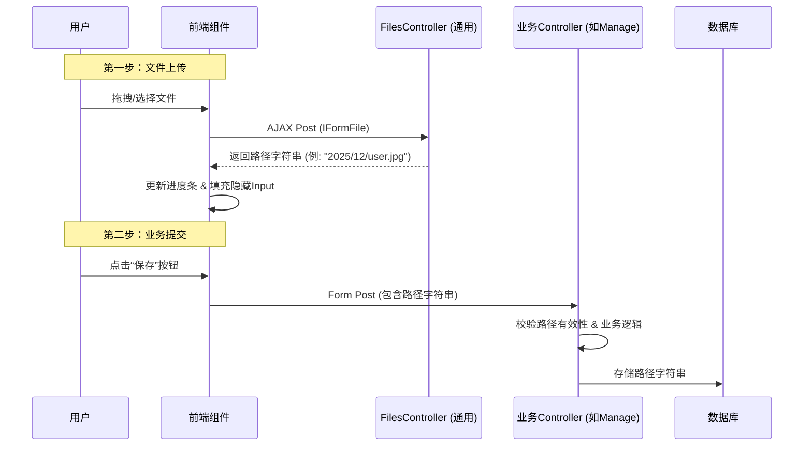

这是为您准备的开发框架文档，专注于文件上传子系统的集成与使用。

---

# 文件存储与上传模块使用指南

## 1. 设计哲学

本框架采用 **“两步走（Two-Step）”** 的上传策略，将“文件传输”与“业务提交”解耦。

* **传统模式**：表单直接提交 `Multipart/form-data`，业务 Controller 既要处理业务逻辑，又要处理文件流，容易导致阻塞和安全隐患。
* **本框架模式**：
1. **上传阶段**：前端通过 AJAX 将文件发送至专用的 `FilesController`，服务器保存文件并返回一个**内部相对路径**（String）。
2. **提交阶段**：前端将该路径填入隐藏域，随业务表单提交给业务 Controller。


**优势**：

* **安全性**：文件上传与业务逻辑隔离，恶意脚本无法直接触发业务流程。
* **体验**：支持实时上传进度条、拖拽上传。
* **性能**：业务接口仅需处理轻量级的字符串，不再处理繁重的文件流。

---

## 2. 核心流程图解



---

## 3. 前端集成 (UI层)

本框架封装了 `FileUpload` ViewComponent，无需编写 JavaScript 即可实现完整的上传交互。

### 3.1 引入组件

在 Razor 视图（`.cshtml`）中，使用 Tag Helper 调用组件：

```html
<form asp-action="ChangeAvatar" method="post">
    <div asp-validation-summary="All" class="text-danger"></div>

    <label asp-for="AvatarUrl">上传新头像</label>
    <vc:file-upload 
        asp-for="@Model.AvatarUrl" 
        upload-endpoint="/upload/avatar" 
        allowed-extensions="png bmp jpg" 
        max-size-in-mb="10">
    </vc:file-upload>
    <span asp-validation-for="AvatarUrl" class="text-danger"></span>

    <button type="submit" class="btn btn-primary">保存修改</button>
</form>

@section styles {
    <link rel="stylesheet" href="~/node_modules/dropify/dist/css/dropify.min.css" />
    <link rel="stylesheet" href="~/styles/uploader.css" />
}

@section scripts {
    <script src="~/node_modules/dropify/dist/js/dropify.min.js"></script>
}

```

### 3.2 参数说明

| 参数 | 说明 | 示例 |
| --- | --- | --- |
| `asp-for` | 绑定到的 ViewModel 属性（必须是 `string` 类型）。 | `@Model.AvatarUrl` |
| `upload-endpoint` | 文件实际上传的通用接口地址。 | `/upload/avatar` (对应 FilesController) |
| `allowed-extensions` | 允许的文件后缀，空格分隔。 | `"jpg png pdf"` |
| `max-size-in-mb` | 允许的最大文件大小（MB）。 | `10` |

---

## 4. 后端处理 (业务层)

业务 Controller 不需要处理 `IFormFile`，只需要接收字符串路径并进行校验。

### 4.1 ViewModel 定义

```csharp
public class ChangeAvatarViewModel
{
    // 这里接收的是上传成功后的相对路径字符串
    [Required]
    public string AvatarUrl { get; set; } 
}

```

### 4.2 Controller 逻辑

在 Action 中，你需要完成三件事：**校验路径**、**检查文件有效性**（可选）、**保存路径**。

```csharp
[HttpPost]
public async Task<IActionResult> ChangeAvatar(ChangeAvatarViewModel model)
{
    if (!ModelState.IsValid) return View(model);

    // 1. 获取文件的物理路径 (用于后续检查)
    // 注意：GetFilePhysicalPath 内部含有防止路径遍历的安全检查
    var absolutePath = storageService.GetFilePhysicalPath(model.AvatarUrl);

    // 2. (可选) 检查文件是否为合法图片
    // 防止用户修改后缀名绕过前端检查
    if (!await imageProcessingService.IsValidImageAsync(absolutePath))
    {
        ModelState.AddModelError(string.Empty, "上传的文件不是有效的图片。");
        return View(model);
    }

    // 3. 业务存储 (只存字符串)
    var user = await GetCurrentUserAsync();
    user.AvatarRelativePath = model.AvatarUrl; 
    await userManager.UpdateAsync(user);

    return RedirectToAction(nameof(Index));
}

```

---

## 5. 文件展示与下载

存储在数据库中的只是相对路径（如 `avatar/2023/10/01/file.jpg`），在展示时需要转换为公网可访问的 URL。

### 5.1 获取访问链接

使用 `StorageService` 将相对路径转换为 URL：

```html
@inject Aiursoft.Template.Services.FileStorage.StorageService Storage


```

### 5.2 图片动态处理 (CDN特性)

框架内置了即时图片处理功能，支持调整大小、裁剪和隐私清理（去除EXIF）。只需在 URL 后追加参数即可。

| 参数 | 说明 | 示例 | 效果 |
| --- | --- | --- | --- |
| `w` | 宽度（像素）。高度会按比例缩放。**注意：宽度会自动向上取整至2的幂次方以防止DoS攻击。** | `?w=256` | 生成宽256px的图片 |
| `square` | 是否裁剪为正方形。 | `?w=256&square=true` | 生成256x256的正方形头像 |

**示例代码：**

```html


```

---

## 6. 内置服务说明 (Reference)

如果你需要扩展功能，可以注入以下核心服务：

### StorageService

负责底层的磁盘操作和路径管理。

* `Save(path, file)`: 保存上传的文件流。
* `GetFilePhysicalPath(relativePath)`: 安全地获取物理磁盘路径（含越权检测）。
* `RelativePathToInternetUrl(relativePath)`: 生成前端可用的 URL。

### ImageProcessingService

负责图像的分析与处理。

* `IsValidImageAsync(path)`: 校验文件头是否为图片。
* `ClearExifAsync(path)`: **隐私保护**，清除照片中的 GPS 等敏感信息。
* `CompressAsync(path, width, height)`: 压缩并缓存图片。

### FilesController

通用的上传网关。

* `/upload/{subfolder}`: 处理文件上传。
* `/download/{path}`: 处理文件下载和图片参数解析。

---

## 7. 最佳实践与注意事项

1. **隐私清理**：框架在生成缩略图（带 `w` 参数）时，会自动清除 EXIF 信息。建议在展示用户头像等敏感场景时始终带上 `w` 参数。
2. **孤儿文件**：由于采用了先上传后提交的策略，如果用户上传后未提交表单，会产生“孤儿文件”。建议在系统层面部署定时任务（BackgroundService），定期清理 `Workspace` 中超过24小时且未在数据库中引用的文件。
3. **安全性**：不要试图绕过 `StorageService` 直接操作 `System.IO.File`，否则可能导致路径遍历漏洞。始终使用框架提供的 API。
