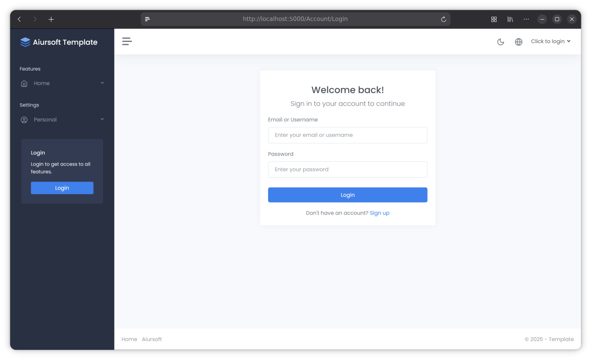

# Aiursoft Template Tutorial - Step 1 - 创建新项目



## Step 1.1 准备开发环境

第一步的目标是创建一个全新的项目。我们推荐你使用 [AnduinOS](https://www.anduinos.com) 1.3 或更高版本来进行实战开发，因为 AnduinOS 1.3+ 非常容易安装 dotnet、bash、npm、git、docker、mysql、nginx 等工具。

!!! tip "Aiursoft Template 可以在几乎所有主流操作系统上运行"

    如果你不想使用 AnduinOS，你也可以在任何支持 .NET 10.0 的操作系统上进行开发，例如 Windows、macOS 或其他 Linux 发行版。

在开始之前，请确保你已经安装了 `git`、`.NET 10.0 SDK` 和 `docker`。在 AnduinOS 上，你可以使用以下命令安装这些工具：

```bash title="在 AnduinOS 上安装必要的工具"
sudo apt install -y git dotnet docker.io
```

必须安装 .NET 10 SDK。

```bash title="在 AnduinOS 上安装 .NET 10"
wget https://dot.net/v1/dotnet-install.sh -O dotnet-install.sh && \
chmod +x dotnet-install.sh && \
sudo ./dotnet-install.sh --channel 10.0 --install-dir /usr/share/dotnet && \
sudo ln -s /usr/share/dotnet/dotnet /usr/bin/dotnet && \
rm dotnet-install.sh
```

安装 git 后，你必须配置你的用户名和邮箱：

```bash title="配置 git 用户名和邮箱"
git config --global user.name "Your Name"
git config --global user.email "YourEmail@domain.com"
```

你还需要安装 Node.js 和 npm 以管理前端的依赖。你可以使用以下命令安装它们：

```bash title="在 AnduinOS 上安装 Node.js 和 npm"
curl -fsSL https://deb.nodesource.com/gpgkey/nodesource-repo.gpg.key | sudo gpg --dearmor -o /etc/apt/keyrings/nodesource.gpg --yes
NODE_MAJOR=22
echo "deb [signed-by=/etc/apt/keyrings/nodesource.gpg] https://deb.nodesource.com/node_$NODE_MAJOR.x nodistro main" | sudo tee /etc/apt/sources.list.d/nodesource.list
sudo apt update
sudo apt install nodejs -y
node -v
```

你还需要一个代码编辑器。我们推荐使用 [Visual Studio Code](https://code.visualstudio.com/) 或 [Jetbrains Rider](https://docs.anduinos.com/Applications/Code-Editors/Jetbrains-Rider/Jetbrains-Rider.html)。你也可以使用以下命令安装 Visual Studio Code：

```bash title="在 AnduinOS 上安装 Visual Studio Code"
cd ~
wget -qO- https://packages.microsoft.com/keys/microsoft.asc | gpg --dearmor > packages.microsoft.gpg
sudo install -D -o root -g root -m 644 packages.microsoft.gpg /etc/apt/keyrings/packages.microsoft.gpg
sudo sh -c 'echo "deb [arch=amd64,arm64,armhf signed-by=/etc/apt/keyrings/packages.microsoft.gpg] https://packages.microsoft.com/repos/code stable main" > /etc/apt/sources.list.d/vscode.list'
rm -f packages.microsoft.gpg
sudo apt update
sudo apt install code -y
```

安装完成后，你可以通过运行 `code` 命令来启动 Visual Studio Code。

为了新建 Aiursoft Template 的项目，你需要安装 Voyager，它是 Aiursoft Template 的脚手架工具。你可以通过以下命令安装它：

```bash title="安装 Voyager"
dotnet tool install --global Aiursoft.Voyager
voyager --version
```

如果提示 `voyager` 命令未找到，请确保你的 `~/.dotnet/tools` 目录在你的 `PATH` 环境变量中。你可以使用这个命令来暂时缓解：

```bash
~/.dotnet/tools/voyager --version
```

如果上面过程一切顺利，你现在应该已经安装好了所有必要的工具，可以开始创建你的第一个 Aiursoft Template 项目了！

## Step 1.2 创建新项目

!!! note "每次创建新项目时，都应当从这一步开始。"

    这里是创建新项目的标准步骤。每次你想创建一个新的 Aiursoft Template 项目时，都应当从这一步开始。

我们建议你使用一个独特的命名空间来避免与其他项目冲突。通常，我们建议使用类似 `MyOrg.MyProject` 的格式，其中 `MyOrg` 是你的组织或公司名称，`MyProject` 是你的项目名称。

这里，我们的模板是创建一个将 markdown 转换为 HTML 的应用，所以我们将命名为 `MyOrg.MarkToHtml`。

首先，创建一个新的文件夹来存放你的项目：

```bash title="创建项目文件夹"
mkdir MyOrg.MarkToHtml
cd MyOrg.MarkToHtml
```

然后使用 voyager 初始化项目：

```bash title="使用 Voyager 创建新项目"
~/.dotnet/tools/voyager new -t web-app-all-in-one
```

!!! warning "每次创建项目时，务必确保 Voyager 运行的目录名称是你想要的项目名称"

    例如，如果你想创建一个名为 `MyOrg.MarkToHtml` 的项目，请确保你在名为 `MyOrg.MarkToHtml` 的文件夹中运行 `voyager new` 命令。Voyager 会默认使用当前目录名称作为项目名称。

你会注意到下面文件被生成：

```bash title="项目文件结构"
.
├── CODE_OF_CONDUCT.md
├── Dockerfile
├── .editorconfig
├── .git
├── .gitignore
├── .gitlab-ci.yml
├── install.sh
├── LICENSE
├── MyOrg.MarkToHtml.sln
├── ninja.yaml
├── nuget.config
├── README.md
├── src
│   ├── MyOrg.MarkToHtml
│   ├── MyOrg.MarkToHtml.Entities
│   ├── MyOrg.MarkToHtml.InMemory
│   ├── MyOrg.MarkToHtml.MySql
│   └── MyOrg.MarkToHtml.Sqlite
└── tests
    ├── IntegrationTests
    └── MyOrg.MarkToHtml.Tests.csproj

15 directories, 17 files
```

其中未必所有文件都对你有用，下面是每个文件的简要说明：

| 文件/文件夹         | 说明                                                                                        |
| ------------------ | ------------------------------------------------------------------------------------------- |
| `CODE_OF_CONDUCT.md` | 代码行为准则，这只是一个示例。你可以放心的删除它而不影响项目。                                     |
| `Dockerfile`         | 用于在 Docker 容器中运行应用的配置文件。它定义了如何在 Docker 里构建和运行应用的环境。                |
| `.editorconfig`      | 代码风格配置文件，帮助你和你的团队保持一致的代码风格。你可以根据需要修改或删除它。                        |
| `.git`             | Git 版本控制的元数据文件夹。新创建项目时会自动生成，也会帮你生成一个初始的 commit。                     |
| `.gitignore`       | Git 忽略文件列表，指定哪些文件或文件夹不应被 Git 追踪。请不要删除它。                              |
| `.gitlab-ci.yml`     | GitLab CI/CD 的配置文件。如果你不使用 GitLab 进行持续集成和部署，可以删除它。                       |
| `install.sh`         | 一个简单的快速部署脚本，帮助你在无 Docker 的服务器上快速部署项目。你可以根据需要修改或删除它。           |
| `LICENSE`            | 许可证文件，说明项目的使用和分发条款。你可以根据需要修改或删除它。                                 |
| `MyOrg.MarkToHtml.sln` | 这是 Visual Studio 的解决方案文件，包含了项目中的所有子项目。请不要删除它。                         |
| `ninja.yaml`         | 这是用于给 nuget ninja 看的配置文件。如果你不使用 nuget ninja，可以删除它。                       |
| `README.md`          | 项目的自述文件，包含项目的基本信息和使用说明。你可以根据需要修改它。                                 |
| `nuget.config`       | NuGet 包管理器的配置文件。如果你不需要自定义包源，可以删除它。                                      |
| `src/`             | 这个文件夹包含了项目的源代码。你可以根据需要添加或删除子项目。                                      |
| `tests/`           | 这个文件夹包含了项目的测试代码。你可以根据需要添加或删除测试项目。                                  |

接下来，你可以使用 Visual Studio Code 或 Jetbrains Rider 打开这个 `MyOrg.MarkToHtml.sln` 解决方案文件，开始编写代码了！

## Step 1.3 运行项目

在你开始编写代码之前，建议先编译并运行一下项目，确保一切正常工作。

你需要先还原前端的依赖。你可以使用以下命令来安装前端依赖：

```bash title="安装前端依赖"
cd ./src/MyOrg.MarkToHtml/wwwroot/
npm install
```

你可以使用以下命令来编译项目：

```bash title="编译项目"
dotnet build ./MyOrg.MarkToHtml.sln
```

如果编译成功，你可以使用以下命令来运行项目：

```bash title="运行项目"
cd ./src/MyOrg.MarkToHtml/
dotnet run
```

默认情况下，应用会在 `http://localhost:5000` 上运行。现在，你可以打开浏览器以访问这个地址，检查应用是否正常工作。正常情况下，你会看到一个欢迎页面。

你可以使用默认账户登录。默认账户信息如下：

* 用户名: `admin`
* 密码: `admin123`

## Step 1.4 配置项目使用的数据库 (可选)

!!! tip "这一步是完全可选的"

    这一步是完全可选的。如果你想使用默认配置，也就是直接用最简单的 Sqlite 数据库，则可以跳过这一步。

默认情况下，应用会使用 SQLite 作为数据库。这是配置在 `appsettings.json` 文件中的。如果你想使用其他数据库（如 MySQL 或 SQL Server），你需要修改 `appsettings.json` 文件中的连接字符串。在默认情况下，第一次启动会自动创建并播种数据库，您会注意到 `app.db` 文件被创建在 `src/MyOrg.MarkToHtml/` 目录下。

我们推荐你使用 [DbBrowser for SQLite](https://flathub.org/en/apps/org.sqlitebrowser.sqlitebrowser) 来查看和管理 SQLite 数据库，也就是 `app.db` 文件。删除这个文件即可将应用的数据重置为初始状态。

## Step 1.5 配置项目使用的文件存储 (可选)

默认情况下，应用会使用 `/tmp/data` 作为文件系统的后端存储路径。在 Docker 中，会默认使用 `/data` 作为存储路径。

你可以在 `appsettings.json` 文件中修改这个路径。在默认情况下，这里可能会存放着默认的头像。

删除这个文件夹即可将应用的文件存储重置为初始状态。

## 结语

恭喜你完成了第一步！你现在已经配置好了开发环境，初始化了 git 仓库，并成功运行了一个基本的 Aiursoft Template 项目，也理解了它使用的文件结构、Sqlite 数据库和文件存储。

接下来，我们将继续开发这个项目，添加更多功能。
