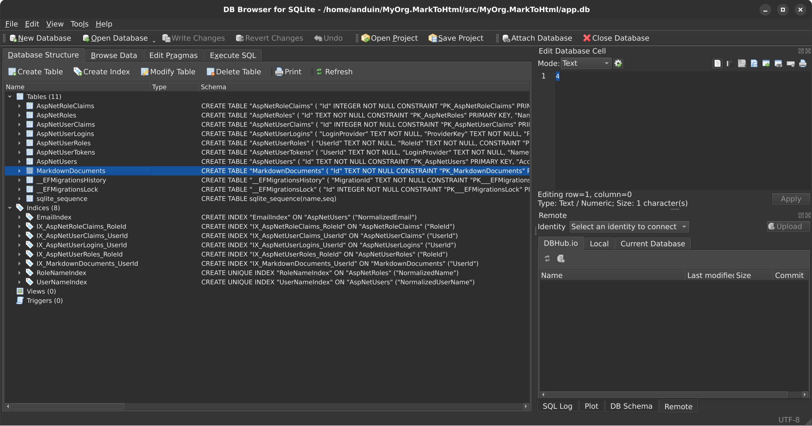

# Aiursoft Template Tutorial - Step 4 - 添加全新的数据模型并改变数据库结构



我们可以扩展上面的例子，允许用户保存他们的 markdown 文档，并在之后重新编辑甚至分享它们。为此，我们需要添加一个新的数据模型，并改变数据库结构。

在改变数据库结构之前，我们需要先了解一下 Aiursoft Template 使用的数据库 ORM 工具：[Entity Framework Core (EF Core)](https://learn.microsoft.com/en-us/ef/core/)。

## Step 4.1 理解 Entity Framework Core （可选）

如果你非常熟悉 Entity Framework Core，可以跳过这一步。

!!! abstract "什么是 Entity Framework Core？"

    Entity Framework Core (EF Core) 是一个强大的对象关系映射 (ORM) 工具，允许你使用 .NET 对象来操作数据库，而不必直接编写 SQL 语句。它支持多种数据库，包括 SQLite、MySQL、SQL Server、PostgreSQL 等等。

例如，它的语法类似：

```csharp title="EF Core 查询示例"
var books = await dbContext.Books
    .Where(b => b.Author == "Anduin Xue")
    .OrderBy(b => b.PublishedDate)
    .Skip(10)
    .Take(10)
    .ToListAsync();
```

这将会从数据库的 `Books` 表中查询作者为 "Anduin Xue" 的书籍，按发布日期排序，跳过前 10 条记录，取接下来的 10 条记录，并将结果转换为一个列表。其 SQL 可能类似：

```sql title="对应的 SQL 查询"
SELECT * FROM Books
WHERE Author = 'Anduin Xue'
ORDER BY PublishedDate
LIMIT 10 OFFSET 10;
```

但是，考虑到我们可能会修改一些实体类的结构，例如增加新的属性，删除旧的属性，或者修改属性的类型。为了让数据库结构与实体类保持同步，我们需要使用 EF Core 的迁移 (Migration) 功能。

在这个例子里，我们将新建一个表，叫做 `MarkdownDocuments`，用于存储用户的 markdown 文档。但真实的数据库里并不存在这个表。因此，我们需要创建一个迁移来告诉 EF Core 如何创建这个表。迁移包含了数据库结构的变更信息。程序在启动的时候，会自动比较数据库本身的表结构的版本和最新的迁移版本，并自动运行差异的迁移。这样就能确保数据库结构与实体类保持同步。

!!! warning "不要在改变了实体类后忘记创建迁移！"

    如果忘记了创建迁移，或迁移没有成功运行，程序会仍然能运行，但执行的 SQL 可能无法正确在数据库里完成预期的操作，导致程序运行时出现异常。因此，每次修改了实体类后，都应该创建一个新的迁移。

## Step 4.2 创建新的数据模型

接下来，我们准备使用 Entity Framework Core 来创建一个新的数据模型类，叫做 `MarkdownDocument`，用于存储用户的 markdown 文档。其存储在表 `MarkdownDocuments` 中。

为了创建这个数据模型，我们直接修改 `./src/MyOrg.MarkToHtml/Entities/User.cs` 文件：

添加必要的 using 语句：

```csharp title="添加 using 语句，User.cs"
using System.ComponentModel.DataAnnotations.Schema;
using System.Diagnostics.CodeAnalysis;
using Newtonsoft.Json;
```

添加一个新的类 `MarkdownDocuments`，表示用户拥有的所有 markdown 文档。

```csharp title="添加 MarkdownDocument 类，User.cs"
public class User : IdentityUser
{
    // ... Existing properties ...
}

// New entity for storing markdown documents
public class MarkdownDocument
{
    [Key]
    public Guid Id { get; set; }

    [MaxLength(100)]
    public string? Title { get; set; }

    [MaxLength(65535)]
    public string? Content { get; set; }

    public DateTime CreationTime { get; init; } = DateTime.UtcNow;

    [StringLength(64)]
    public required string UserId { get; set; }

    [ForeignKey(nameof(UserId))]
    [NotNull]
    public User? User { get; set; }
}
```

在上面的例子中，我们的类 `MarkdownDocument` 包含了以下属性：

* `Id`：文档的唯一标识符，使用 GUID 类型。
* `Title`：文档的标题，最多 100 个字符。
* `Content`：文档的内容，最多 65535 个字符。
* `CreationTime`：文档的创建时间，使用 UTC 时间。
* `UserId`：文档所属用户的 ID，使用字符串类型，长度为 64 个字符。
* `User`：导航属性，表示文档所属的用户。其中 `UserId` 是外键，引用了 `User` 实体的主键。

!!! info "关系型数据库的关系"

    关系型数据库的表之间通常通过外键来建立关联。在上面的例子中，`MarkdownDocument` 实体通过 `UserId` 属性与 `User` 实体建立了多对一的关系。也就是说，一个用户可以拥有多个文档，而每个文档只能属于一个用户。

在这里我们使用了一些 `Attributes`，例如 `[Key]`、`[MaxLength]`、`[StringLength]`、`[ForeignKey]` 等等。这些 `Attributes` 用于告诉 Entity Framework Core 如何映射这个类到数据库表。而 `[NotNull]` 和 `[JsonIgnore]` 则用于避免在 Controller 中试图 JSON 序列化时出现循环引用的问题。

同时，我们编辑上面的 User 类，增加属性：

```csharp title="为 User 类添加 CreatedDocuments 属性"
[JsonIgnore]
[InverseProperty(nameof(MarkdownDocument.User))]
public IEnumerable<MarkdownDocument> CreatedDocuments { get; set; } = new List<MarkdownDocument>();
```

最终这个文件看起来可能像这样：

```csharp title="完整的 User.cs"
using System.ComponentModel.DataAnnotations;
using System.ComponentModel.DataAnnotations.Schema;
using System.Diagnostics.CodeAnalysis;
using Newtonsoft.Json;
using Microsoft.AspNetCore.Identity;

namespace MyOrg.MarkToHtml.Entities;

public class User : IdentityUser
{
    public const string DefaultAvatarPath = "Workspace/avatar/default-avatar.jpg";

    [MaxLength(30)]
    [MinLength(2)]
    public required string DisplayName { get; set; }

    [MaxLength(150)]
    [MinLength(2)]
    public string AvatarRelativePath { get; set; } = DefaultAvatarPath;

    public DateTime CreationTime { get; init; } = DateTime.UtcNow;

    [JsonIgnore]
    [InverseProperty(nameof(MarkdownDocument.User))]
    public IEnumerable<MarkdownDocument> CreatedDocuments { get; set; } = new List<MarkdownDocument>();
}

public class MarkdownDocument
{
    [Key]
    public Guid Id { get; set; }

    [MaxLength(100)]
    public string? Title { get; set; }

    [MaxLength(65535)]
    public string? Content { get; set; }

    public DateTime CreationTime { get; init; } = DateTime.UtcNow;

    [StringLength(64)]
    public required string UserId { get; set; }

    [ForeignKey(nameof(UserId))]
    [NotNull]
    public User? User { get; set; }
}
```

这样，我们就完成了数据模型的创建。

最后，为了显示的表明我们需要一个新表，编辑文件 `./src/MyOrg.MarkToHtml.Entities/MarkToHtmlDbContext.cs`，为 `TemplateDbContext` 添加以下属性：

```csharp title="为 TemplateDbContext 添加 DbSet 属性"
public DbSet<MarkdownDocument> MarkdownDocuments => Set<MarkdownDocument>();
```

当我们将 `TemplateDbContext` 作为数据库上下文类时，Entity Framework Core 会自动识别 `MarkdownDocuments` 属性，并将其映射到数据库中的 `MarkdownDocuments` 表。从而我们可以操作 `dbContext.MarkdownDocuments` 来进行 CRUD 操作。其会自动翻译成相应的 SQL 语句。

最终这个文件看起来可能像这样：

```csharp title="完整的 MarkToHtmlDbContext.cs"
using Aiursoft.DbTools;
using Microsoft.AspNetCore.Identity.EntityFrameworkCore;
using Microsoft.EntityFrameworkCore;

namespace MyOrg.MarkToHtml.Entities;

public abstract class TemplateDbContext(DbContextOptions options) : IdentityDbContext<User>(options), ICanMigrate
{
    public virtual  Task MigrateAsync(CancellationToken cancellationToken) =>
        Database.MigrateAsync(cancellationToken);

    public virtual  Task<bool> CanConnectAsync() =>
        Database.CanConnectAsync();

    public DbSet<MarkdownDocument> MarkdownDocuments => Set<MarkdownDocument>();
}
```

这样，我们就完成了数据模型的创建。但是，数据库本身并不存在这个表。因此现在直接运行程序会报错。我们需要创建一个迁移来告诉 EF Core 如何创建这个表。

## Step 4.3 创建迁移并更新数据库

Aiursoft Template 支持多种数据库，包括 SQLite、MySQL、InMemory 等等。用户还可以额外扩展出其它数据库，例如 `PostgreSQL`、`SQL Server` 等等。在这里，我们只为默认的 SQLite 和 MySQL 创建迁移。其中 InMemory 数据库不需要迁移，因为它是临时的，程序每次启动都会重新创建。

!!! tip "迁移，Migration，是一个名词；并不是立刻将数据库改变的意思"

    迁移 (Migration) 是一个名词，表示数据库结构的变更信息。我们创建迁移是为了告诉 EF Core 如何改变数据库结构。程序在启动的时候，会自动比较数据库本身的表结构的版本和最新的迁移版本，并自动运行差异的迁移。这样就能确保数据库结构与实体类保持同步。

为了创建迁移，我们需要使用 Entity Framework Core 的命令行工具 `dotnet ef`。如果你还没有安装它，可以使用以下命令来安装：

```bash title="安装 dotnet ef 工具"
dotnet tool install --global dotnet-ef
```

### Step 4.3.1 为 SQLite 创建迁移

然后，我们需要为 SQLite 和 MySQL 分别创建迁移。为 Sqlite 创建迁移时，需要确保 `./src/MyOrg.MarkToHtml/appsettings.json` 中的 `ConnectionStrings.DbType` 设置为 `Sqlite`，并且 `DefaultConnection` 指向一个 SQLite 数据库文件，例如：

```json title="修改 appsettings.json"
{
  "ConnectionStrings": {
    "AllowCache": "True",
    "DbType": "Sqlite",
    "DefaultConnection": "DataSource=app.db;Cache=Shared"
  },
  // ... other settings ...
}
```

然后，运行以下命令来创建迁移：

```bash title="为 Sqlite 创建迁移"
cd ./src/MyOrg.MarkToHtml.Sqlite/
dotnet ef migrations add AddMarkdownDocumentsTable --context "SqliteContext" -s ../MyOrg.MarkToHtml/MyOrg.MarkToHtml.csproj
```

!!! note "上面的命令不会改变任何数据库结构！"

    这个命令只是创建一个迁移文件，告诉 EF Core 如何创建 `MarkdownDocuments` 表。它不会实际改变数据库结构。要实际应用这个迁移，程序在启动时会自动应用所有未应用的迁移。

会注意到类似这样的输出：

```bash title="创建迁移的输出"
Done. To undo this action, use 'ef migrations remove'
```

同时，会在 `./src/MyOrg.MarkToHtml.Sqlite/Migrations/` 目录下生成一个新的迁移文件，名字类似 `20231010123456_AddMarkdownDocumentsTable.cs`。其内容可能类似：

```csharp title="生成的迁移文件"
using System;
using Microsoft.EntityFrameworkCore.Migrations;

#nullable disable

namespace MyOrg.MarkToHtml.Sqlite.Migrations
{
    /// <inheritdoc />
    public partial class AddMarkdownDocumentsTable : Migration
    {
        /// <inheritdoc />
        protected override void Up(MigrationBuilder migrationBuilder)
        {
            migrationBuilder.CreateTable(
                name: "MarkdownDocuments",
                columns: table => new
                {
                    Id = table.Column<Guid>(type: "TEXT", nullable: false),
                    Title = table.Column<string>(type: "TEXT", maxLength: 100, nullable: true),
                    Content = table.Column<string>(type: "TEXT", maxLength: 65535, nullable: true),
                    CreationTime = table.Column<DateTime>(type: "TEXT", nullable: false),
                    UserId = table.Column<string>(type: "TEXT", maxLength: 64, nullable: false)
                },
                constraints: table =>
                {
                    table.PrimaryKey("PK_MarkdownDocuments", x => x.Id);
                    table.ForeignKey(
                        name: "FK_MarkdownDocuments_AspNetUsers_UserId",
                        column: x => x.UserId,
                        principalTable: "AspNetUsers",
                        principalColumn: "Id",
                        onDelete: ReferentialAction.Cascade);
                });

            migrationBuilder.CreateIndex(
                name: "IX_MarkdownDocuments_UserId",
                table: "MarkdownDocuments",
                column: "UserId");
        }

        /// <inheritdoc />
        protected override void Down(MigrationBuilder migrationBuilder)
        {
            migrationBuilder.DropTable(
                name: "MarkdownDocuments");
        }
    }
}
```

我们需要仔细 Review 上面的变化。当这个新的迁移运行时，它会创建一个新的表 `MarkdownDocuments`，并包含我们在数据模型中定义的所有列和约束，包含我们定义的外键约束。其中，`onDelete: ReferentialAction.Cascade` 表示当用户被删除时，关联的文档也会被自动删除。这是符合我们的预期的。

而 `Down` 方法则用于回滚迁移，即删除 `MarkdownDocuments` 表。符合我们的期待，那么么我们就可以继续了。

### Step 4.3.2 为 MySQL 创建迁移

然后，我们需要为 MySQL 创建迁移。为 MySQL 创建迁移时，需要确保 `./src/MyOrg.MarkToHtml.MySQL/appsettings.json` 中的 `ConnectionStrings.DbType` 设置为 `MySQL`，并且 `DefaultConnection` 指向一个 MySQL 数据库。其开头可以改成下面这样：

```json title="修改 MySQL 的 appsettings.json"
{
  "ConnectionStrings": {
    "AllowCache": "True",
    "DbType": "MySql",
    "DefaultConnection": "Server=localhost;Database=template;Uid=template;Pwd=template_password;"
  },
  // ... other settings ...
}
```

接下来，为了创建迁移，我们必须启动一个真正的 MySQL。我们可以使用 Docker 来快速启动一个 MySQL 实例：

```bash title="使用 Docker 启动 MySQL"
sudo docker run -d --name db -e MYSQL_RANDOM_ROOT_PASSWORD=true -e MYSQL_DATABASE=template -e MYSQL_USER=template -e MYSQL_PASSWORD=template_password -p 3306:3306 mysql
```

!!! info "创建迁移需要可以连接到数据库"

    虽然创建迁移不会改变数据库结构，但它需要连接到数据库，以便 EF Core 能够读取数据库的元数据，从而生成正确的迁移代码。因此，确保你的 MySQL 实例正在运行，并且连接字符串正确无误。

这满足了我们的应用程序的连接字符串要求。此时，我们可以使用以下命令来创建迁移：

```bash title="为 MySQL 创建迁移"
cd ./src/MyOrg.MarkToHtml.MySql/ # 务必确保你在这个目录下
dotnet ef migrations add AddMarkdownDocumentsTable --context "MySqlContext" -s ../MyOrg.MarkToHtml/MyOrg.MarkToHtml.csproj
```

类似的，也会在 `./src/MyOrg.MarkToHtml.MySQL/Migrations/` 目录下生成一个新的迁移文件，名字类似 `20231010123456_AddMarkdownDocumentsTable.cs`。将其内容仔细 Review 一下，确保它符合我们的预期，即可继续。

### Step 4.3.3 清理工作 删除数据库、回滚 appsettings.json (可选)

注意：如果你在创建迁移时遇到错误，提示无法连接到数据库，或者找不到某些类型，可能是因为你的 MySQL 服务器没有正确启动，或者你忘记了修改 `appsettings.json` 文件中的连接字符串。请确保你的 MySQL 服务器正在运行，并且连接字符串正确无误。

!!! note "如果你打算继续用 MySQL 来调试，这个步骤可以跳过"

    在经历了刚才的步骤后，你可能会想继续使用 MySQL 来调试应用程序。在这种情况下，你可以跳过下面的清理工作，直接运行应用程序。

注意：在创建完 MySQL 迁移后，如果你不再需要这个 MySQL 实例，可以使用以下命令来停止并删除它：

```bash title="停止并删除 MySQL 容器"
sudo docker stop db
sudo docker rm db
```

同时，为了方便本地调试，建议回滚 `appsettings.json` 文件中的 `ConnectionStrings.DbType` 设置为 `Sqlite`，并且 `DefaultConnection` 指向一个 SQLite 数据库文件，例如：

```json title="回滚 appsettings.json"
{
  "ConnectionStrings": {
    "AllowCache": "True",
    "DbType": "Sqlite",
    "DefaultConnection": "DataSource=app.db;Cache=Shared"
  },
  // ... other settings ...
}
```

每次修改了任何实体类，都应该重复执行上面 4.3.1 和 4.3.2 的步骤，创建新的迁移。如果你还支持了更多的数据库，也应该为它们创建迁移。

## Step 4.4 运行应用并验证数据库自动迁移（可选）

!!! tip "这一步是可选的"

    这一步是可选的。因为在生产环境中，迁移会在应用启动时自动运行。

现在，我们已经创建了迁移，接下来我们需要运行应用程序，并让它自动应用这些迁移，从而更新数据库结构。

在开始之前，我们可以先阅读一下 `./src/MyOrg.MarkToHtml/Startup.cs` 文件，了解一下应用程序是如何配置数据库的。找到下面代码，无需修改：

```csharp title="Startup.cs 中的关键数据库配置代码"
var (connectionString, dbType, allowCache) = configuration.GetDbSettings();
services.AddSwitchableRelationalDatabase(
    dbType: EntryExtends.IsInUnitTests() ? "InMemory": dbType,
    connectionString: connectionString,
    supportedDbs:
    [
        new MySqlSupportedDb(allowCache: allowCache, splitQuery: false),
        new SqliteSupportedDb(allowCache: allowCache, splitQuery: true),
        new InMemorySupportedDb()
    ]);
```

上面的代码是配置此应用程序支持的数据库的核心代码。它会根据配置文件中的 `ConnectionStrings.DbType` 来选择使用哪种数据库，并根据 `ConnectionStrings.DefaultConnection` 来连接数据库。

其中，`allowCache` 则表示是否允许使用内存缓存数据库的查询结果，以提高性能。对于单个的实例，这个值通常应该设置为 `True` 以巨大的提升性能。但对于多实例的部署，这个值应该设置为 `False`，以避免缓存不一致的问题。

我们也会注意到，在单元测试环境中，数据库类型会被强制设置为 `InMemory`，以避免对真实数据库的依赖。

接下来，我们直接使用命令行来运行应用程序：

```bash
cd ./src/MyOrg.MarkToHtml/
dotnet run
```

在这次的运行中，会注意到下面的输出（注意：它只会在第一次运行时出现）：

```bash title="程序输出"
info: Microsoft.EntityFrameworkCore.Database.Command[20101]
      Executed DbCommand (1ms) [Parameters=[], CommandType='Text', CommandTimeout='30']
      SELECT "MigrationId", "ProductVersion"
      FROM "__EFMigrationsHistory"
      ORDER BY "MigrationId";
info: Microsoft.EntityFrameworkCore.Migrations[20402]
      Applying migration '20250924144553_AddMarkdownDocumentsTable'.
info: Microsoft.EntityFrameworkCore.Database.Command[20101]
      Executed DbCommand (0ms) [Parameters=[], CommandType='Text', CommandTimeout='30']
      CREATE TABLE "MarkdownDocuments" (
          "Id" TEXT NOT NULL CONSTRAINT "PK_MarkdownDocuments" PRIMARY KEY,
          "Title" TEXT NULL,
          "Content" TEXT NULL,
          "CreationTime" TEXT NOT NULL,
          "UserId" TEXT NOT NULL,
          CONSTRAINT "FK_MarkdownDocuments_AspNetUsers_UserId" FOREIGN KEY ("UserId") REFERENCES "AspNetUsers" ("Id") ON DELETE CASCADE
      );
info: Microsoft.EntityFrameworkCore.Database.Command[20101]
      Executed DbCommand (0ms) [Parameters=[], CommandType='Text', CommandTimeout='30']
      CREATE INDEX "IX_MarkdownDocuments_UserId" ON "MarkdownDocuments" ("UserId");
info: Microsoft.EntityFrameworkCore.Database.Command[20101]
      Executed DbCommand (0ms) [Parameters=[], CommandType='Text', CommandTimeout='30']
      INSERT INTO "__EFMigrationsHistory" ("MigrationId", "ProductVersion")
      VALUES ('20250924144553_AddMarkdownDocumentsTable', '9.0.9');
info: Microsoft.EntityFrameworkCore.Database.Command[20101]
      Executed DbCommand (5ms) [Parameters=[], CommandType='Text', CommandTimeout='30']
      DELETE FROM "__EFMigrationsLock";
info: MyOrg.MarkToHtml.Entities.TemplateDbContext[0]
      Migrated database associated with context TemplateDbContext
```

可以看到，应用程序自动检测到数据库结构与最新的迁移版本不一致，因此它自动应用了我们刚才创建的迁移，创建了 `MarkdownDocuments` 表。只会再次运行，将会直接启动，而不会再次应用迁移。

## 结语

恭喜你完成了第四步！你现在已经成功地添加了一个全新的数据模型，并改变了数据库结构。通过合理地使用 Entity Framework Core 的迁移功能，你可以轻松地管理数据库结构的变更，而不必担心手动编写 SQL 语句，也不必担心数据库结构与实体类不一致的问题。甚至无需反复编译程序，就可以灵活的在多种数据库之间切换。
