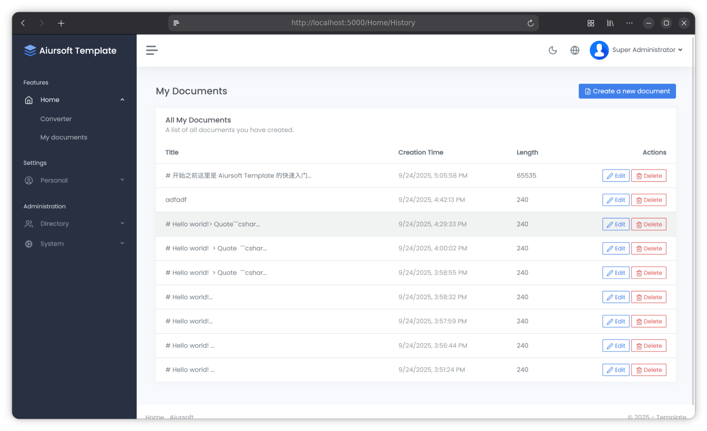

# Aiursoft Template Tutorial - Step 5 - 将数据保存到数据库



接下来，我们将继续扩展上面的例子，允许用户保存他们的 markdown 文档，并在之后重新编辑甚至分享它们。为此，我们需要修改控制器和视图，以便用户可以创建、查看、编辑和删除他们的文档。

## Step 5.1 保存并更新用户的文档

首先，我们需要修改 `./src/MyOrg.MarkToHtml/Controllers/HomeController.cs` 文件，添加必要的 using 语句：

```csharp title="HomeController.cs 的 using 语句"
using System.ComponentModel.DataAnnotations;
using Aiursoft.CSTools.Tools;
using MyOrg.MarkToHtml.Models.HomeViewModels;
using MyOrg.MarkToHtml.Services;
using Aiursoft.UiStack.Navigation;
using Microsoft.AspNetCore.Authorization;
using Microsoft.AspNetCore.Identity;
using Microsoft.AspNetCore.Mvc;
using Microsoft.EntityFrameworkCore;
using MyOrg.MarkToHtml.Entities;
```

然后我们调整其构造方法，支持日志、数据库和用户管理器：

```csharp title="HomeController.cs 的构造方法"
public class HomeController(
    ILogger<HomeController> logger,
    UserManager<User> userManager,
    TemplateDbContext context,
    MarkToHtmlService mtohService) : Controller
```

接下来我们重构 `Index` 方法，对于未认证的用户，我们直接渲染成 HTML，以保持核心功能不变。而对于已经认证的用户，我们则直接在数据库中添加或更新他们的文档，然后交给具体的 `Edit` 方法来渲染。

将 `Index` 方法修改为：

```csharp title="HomeController.cs 重构的 Index 的 POST 方法"
[HttpPost]
[ValidateAntiForgeryToken]
public async Task<IActionResult> Index(IndexViewModel model)
{
    if (!ModelState.IsValid)
    {
        return this.StackView(model);
    }

    var userId = userManager.GetUserId(User);
    if (User.Identity?.IsAuthenticated == true && !string.IsNullOrWhiteSpace(userId))
    {
        // If the user is authenticated, this action only saves the document in the database. And it's `edit` action to render it.
        // And go to the edit page.
        logger.LogTrace("Authenticated user submitted a document with ID: '{Id}'. Save it to the database.",
            model.DocumentId);
        var documentInDb = await context.MarkdownDocuments
            .FirstOrDefaultAsync(d => d.Id == model.DocumentId && d.UserId == userId);
        var isExistingDocument = documentInDb != null;
        if (documentInDb != null)
        {
            logger.LogInformation("Updating the document with ID: '{Id}'.", model.DocumentId);
            documentInDb.Content = model.InputMarkdown.SafeSubstring(65535);
            documentInDb.Title = model.Title;
        }
        else
        {
            logger.LogInformation("Creating a new document with ID: '{Id}'.", model.DocumentId);
            model.DocumentId = Guid.NewGuid();
            var newDocument = new MarkdownDocument
            {
                Id = model.DocumentId,
                Content = model.InputMarkdown.SafeSubstring(65535),
                Title = model.InputMarkdown.SafeSubstring(40),
                UserId = userId
            };
            context.MarkdownDocuments.Add(newDocument);
        }

        await context.SaveChangesAsync();
        return RedirectToAction(nameof(Edit), new { id = model.DocumentId, saved = isExistingDocument });
    }
    else
    {
        // If the user is not authenticated, just show the result.
        logger.LogInformation(
            "An anonymous user submitted a document with ID: '{Id}'. It was not saved to the database.",
            model.DocumentId);
        model.OutputHtml = mtohService.ConvertMarkdownToHtml(model.InputMarkdown);
        return this.StackView(model);
    }
}
```

### Step 5.1.1 更新视图模型

当然，完成上面的修改后，你会注意到几个错误，包括 `model.DocumentId`、`model.Title` 找不到等。别担心，我们立刻去更新 `IndexViewModel`。

编辑文件 `./src/MyOrg.MarkToHtml/Models/HomeViewModels/IndexViewModel.cs`，添加必要的属性：

```csharp title="IndexViewModel.cs"
[Required(ErrorMessage = "Something went wrong, please try again later.")]
public Guid DocumentId { get; set; } = Guid.NewGuid();

public bool IsEditing { get; init; }

[MaxLength(100)]
public string? Title { get; set; }

public bool SavedSuccessfully { get; set; }
```

### Step 5.1.2 理解保存和更新逻辑 (可选)

阅读服务端的代码，其中核心逻辑是：

```csharp title="HomeController.cs 的 Index 方法"
var documentInDb = await context.MarkdownDocuments
    .FirstOrDefaultAsync(d => d.Id == model.DocumentId && d.UserId == userId);
var isExistingDocument = documentInDb != null;
if (documentInDb != null)
{
    logger.LogInformation("Updating the document with ID: '{Id}'.", model.DocumentId);
    documentInDb.Content = model.InputMarkdown.SafeSubstring(65535);
    documentInDb.Title = model.Title;
}
else
{
    logger.LogInformation("Creating a new document with ID: '{Id}'.", model.DocumentId);
    model.DocumentId = Guid.NewGuid();
    var newDocument = new MarkdownDocument
    {
        Id = model.DocumentId,
        Content = model.InputMarkdown.SafeSubstring(65535),
        Title = model.InputMarkdown.SafeSubstring(40),
        UserId = userId
    };
    context.MarkdownDocuments.Add(newDocument);
}
```

对于未认证用户，我们直接渲染成 HTML，以保持核心功能不变。对于已认证的用户，我们要支持保存和更新他们的文档。所以第一次提交时，我们可以帮用户保存到数据库，并建立 DocumentId 和 UserId 的关联。之后用户再次提交时，我们就可以根据 DocumentId 和 UserId 来找到对应的文档，并更新它的内容和标题。

我们的代码是：

```text
用户的 DocumentId 如果不存在或不属于这个用户，那么不会信任用户提交的 DocumentId，而是重新生成一个新的 ID 然后插入数据库。这样可以防止用户恶意提交别人的 DocumentId 来修改别人的文档。

而如果用户提交的 DocumentId 存在并且属于当前用户，那么就只更新这个文档的内容和标题。具体的 Markdown 渲染过程则交给了 `Edit` 方法来处理。现在，我们创建 `Edit` 方法。
```

## Step 5.2 创建编辑文档的页面

### Step 5.2.1 创建 Edit 方法

在 `./src/MyOrg.MarkToHtml/Controllers/HomeController.cs` 文件中，添加以下代码：

```csharp title="HomeController.cs 的 Edit 方法"
[Authorize]
public async Task<IActionResult> Edit([Required][FromRoute] Guid id, [FromQuery] bool? saved = false)
{
    var userId = userManager.GetUserId(User);
    var document = await context.MarkdownDocuments.FirstOrDefaultAsync(d => d.Id == id && d.UserId == userId);

    if (document == null)
    {
        return NotFound("The document was not found or you do not have permission to edit it.");
    }

    var model = new IndexViewModel
    {
        DocumentId = document.Id,
        Title = document.Title,
        InputMarkdown = document.Content ?? string.Empty,
        OutputHtml = mtohService.ConvertMarkdownToHtml(document.Content ?? string.Empty),
        IsEditing = true,
        SavedSuccessfully = saved ?? false
    };

    return this.StackView(model: model, viewName: nameof(Index)); // Reuse the Index view for editing.
}
```

在上面的代码中，我们使用了 `[Authorize]` 属性来确保只有认证用户才能访问这个方法。

我们根据传入的 `id` 参数，从数据库中查询对应的文档。如果找不到文档，或者文档不属于当前用户，就返回 404 错误。

> ASP.NET Core 会自动将路由参数绑定到方法参数上。如果参数使用了 `[FromRoute]` 属性，表示这个参数来自路由。而 `id` 这个参数，则来自于 URL 中的 `{id}` 部分。在默认行为下，它的路由遵循控制器的路由规则，例如 `/Home/Edit/{id}`。也就是说，如果用户访问 `/Home/Edit/1234`，那么 `id` 参数就会被绑定为 `1234`。

我们之前的 `Index` 已经可以将已经认证的用户的文档保存到数据库中，并且在保存后重定向到 `Edit` 方法来渲染文档。因此，我们可以复用 `Index` 视图来显示编辑页面。

### Step 5.2.2 调整 Index 视图

考虑到创建和编辑我们共享了同一个视图，我们在 `IndexViewModel` 中添加了一个 `IsEditing` 属性，用于区分当前是创建还是编辑状态。也添加了一个 `SavedSuccessfully` 属性，用于在编辑页面显示保存成功的提示。

例如，我们可以在编辑模式下，除了允许编辑文档外，还可以允许用户编辑文档的标题。我们可以在视图中添加一个输入框，用于编辑标题。也在编辑的页面上，添加一个隐藏的输入控件，以便在提交时携带 `DocumentId`。其中，`DocumentId` 用于标识用户的文档。对于每个新 GET 请求，我们每次都会生成一个新的 ID。为了确保反复提交编辑过程中这个Id不会变，我们需要在视图中将其作为隐藏字段提交。

这样我们可以构建出一个非常理想的体验：用户可以创建新的文档，并且在编辑页面中，可以看到当前文档的标题和内容，并且可以修改它们。每次第一次提交时，会创建一个新的文档，并生成一个新的 `DocumentId`。之后每次编辑提交时，都会携带这个 `DocumentId`，以便服务器端能够识别这是哪个文档，并更新它的内容和标题。

修改 `./src/MyOrg.MarkToHtml/Views/Home/Index.cshtml` 文件，在左侧的 Markdown 输入区域上方，添加以下代码：

```html title="Index.cshtml 调整其 Markdown 输入区域"
@* Left Column: Markdown Input *@
<div class="col-lg-6 d-flex">
    <div class="card flex-fill">
        <div class="card-header">
            <h5 class="card-title mb-0">
                <i class="align-middle" data-lucide="markdown">&nbsp;</i>
                @Localizer["Markdown Input"]
            </h5>
        </div>
        <div class="card-body p-2">
            @* Add this block for editing title if in editing mode *@
            @if (Model.IsEditing)
            {
                <input type="hidden" asp-for="DocumentId" />
                <div class="mb-3">
                    <label asp-for="Title" class="form-label">@Localizer["Document Title (optional)"]</label>
                    <input asp-for="Title" class="form-control form-control-lg" placeholder="@Localizer["Document Title (optional)"]"/>
                    <span asp-validation-for="Title" class="text-danger"></span>
                </div>
            }

            <textarea asp-for="InputMarkdown" class="form-control" id="markdown-editor"
                        placeholder="@Localizer["Type your Markdown here..."]"></textarea>
            <span asp-validation-for="InputMarkdown" class="text-danger"></span>
        </div>
    </div>
</div>
```

!!! tip "<input type="hidden" /> 的作用"

    `<input type="hidden" />` 标签用于在表单中存储一些不需要用户直接编辑但需要提交到服务器的数据。在这里，我们使用它来存储 `DocumentId`，以便在用户提交表单时，服务器能够识别这是哪个文档。

    ```html title="Index.cshtml"
    @if (Model.IsEditing)
    {
        <input type="hidden" asp-for="DocumentId" />
        ...
    }
    ```

    在上面的例子中，如果 `Model.IsEditing` 为真，表示当前是编辑模式，我们就会渲染一个隐藏的输入字段，绑定到 `DocumentId` 属性。因为编辑模式下必须确定正在编辑的是哪个文档，所以我们需要将 `DocumentId` 一起提交到服务器。

这样，在编辑模式下，用户可以看到一个标题输入框，可以为他们的文档添加一个标题。

同时，我们在表单的顶部，添加一个提示框，用于显示保存成功的消息。将以下代码添加到 `./src/MyOrg.MarkToHtml/Views/Home/Index.cshtml` 文件，紧接在 `<form>` 标签之前：

```html title="Index.cshtml 显示保存成功的提示"
... Other code ...
</div>

@if (Model.SavedSuccessfully)
{
    <div class="alert alert-success alert-dismissible" role="alert">
        <button type="button" class="btn-close" data-bs-dismiss="alert" aria-label="Close"></button>
        <div class="d-flex">
            <div class="alert-icon pe-3">
                <i class="align-middle" data-lucide="alert-triangle"></i>
            </div>
            <div class="alert-message">
                <strong>@Localizer["Success!"]</strong>
                @Localizer["Document updated successfully."]
            </div>
        </div>
    </div>
}

<form asp-action="Index" method="post" id="markdown-form">
... Other code ...
```

这样，如果用户是从编辑页面保存后重定向回来的，就会看到一个绿色的提示框，告诉他们文档已经成功保存。

### Step 5.2.3 测试功能

!!! note "现在可以运行应用以及测试功能了。"

    现在，你可以运行应用，注册一个新用户，并测试创建和编辑文档的功能。你应该能够创建新的文档，并编辑它们的标题和内容。

    每次编辑后，地址栏的路径都会变成例如 `/Home/Edit/{DocumentId}` 的形式，表示你正在编辑一个已经存在的文档。

    同时，检查数据库中的 `MarkdownDocuments` 表，应该能够看到你创建和编辑的文档已经被保存到数据库中。

这样在每次提交的时候，都会将 `DocumentId` 一起提交到服务器端。否则每次用户提交都会生成一个新的 ID，导致无法更新之前的文档，而不停地创建新文档。

当然，最核心的功能，也就是查看自己的文档列表，仍然没有实现。我们将在下一步中实现这个功能。

## Step 5.3 创建用户文档列表页面

用户的文档列表页面将提供给用户查看自己的文档历史记录，并允许他们选择一个文档进行编辑或删除。

在 `./src/MyOrg.MarkToHtml/Controllers/HomeController.cs` 文件中，添加以下代码：

```csharp title="HomeController.cs"
[Authorize]
[RenderInNavBar(
    NavGroupName = "Features",
    NavGroupOrder = 1,
    CascadedLinksGroupName = "Home",
    CascadedLinksIcon = "history",
    CascadedLinksOrder = 2,
    LinkText = "My documents",
    LinkOrder = 2)]
public async Task<IActionResult> History()
{
    var userId = userManager.GetUserId(User);
    var documents = await context.MarkdownDocuments
        .Where(d => d.UserId == userId)
        .OrderByDescending(d => d.CreationTime)
        .ToListAsync();

    var model = new HistoryViewModel
    {
        MyDocuments = documents
    };
    return this.StackView(model);
}
```

它的功能正是从数据库中查询当前用户的所有文档，并按创建时间降序排列。然后将这些文档传递给视图进行渲染。

其中，`[RenderInNavBar]` 属性用于将这个方法渲染到导航栏中。这样用户就可以通过导航栏访问他们的文档列表。

创建文件 `./src/MyOrg.MarkToHtml/Models/HomeViewModels/HistoryViewModel.cs`，添加以下代码：

```csharp title="HistoryViewModel.cs"
using Aiursoft.UiStack.Layout;
using MyOrg.MarkToHtml.Entities;

namespace MyOrg.MarkToHtml.Models.HomeViewModels;

public class HistoryViewModel : UiStackLayoutViewModel
{
    public HistoryViewModel()
    {
        PageTitle = "My Documents History";
    }

    public IEnumerable<MarkdownDocument> MyDocuments { get; set; } = new List<MarkdownDocument>();
}
```

创建文件 `./src/MyOrg.MarkToHtml/Views/Home/History.cshtml`，添加以下代码：

```html title="History.cshtml"
@using Aiursoft.WebTools
@model MyOrg.MarkToHtml.Models.HomeViewModels.HistoryViewModel
@inject IViewLocalizer Localizer

<style>
    .clickable-row {
        cursor: pointer;
    }
</style>

<div class="row mb-2 mb-xl-3">
    <div class="col-auto d-none d-sm-block">
        <h3>@Localizer["My Documents"]</h3>
    </div>

    <div class="col-auto ms-auto mt-n1">
        <a asp-controller="Home" asp-action="Index" class="btn btn-primary">
            <i class="align-middle" data-lucide="file-plus"></i> @Localizer["Create a new document"]
        </a>
    </div>
</div>

<div class="card">
    <div class="card-header">
        <h5 class="card-title">@Localizer["All My Documents"]</h5>
        <h6 class="card-subtitle text-muted">@Localizer["A list of all documents you have created."]</h6>
    </div>
    <div class="table-responsive">
        <table class="table table-hover mb-0">
            <thead>
            <tr>
                <th>@Localizer["Title"]</th>
                <th>@Localizer["Creation Time"]</th>
                <th>@Localizer["Length"]</th>
                <th class="text-end">@Localizer["Actions"]</th>
            </tr>
            </thead>
            <tbody>
            @foreach (var doc in Model.MyDocuments)
            {
                <tr class="clickable-row" data-href="@Url.Action("Edit", new { id = doc.Id })">
                    <td>
                        @if (string.IsNullOrWhiteSpace(doc.Title))
                        {
                            <label class="text-muted">(no title)</label>
                        }
                        else
                        {
                            @doc.Title
                        }
                    </td>
                    <td>
                        <label class="text-muted" data-utc-time="@doc.CreationTime.ToHtmlDateTime()"></label>
                    </td>
                    <td>@(doc.Content?.Length ?? 0)</td>
                    <td class="text-end">
                        <a asp-action="Edit" asp-route-id="@doc.Id" class="btn btn-sm btn-outline-primary">
                            <i class="align-middle" data-lucide="edit-2"></i> @Localizer["Edit"]
                        </a>
                        <a asp-action="Delete" asp-route-id="@doc.Id" class="btn btn-sm btn-outline-danger">
                            <i class="align-middle" data-lucide="trash-2"></i> @Localizer["Delete"]
                        </a>
                    </td>
                </tr>
            }
            </tbody>
        </table>
    </div>
</div>

@* ReSharper disable once Razor.SectionNotResolved *@
@section scripts {
    <script>
        document.addEventListener("DOMContentLoaded", function () {
            const rows = document.querySelectorAll(".clickable-row");
            rows.forEach(row => {
                row.addEventListener("click", function (event) {
                    const target = event.target;
                    // Prevent navigation if a link or button was clicked inside the row
                    if (!target.matches('a, a *, button, button *')) {
                        window.location.href = row.dataset.href;
                    }
                });
            });
        });
    </script>
}
```

这个视图使用了一个表格来显示用户的所有文档。每一行显示文档的标题、创建时间、内容长度以及操作按钮（编辑和删除）。点击行可以导航到编辑页面。

注意，其中我们使用了一个技巧：`data-utc-time` 属性来存储 UTC 时间。Aiursoft Template 自带的 JavaScript 会自动将其转换为用户本地时间并显示。还记得我们在设计实体的时候是如何定义这个 `CreationTime` 属性的吗？当时的代码是：

```csharp title="MarkdownDocument 的 CreationTime 属性"
public DateTime CreationTime { get; init; } = DateTime.UtcNow;
```

所以这个实体本身创建的时候，就已经将当时的 UTC 时间存储在数据库里了。而转换为当地时区是靠 JavaScript 在用户的设备上实现的。这样可以确保无论用户来自哪个时区，显示的时间都是当地的时间。

最后，为了方便用户在编辑页面能够返回到他们的文档列表，我们在 `./src/MyOrg.MarkToHtml/Views/Home/Index.cshtml` 文件中，找到提交按钮，在它左侧添加一个返回按钮，并且对于已经认证的用户，强调转换按钮有保存的功能。修改如下：

```html title="Index.cshtml 给提交按钮添加返回按钮"
    @* Submit Button Row *@
    <div class="row mt-3">
        <div class="col text-center">
            @* Add the back button *@
            @if ((User.Identity?.IsAuthenticated ?? false) && Model.IsEditing)
            {
                <a asp-action="History" class="btn btn-outline-secondary btn-lg mr-2">
                    <i class="align-middle" data-lucide="file-text">&nbsp;</i>
                    @Localizer["My Documents"]
                </a>
            }

            <button type="submit" class="btn btn-primary btn-lg">
                @if (User.Identity?.IsAuthenticated ?? false)
                {
                    <i class="align-middle" data-lucide="check-circle">&nbsp;</i>
                    @Localizer["Convert and save"]
                }
                else
                {
                    <i class="align-middle" data-lucide="chevrons-right">&nbsp;</i>
                    @Localizer["Convert to HTML"]
                }
            </button>
        </div>
    </div>
```

现在，不会再有错误了。你可以运行应用程序，在匿名模式下，只能创建并查看 HTML。而在登录后，你可以创建、编辑和查看你自己的文档列表。

> 默认用户是 `admin`，默认密码是 `admin123`。

当然，我们还没有实现删除文档的功能。我们将在下一步中实现这个功能。

## Step 5.4 实现删除文档的功能

在完成了创建、编辑、列表等功能后，删除自然已经是最后一个需要实现的功能了。到这里，我们已经熟练掌握了如何使用 Entity Framework Core 来操作数据库中的数据。删除文档的功能也不例外。你可以试试自己实现它，或者参考下面的代码。

在 `./src/MyOrg.MarkToHtml/Controllers/HomeController.cs` 文件中，添加以下代码：

```csharp title="HomeController.cs 的 Delete 方法"
// GET: /Home/Delete/{guid}
[Authorize]
public async Task<IActionResult> Delete(Guid? id)
{
    if (id == null)
    {
        return NotFound();
    }

    var userId = userManager.GetUserId(User);
    var document = await context.MarkdownDocuments
        .FirstOrDefaultAsync(d => d.Id == id && d.UserId == userId);

    if (document == null)
    {
        // Document not found or user does not have permission.
        return NotFound();
    }

    return this.StackView(new DeleteViewModel
    {
        Document = document
    });
}

// POST: /Home/Delete/{guid}
[HttpPost, ActionName("Delete")]
[ValidateAntiForgeryToken]
[Authorize]
public async Task<IActionResult> DeleteConfirmed(Guid id)
{
    var userId = userManager.GetUserId(User);
    var document = await context.MarkdownDocuments
        .FirstOrDefaultAsync(d => d.Id == id && d.UserId == userId);

    if (document == null)
    {
        return NotFound();
    }

    context.MarkdownDocuments.Remove(document);
    await context.SaveChangesAsync();

    logger.LogInformation("Document with ID: '{Id}' was deleted by user: '{UserId}'.", id, userId);

    return RedirectToAction(nameof(History));
}
```

同时创建 `./src/MyOrg.MarkToHtml/Models/HomeViewModels/DeleteViewModel.cs` 文件，添加以下代码：

```csharp title="DeleteViewModel.cs"
using Aiursoft.UiStack.Layout;
using MyOrg.MarkToHtml.Entities;

namespace MyOrg.MarkToHtml.Models.HomeViewModels;

public class DeleteViewModel : UiStackLayoutViewModel
{
    public DeleteViewModel()
    {
        PageTitle = "Delete Document";
    }

    // This property will hold the document to be deleted, so the view can display its details.
    public MarkdownDocument Document { get; set; } = null!;
}
```

创建 `./src/MyOrg.MarkToHtml/Views/Home/Delete.cshtml` 文件，添加以下代码：

```html title="Delete.cshtml"
@using Aiursoft.WebTools
@model MyOrg.MarkToHtml.Models.HomeViewModels.DeleteViewModel
@inject IViewLocalizer Localizer

<h1 class="h3 mb-3">@Localizer["Delete Document"]</h1>

<div class="row justify-content-center">
    <div class="col-lg-10 col-xl-8">
        <div class="card">
            <div class="card-header text-center">
                <i class="align-middle text-danger" data-lucide="shield-alert" style="width: 48px; height: 48px;"></i>
            </div>
            <div class="card-body">
                <div class="text-center">
                    <h2 class="h4 card-title fw-bold">@Localizer["Are you sure?"]</h2>
                    <p class="mb-3 text-muted">@Localizer["This action is irreversible. You are about to permanently delete the following document:"]</p>
                </div>

                <div class="list-group list-group-flush my-4">
                    <div class="list-group-item">
                        <div class="row">
                            <strong class="col-sm-3">@Localizer["Title"]</strong>
                            <div class="col-sm-9">
                                @if (string.IsNullOrWhiteSpace(Model.Document.Title))
                                {
                                    <label class="text-muted">(no title)</label>
                                }
                                else
                                {
                                    @Model.Document.Title
                                }
                            </div>
                        </div>
                    </div>
                    <div class="list-group-item">
                        <div class="row">
                            <strong class="col-sm-3">@Localizer["Creation Time"]</strong>
                            <div class="col-sm-9">
                                <label data-utc-time="@Model.Document.CreationTime.ToHtmlDateTime()" class="text-monospace"></label>
                            </div>
                        </div>
                    </div>
                </div>

                <div class="text-center">
                    <form asp-action="Delete" class="d-inline-block">
                        <input type="hidden" asp-for="@Model.Document.Id" />
                        <button type="submit" class="btn btn-danger">
                            <i class="align-middle me-2" data-lucide="trash-2"></i> @Localizer["Yes, delete this document"]
                        </button>
                    </form>
                    <a asp-action="History" class="btn btn-light">@Localizer["Cancel"]</a>
                </div>
            </div>
        </div>
    </div>
</div>
```

这个视图显示了一个确认删除的页面，列出了要删除的文档的标题和创建时间，并提供了确认和取消按钮。

## 结语

恭喜你完成了第五步！你现在已经成功地实现了一个完整的 CRUD（创建、读取、更新、删除）功能，允许用户创建、编辑、查看和删除他们的 Markdown 文档。

通过合理地使用 Entity Framework Core，你可以轻松地操作数据库中的数据，而不必担心手动编写 SQL 语句，也不必担心数据库结构与实体类不一致的问题。

在上面的过程中，我们巧妙的将创建和编辑共享了同一个视图，这样可以减少代码重复，提高代码的可维护性。同时我们还对于匿名用户和已经认证的用户做了不同处理，确保匿名用户可以匿名使用，而认证用户则可以享受更多的功能。

现在运行应用程序，尝试创建、编辑、查看和删除你的文档，体验一下完整的功能吧！
