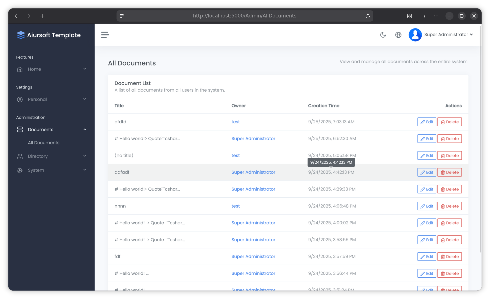

# Aiursoft Template Tutorial - Step 6 - 管理员看板和全新的权限



作为站长，你可能希望有一个专门的管理员看板，用于管理用户和内容。你也可能希望有一些特殊的权限设置，例如调整一篇文档的所有者，或者让某些用户拥有更高的权限。我们将在这一步中实现这些功能。

因此，在这一章节，我们将介绍权限系统的设计思路，并实现一个简单的管理员看板。

## Step 6.1 理解 Aiursoft Template 的权限系统

在继续之前，我们需要理解 Aiursoft Template 的权限系统是基于角色 `Role` 的。每个用户 `User` 可以拥有多个角色，每个角色可以拥有多个权限 `Claim`。

其中，`User` 和 `Role` 之间是多对多的关系，而 `Role` 和 `Claim` 之间也是多对多的关系。

`User` 和 `Role` 是存储在数据库中的。程序第一次启动，会创建一个默认的 `Admin` 角色，和叫 `Administrators` 的权限组。

下面，我们阅读这部分核心代码，找到文件 `./src/MyOrg.MarkToHtml/ProgramExtends.cs`，找到其中的 `SeedAsync` 方法：

```csharp title="ProgramExtensions.cs 无需要修改"
var role = await roleManager.FindByNameAsync("Administrators");
if (role == null)
{
    role = new IdentityRole("Administrators");
    await roleManager.CreateAsync(role);
}

var existingClaims = await roleManager.GetClaimsAsync(role);
var existingClaimValues = existingClaims
    .Where(c => c.Type == AppPermissions.Type)
    .Select(c => c.Value)
    .ToHashSet();

foreach (var permission in AppPermissions.GetAllPermissions())
{
    if (!existingClaimValues.Contains(permission.Key))
    {
        var claim = new Claim(AppPermissions.Type, permission.Key);
        await roleManager.AddClaimAsync(role, claim);
    }
}

if (!await db.Users.AnyAsync(u => u.UserName == "admin"))
{
    var user = new User
    {
        UserName = "admin",
        DisplayName = "Super Administrator",
        Email = "admin@default.com",
    };
    _ = await userManager.CreateAsync(user, "admin123");
    await userManager.AddToRoleAsync(user, "Administrators");
}
```

上面的代码会在程序第一次运行时执行。它会在启动时确保 `Administrators` 角色存在，并且包含所有的权限。它还会确保存在一个用户名为 `admin` 的用户，并将其添加到 `Administrators` 角色中。

!!! info "Administrators 用户组并没有任何特殊性"

    在第一次启动后，`Administrators` 角色并没有任何特殊性。它只是一个普通的角色，唯一的区别是它被赋予了所有的权限。你可以创建其他角色，并赋予它们不同的权限。或删除这个自动创建的角色。

    并不会，也不应当有任何业务逻辑，强制要求一个用户必须属于 `Administrators` 角色才能执行某些操作。权限系统是完全基于权限 `Claim` 来控制的，而不是 `Role`。

和 `User` `Role` 不同，`Claim` 并不直接存储在数据库中，而是存储在代码中。你可以在 `./src/MyOrg.MarkToHtml/AppPermissions.cs` 文件中找到所有的权限定义。

我们也可以修改上述文件，以添加新的权限。

!!! note "新添加的权限 `Claim` 不会自动分配给任何角色 `Role`"

    如果你添加了新的权限，你需要手动将它们分配给某个角色 `Role`，否则没有任何用户会拥有这个权限。

## Step 6.2 设计权限系统

首先，我们需要确定我们需要哪些权限。在这个例子中，我们将设计三个非常高的权限，以允许特定用户执行一些敏感操作：

* 查看所有用户的文档
* 任意编辑一个用户的文档
* 删除任意用户的文档

!!! tip "基础功能还需要设计权限吗？"

    你可能会好奇，基础功能（例如创建、编辑、删除自己的文档）是否也需要设计权限？在我们的例子中，我们允许了所有用户(甚至匿名用户)创建文档，因此这类可以无条件服务的用例不需要权限。

修改文件 `./src/MyOrg.MarkToHtml/AppPermissionNames.cs`，添加新的权限：

```csharp title="AppPermissions.cs 新增权限"
// Document Management
public const string CanReadAllDocuments = nameof(CanReadAllDocuments);
public const string CanDeleteAnyDocument = nameof(CanDeleteAnyDocument);
public const string CanEditAnyDocument = nameof(CanEditAnyDocument);
```

修改后，这个文件应该如下所示：

```csharp title="AppPermissions.cs 完整代码"
namespace MyOrg.MarkToHtml.Authorization;

/// <summary>
/// Defines all permission keys as constants. This is the single source of truth.
/// </summary>
public static class AppPermissionNames
{
    // User Management
    public const string CanReadUsers = nameof(CanReadUsers);
    public const string CanDeleteUsers = nameof(CanDeleteUsers);
    public const string CanAddUsers = nameof(CanAddUsers);
    public const string CanEditUsers = nameof(CanEditUsers);
    public const string CanAssignRoleToUser = nameof(CanAssignRoleToUser);

    // Role Management
    public const string CanReadRoles = nameof(CanReadRoles);
    public const string CanDeleteRoles = nameof(CanDeleteRoles);
    public const string CanAddRoles = nameof(CanAddRoles);
    public const string CanEditRoles = nameof(CanEditRoles);

    // System Management
    public const string CanViewSystemContext = nameof(CanViewSystemContext);
    public const string CanRebootThisApp = nameof(CanRebootThisApp);

    // Document Management
    public const string CanReadAllDocuments = nameof(CanReadAllDocuments);
    public const string CanDeleteAnyDocument = nameof(CanDeleteAnyDocument);
    public const string CanEditAnyDocument = nameof(CanEditAnyDocument);
}
```

接下来，修改文件 `./src/MyOrg.MarkToHtml/AppPermissions.cs`，将新的权限添加到权限列表中：

```csharp title="AppPermissions.cs 新增三个权限"
new(AppPermissionNames.CanReadAllDocuments,
    localizer["Read All Documents"],
    localizer["Allows viewing all documents in the system, regardless of ownership."]),
new(AppPermissionNames.CanDeleteAnyDocument,
    localizer["Delete Any Document"],
    localizer["Allows deletion of any document, regardless of ownership."]),
new(AppPermissionNames.CanEditAnyDocument,
    localizer["Edit Any Document"],
    localizer["Allows editing of any document, regardless of ownership."]),
```

这里构造的 `PermissionDescriptor` 包含三个参数：

* Key 权限的唯一标识符（字符串）
* Name 权限的名称（本地化字符串）
* Description 权限的描述（本地化字符串）

每次新增一个权限，都应当完整的填写这三个参数以描述它的功能。

## Step 6.3 为 Administrators 角色分配新权限

接下来，我们需要将新添加的权限分配给 `Administrators` 角色。无需修改任何代码，直接启动应用程序。

!!! tip "为什么这次需要手动分配权限？"

    虽然程序会在第一次启动时创建 `Administrators` 角色并分配所有权限，但如果你是在程序已经运行过一次之后添加的新权限，程序不会自动将这些新权限分配给 `Administrators` 角色。

我们需要手工来到 `Roles` 页面，找到 `Administrators` 角色，然后点击 `Edit this Role` 按钮。

在编辑角色页面中，找到新添加的权限，并勾选它们，然后点击 `Save Changes` 按钮保存更改。

## Step 6.4 创建管理员看板

接下来，我们将创建一个简单的管理员看板，允许管理员查看所有用户的文档。

### Step 6.4.1 创建 ViewModel

首先，创建四个关键的 ViewModel：

在 `./src/MyOrg.MarkToHtml/Models/AdminViewModels/` 目录下创建四个文件，内容分别为：

用于查看所有文档的 ViewModel `AllDocumentsViewModel.cs`：

```csharp title="AllDocumentsViewModel.cs"
using Aiursoft.UiStack.Layout;
using MyOrg.MarkToHtml.Entities;

namespace MyOrg.MarkToHtml.Models.AdminViewModels;

public class AllDocumentsViewModel : UiStackLayoutViewModel
{
    public required List<MarkdownDocument> AllDocuments { get; set; }
}
```

用于查看某个用户的所有文档的 ViewModel `UserDocumentsViewModel.cs`：

```csharp title="UserDocumentsViewModel.cs"
using Aiursoft.UiStack.Layout;
using MyOrg.MarkToHtml.Entities;

namespace MyOrg.MarkToHtml.Models.AdminViewModels;

public class UserDocumentsViewModel : UiStackLayoutViewModel
{
    public required User User { get; set; }
    public required List<MarkdownDocument> UserDocuments { get; set; }
}
```

用于编辑文档的 ViewModel `EditDocumentViewModel.cs`：

```csharp title="EditDocumentViewModel.cs"
using System.ComponentModel.DataAnnotations;
using Aiursoft.UiStack.Layout;
using Microsoft.AspNetCore.Mvc.Rendering;

namespace MyOrg.MarkToHtml.Models.AdminViewModels;

public class EditDocumentViewModel : UiStackLayoutViewModel
{
    public Guid DocumentId { get; set; }

    [MaxLength(100)]
    public string? Title { get; set; }

    [Required]
    [MaxLength(65535)]
    [Display(Name = "Markdown Content")]
    public string InputMarkdown { get; set; } = string.Empty;

    [Required]
    [Display(Name = "Owner")]
    public string SelectedUserId { get; set; } = string.Empty;

    public List<SelectListItem> AllUsers { get; set; } = new();

    public bool SavedSuccessfully { get; set; }
}
```

用于删除文档的 ViewModel `DeleteDocumentViewModel.cs`：

```csharp title="DeleteDocumentViewModel.cs"
using Aiursoft.UiStack.Layout;
using MyOrg.MarkToHtml.Entities;

namespace MyOrg.MarkToHtml.Models.AdminViewModels;

public class DeleteDocumentViewModel : UiStackLayoutViewModel
{
    public required MarkdownDocument Document { get; set; }
}
```

### Step 6.4.2 创建 AdminController

接下来在 `./src/MyOrg.MarkToHtml/Controllers` 目录下创建一个新的控制器 `AdminController.cs`：

```csharp title="AdminController.cs"
using Aiursoft.CSTools.Tools;
using MyOrg.MarkToHtml.Authorization;
using MyOrg.MarkToHtml.Entities;
using MyOrg.MarkToHtml.Services;
using Aiursoft.UiStack.Navigation;
using Microsoft.AspNetCore.Mvc;
using Microsoft.EntityFrameworkCore;
using Microsoft.AspNetCore.Authorization;
using Microsoft.AspNetCore.Identity;
using Microsoft.AspNetCore.Mvc.Rendering;
using Microsoft.Extensions.Localization;
using MyOrg.MarkToHtml.Models.AdminViewModels;

namespace MyOrg.MarkToHtml.Controllers;

/// <summary>
/// This controller is used for administrative actions related to documents.
/// </summary>
[Authorize]
public class AdminController(
    IStringLocalizer<ManageController> localizer,
    UserManager<User> userManager,
    TemplateDbContext context)
    : Controller
{
    /// <summary>
    /// Displays a list of all markdown documents in the system.
    /// This action requires the 'CanReadAllDocuments' permission.
    /// </summary>
    [Authorize(Policy = AppPermissionNames.CanReadAllDocuments)]
    [RenderInNavBar(
        NavGroupName = "Administration",
        NavGroupOrder = 9999,
        CascadedLinksGroupName = "Documents",
        CascadedLinksIcon = "server",
        CascadedLinksOrder = 1,
        LinkText = "All Documents",
        LinkOrder = 1)]
    public async Task<IActionResult> AllDocuments()
    {
        var allDocuments = await context.MarkdownDocuments
            .Include(d => d.User)
            .OrderByDescending(d => d.CreationTime)
            .ToListAsync();

        return this.StackView(new AllDocumentsViewModel
        {
            AllDocuments = allDocuments
        });
    }

    /// <summary>
    /// Displays a list of markdown documents for a specific user.
    /// This action requires the 'CanReadAllDocuments' permission.
    /// </summary>
    [Authorize(Policy = AppPermissionNames.CanReadAllDocuments)]
    public async Task<IActionResult> UserDocuments([FromRoute] string? id)
    {
        if (string.IsNullOrWhiteSpace(id))
        {
            return NotFound("User ID is required.");
        }

        var user = await userManager.FindByIdAsync(id);
        if (user == null)
        {
            return NotFound("User not found.");
        }

        var documents = await context.MarkdownDocuments
            .Where(d => d.UserId == id)
            .OrderByDescending(d => d.CreationTime)
            .ToListAsync();

        var model = new UserDocumentsViewModel
        {
            User = user,
            UserDocuments = documents
        };

        return this.StackView(model);
    }

    /// <summary>
    /// Allows an administrator to edit any document, including its owner.
    /// This action requires the 'CanEditAnyDocument' permission.
    /// </summary>
    [Authorize(Policy = AppPermissionNames.CanEditAnyDocument)]
    public async Task<IActionResult> EditDocument([FromRoute] Guid id, [FromQuery] bool? saved = false)
    {
        var document = await context.MarkdownDocuments
            .FirstOrDefaultAsync(d => d.Id == id);

        if (document == null)
        {
            return NotFound("Document not found.");
        }

        var allUsers = await userManager.Users
            .OrderBy(u => u.UserName)
            .ToListAsync();

        var model = new EditDocumentViewModel
        {
            DocumentId = document.Id,
            Title = document.Title,
            InputMarkdown = document.Content ?? string.Empty,
            SelectedUserId = document.UserId,
            AllUsers = allUsers.Select(user => new SelectListItem
            {
                Value = user.Id,
                Text = user.UserName,
                Selected = user.Id == document.UserId
            }).ToList(),
            SavedSuccessfully = saved ?? false
        };

        return this.StackView(model);
    }

    /// <summary>
    /// Saves the changes to a document from an administrator, including the owner.
    /// This action requires the 'CanEditAnyDocument' permission.
    /// </summary>
    [HttpPost]
    [ValidateAntiForgeryToken]
    [Authorize(Policy = AppPermissionNames.CanEditAnyDocument)]
    public async Task<IActionResult> EditDocument(EditDocumentViewModel model)
    {
        var newOwner = await userManager.FindByIdAsync(model.SelectedUserId);
        if (!ModelState.IsValid || newOwner == null)
        {
            if (newOwner == null)
            {
                ModelState.AddModelError(nameof(model.SelectedUserId), localizer["The selected new owner does not exist."]);
            }
            var allUsers = await userManager.Users.OrderBy(u => u.UserName).ToListAsync();
            model.AllUsers = allUsers.Select(user => new SelectListItem
            {
                Value = user.Id,
                Text = user.UserName,
                Selected = user.Id == model.SelectedUserId
            }).ToList();
            return this.StackView(model);
        }

        var documentInDb = await context.MarkdownDocuments.FirstOrDefaultAsync(d => d.Id == model.DocumentId);
        if (documentInDb == null)
        {
            return NotFound("Document not found.");
        }
        documentInDb.Content = model.InputMarkdown.SafeSubstring(65535);
        documentInDb.Title = model.Title;
        documentInDb.UserId = model.SelectedUserId;

        await context.SaveChangesAsync();
        return RedirectToAction(nameof(EditDocument), new { id = model.DocumentId, saved = true });
    }

    /// <summary>
    /// Displays a confirmation page before an administrator deletes a document.
    /// This action requires the 'CanDeleteAnyDocument' permission.
    /// </summary>
    [Authorize(Policy = AppPermissionNames.CanDeleteAnyDocument)]
    public async Task<IActionResult> DeleteDocument([FromRoute] Guid id)
    {
        var document = await context.MarkdownDocuments
            .Include(d => d.User)
            .FirstOrDefaultAsync(d => d.Id == id);

        if (document == null)
        {
            return NotFound("Document not found.");
        }

        return this.StackView(new DeleteDocumentViewModel
        {
            Document = document
        });
    }

    /// <summary>
    /// Deletes a document from the database.
    /// This action requires the 'CanDeleteAnyDocument' permission.
    /// </summary>
    [HttpPost, ActionName("DeleteDocument")]
    [ValidateAntiForgeryToken]
    [Authorize(Policy = AppPermissionNames.CanDeleteAnyDocument)]
    public async Task<IActionResult> DeleteDocumentConfirmed([FromRoute] Guid id)
    {
        var document = await context.MarkdownDocuments.FirstOrDefaultAsync(d => d.Id == id);
        if (document == null)
        {
            return NotFound("Document not found.");
        }

        context.MarkdownDocuments.Remove(document);
        await context.SaveChangesAsync();

        return RedirectToAction(nameof(AllDocuments));
    }
}
```

上面的控制器包含了五个主要的动作：

* `AllDocuments`：显示系统中所有的文档。
* `UserDocuments`：显示某个用户的所有文档。
* `EditDocument`：允许管理员编辑任何文档，包括更改文档的所有者。
* `DeleteDocument`：显示删除文档的确认页面。
* `DeleteDocumentConfirmed`：执行删除文档的操作。

在上面的例子中，我们使用了技巧 `[Authorize(Policy = AppPermissionNames.CanReadAllDocuments)]` 来保护控制器的每个动作，确保只有拥有相应权限的用户才能访问这些功能。

!!! tip "Authorize 特性"

    `Authorize` 特性可以应用于控制器类或单个动作方法。它可以接受一个 `Policy` 参数，指定所需的权限。你也可以使用 `Roles` 参数来指定所需的角色，但在我们的设计中，我们更倾向于使用权限 `Claim` 来控制访问。

!!! warning "已经登录的用户必须在拥有权限后重新登录才能生效"

    由于权限是存储在用户的身份验证票据中的，也就是在浏览器的 Cookies 中的，如果你在用户已经登录后才给他们分配了新的权限，他们需要重新登录才能获得这些新的权限。

    同样的，如果你撤销了某个用户的权限，他们也需要重新登录才能失去这些权限。这会带来一些安全隐患。

    在紧急情况下，可以吊销所有用户的登录状态，强制他们重新登录以获得最新的权限。可以通过删除：

    * 本地调试: `~/.aspnet/DataProtection-Keys` 目录
    * Docker 环境：`/data/aspnet/DataProtection-Keys` 目录

    即可。

### Step 6.4.3 创建视图

接下来，我们需要为上面的控制器动作创建视图。

在 `./src/MyOrg.MarkToHtml/Views/Admin/` 目录下创建四个文件，内容分别为：

用于显示所有文档的视图 `AllDocuments.cshtml`：

```html title="AllDocuments.cshtml"
@using Aiursoft.WebTools
@using Microsoft.AspNetCore.Authorization
@using MyOrg.MarkToHtml.Authorization
@model MyOrg.MarkToHtml.Models.AdminViewModels.AllDocumentsViewModel
@inject IViewLocalizer Localizer
@inject IAuthorizationService AuthorizationService

@{
    var canEditAnyDocument = (await AuthorizationService.AuthorizeAsync(User, AppPermissionNames.CanEditAnyDocument)).Succeeded;
    var canDeleteAnyDocument = (await AuthorizationService.AuthorizeAsync(User, AppPermissionNames.CanDeleteAnyDocument)).Succeeded;
}

<style>
    .clickable-row {
        cursor: pointer;
    }
</style>

<div class="row mb-2 mb-xl-3">
    <div class="col-auto d-none d-sm-block">
        <h3>@Localizer["All Documents"]</h3>
    </div>
    <div class="col-auto ms-auto text-end mt-n1">
        <p class="mb-0 text-muted">@Localizer["View and manage all documents across the entire system."]</p>
    </div>
</div>

<div class="card">
    <div class="card-header">
        <h5 class="card-title">@Localizer["Document List"]</h5>
        <h6 class="card-subtitle text-muted">@Localizer["A list of all documents from all users in the system."]</h6>
    </div>
    @if (!Model.AllDocuments.Any())
    {
        <div class="card-body">
            <div class="alert alert-info mb-0" role="alert">
                @Localizer["No documents found in the system."]
            </div>
        </div>
    }
    else
    {
        <div class="table-responsive">
            <table class="table table-hover mb-0">
                <thead>
                    <tr>
                        <th scope="col">@Localizer["Title"]</th>
                        <th scope="col">@Localizer["Owner"]</th>
                        <th scope="col">@Localizer["Creation Time"]</th>
                        <th scope="col" class="text-end">@Localizer["Actions"]</th>
                    </tr>
                </thead>
                <tbody>
                    @foreach (var doc in Model.AllDocuments)
                    {
                        // Use the edit action for the clickable row, if the user has permission.
                        var rowHref = canEditAnyDocument ? Url.Action("EditDocument", new { id = doc.Id }) : null;
                        <tr class="@(rowHref != null ? "clickable-row" : "")" data-href="@rowHref">
                            <td>
                                @if (string.IsNullOrWhiteSpace(doc.Title))
                                {
                                    <span class="text-muted">@Localizer["(no title)"]</span>
                                }
                                else
                                {
                                    @doc.Title
                                }
                            </td>
                            <td>
                                <a asp-action="UserDocuments" asp-route-id="@doc.UserId">
                                    @doc.User.DisplayName
                                </a>
                            </td>
                            <td>
                                <label class="text-muted" data-utc-time="@doc.CreationTime.ToHtmlDateTime()"></label>
                            </td>
                            <td class="text-end">
                                @if (canEditAnyDocument)
                                {
                                    <a asp-action="EditDocument" asp-route-id="@doc.Id" class="btn btn-sm btn-outline-primary">
                                        <i class="align-middle" data-lucide="edit-2"></i> @Localizer["Edit"]
                                    </a>
                                }
                                @if (canDeleteAnyDocument)
                                {
                                    <a asp-action="DeleteDocument" asp-route-id="@doc.Id" class="btn btn-sm btn-outline-danger">
                                        <i class="align-middle" data-lucide="trash-2"></i> @Localizer["Delete"]
                                    </a>
                                }
                            </td>
                        </tr>
                    }
                </tbody>
            </table>
        </div>
    }
</div>

@* ReSharper disable once Razor.SectionNotResolved *@
@section scripts {
    <script>
        document.addEventListener("DOMContentLoaded", function () {
            const rows = document.querySelectorAll(".clickable-row");
            rows.forEach(row => {
                // Ensure the row has a href to go to
                if (row.dataset.href) {
                    row.addEventListener("click", function (event) {
                        const target = event.target;
                        // Prevent navigation if a link or button was clicked inside the row
                        if (!target.matches('a, a *, button, button *')) {
                            window.location.href = row.dataset.href;
                        }
                    });
                }
            });
        });
    </script>
}
```

在上面的例子中，我们为了确定用户是否有权限编辑或删除文档，使用了 `IAuthorizationService` 服务来检查用户的权限。

使用这个技巧，可以根据用户的权限动态地显示或隐藏某些功能按钮。

同样的，基于这个技巧，我们也可以为其他视图添加类似的权限检查。包括用于显示某个用户的所有文档的视图 `UserDocuments.cshtml`：

```html title="UserDocuments.cshtml"
@using Aiursoft.WebTools
@using Microsoft.AspNetCore.Authorization
@using MyOrg.MarkToHtml.Authorization
@using MyOrg.MarkToHtml.Services
@model MyOrg.MarkToHtml.Models.AdminViewModels.UserDocumentsViewModel
@inject IViewLocalizer Localizer
@inject IAuthorizationService AuthorizationService
@inject StorageService StorageService

@{
    var canEditAnyDocument = (await AuthorizationService.AuthorizeAsync(User, AppPermissionNames.CanEditAnyDocument)).Succeeded;
    var canDeleteAnyDocument = (await AuthorizationService.AuthorizeAsync(User, AppPermissionNames.CanDeleteAnyDocument)).Succeeded;
}

<!--suppress CssUnusedSymbol -->
<style>
    .clickable-row {
        cursor: pointer;
    }
</style>

<div class="row mb-2 mb-xl-3">
    <div class="col-auto d-none d-sm-block">
        <h3>@Localizer["Documents by"] @Model.User.DisplayName</h3>
    </div>
    <div class="col-auto ms-auto text-end mt-n1">
        <a asp-action="AllDocuments" class="btn btn-light">
            <i class="align-middle" data-lucide="arrow-left"></i> @Localizer["Back to All Documents"]
        </a>
    </div>
</div>

<div class="row">
    @* Left Column: User Profile Details *@
    <div class="col-md-4 col-xl-3">
        <div class="card mb-3">
            <div class="card-header">
                <h5 class="card-title mb-0">@Localizer["Profile Details"]</h5>
            </div>
            <div class="card-body text-center">
                <a href="@StorageService.RelativePathToInternetUrl(Model.User.AvatarRelativePath)" target="_blank" rel="noopener noreferrer">
                    
                </a>
                <h5 class="card-title mb-0">@Model.User.DisplayName</h5>
                <div class="text-muted mb-2">@Model.User.Email</div>
            </div>
            <div class="list-group list-group-flush">
                <div class="list-group-item">
                    <div class="row">
                        <strong class="col-sm-6">@Localizer["Username"]</strong>
                        <div class="col-sm-6 text-sm-end">@@@Model.User.UserName</div>
                    </div>
                </div>
                <div class="list-group-item">
                    <div class="row">
                        <strong class="col-sm-6">@Localizer["Total Docs"]</strong>
                        <div class="col-sm-6 text-sm-end">@Model.UserDocuments.Count()</div>
                    </div>
                </div>
            </div>
        </div>
    </div>

    @* Right Column: User's Document List *@
    <div class="col-md-8 col-xl-9">
        <div class="card">
            <div class="card-header">
                <h5 class="card-title">@Localizer["Document List"]</h5>
                <h6 class="card-subtitle text-muted">@Localizer["A list of all documents created by this user."]</h6>
            </div>
            @if (!Model.UserDocuments.Any())
            {
                <div class="card-body">
                    <div class="alert alert-info mb-0" role="alert">
                        @Localizer["This user has not created any documents yet."]
                    </div>
                </div>
            }
            else
            {
                <div class="table-responsive">
                    <table class="table table-hover mb-0">
                        <thead>
                            <tr>
                                <th scope="col">@Localizer["Title"]</th>
                                <th scope="col">@Localizer["Creation Time"]</th>
                                <th scope="col" class="text-end">@Localizer["Actions"]</th>
                            </tr>
                        </thead>
                        <tbody>
                            @foreach (var doc in Model.UserDocuments)
                            {
                                var rowHref = canEditAnyDocument ? Url.Action("EditDocument", new { id = doc.Id }) : null;
                                <tr class="@(rowHref != null ? "clickable-row" : "")" data-href="@rowHref">
                                    <td>
                                        @if (string.IsNullOrWhiteSpace(doc.Title))
                                        {
                                            <span class="text-muted">@Localizer["(no title)"]</span>
                                        }
                                        else
                                        {
                                            @doc.Title
                                        }
                                    </td>
                                    <td>
                                        <label class="text-muted" data-utc-time="@doc.CreationTime.ToHtmlDateTime()"></label>
                                    </td>
                                    <td class="text-end">
                                        @if (canEditAnyDocument)
                                        {
                                            <a asp-action="EditDocument" asp-route-id="@doc.Id" class="btn btn-sm btn-outline-primary">
                                                <i class="align-middle" data-lucide="edit-2"></i> @Localizer["Edit"]
                                            </a>
                                        }
                                        @if (canDeleteAnyDocument)
                                        {
                                            <a asp-action="DeleteDocument" asp-route-id="@doc.Id" class="btn btn-sm btn-outline-danger">
                                                <i class="align-middle" data-lucide="trash-2"></i> @Localizer["Delete"]
                                            </a>
                                        }
                                    </td>
                                </tr>
                            }
                        </tbody>
                    </table>
                </div>
            }
        </div>
    </div>
</div>

@* ReSharper disable once Razor.SectionNotResolved *@
@section scripts {
    <script>
        document.addEventListener("DOMContentLoaded", function () {
            const rows = document.querySelectorAll(".clickable-row");
            rows.forEach(row => {
                if (row.dataset.href) {
                    row.addEventListener("click", function (event) {
                        const target = event.target;
                        if (!target.matches('a, a *, button, button *')) {
                            window.location.href = row.dataset.href;
                        }
                    });
                }
            });
        });
    </script>
}
```

用于编辑文档的视图 `EditDocument.cshtml`。

这里我们可以直接从之前已经开发好的 `Home/Index.cshtml` 复制过来，并做一些修改，删掉无意义的用于渲染 HTML 预览的代码即可。

```html title="EditDocument.cshtml"
@using MyOrg.MarkToHtml.Controllers
@using MyOrg.MarkToHtml.Authorization
@using Microsoft.AspNetCore.Authorization
@model MyOrg.MarkToHtml.Models.AdminViewModels.EditDocumentViewModel
@inject IViewLocalizer Localizer
@inject IAuthorizationService AuthorizationService
@{
    var canDeleteAnyDocument = (await AuthorizationService.AuthorizeAsync(User, AppPermissionNames.CanDeleteAnyDocument)).Succeeded;
}

<div class="row mb-2 mb-xl-3">
    <div class="col-auto d-none d-sm-block">
        <h3>@Localizer["Edit Document"]</h3>
        <p class="mb-0 text-muted">@Localizer["Modify document content, title, and owner."]</p>
    </div>
    <div class="col-auto ms-auto text-end mt-n1">
            <a asp-action="DeleteDocument" asp-route-id="@Model.DocumentId" class="btn btn-danger">
                @if (canDeleteAnyDocument)
                {
                    <i class="align-middle" data-lucide="trash-2"></i> @Localizer["Delete"]
                }
            </a>
    </div>
</div>

@if (Model.SavedSuccessfully)
{
    <div class="alert alert-success alert-dismissible" role="alert">
        <button type="button" class="btn-close" data-bs-dismiss="alert" aria-label="Close"></button>
        <div class="d-flex">
            <div class="alert-icon pe-3">
                <i class="align-middle" data-lucide="alert-triangle"></i>
            </div>
            <div class="alert-message">
                <strong>@Localizer["Success!"]</strong>
                @Localizer["Document updated successfully."]
            </div>
        </div>
    </div>
}

<form asp-action="EditDocument" method="post">
    <input type="hidden" asp-for="DocumentId" />

    <div class="card">
        <div class="card-header">
            <h5 class="card-title mb-0">
                <i class="align-middle" data-lucide="file-pen-line">&nbsp;</i>
                @Localizer["Document Details"]
            </h5>
        </div>
        <div class="card-body">
            <div class="mb-3">
                <label asp-for="Title" class="form-label">@Localizer["Document Title (optional)"]</label>
                <input asp-for="Title" class="form-control form-control-lg" placeholder="@Localizer["Enter the document title"]" />
                <span asp-validation-for="Title" class="text-danger"></span>
            </div>

            <div class="mb-3">
                <label asp-for="SelectedUserId" class="form-label"></label>
                <select asp-for="SelectedUserId" asp-items="@Model.AllUsers" class="form-select form-select-lg">
                    <option value="">@Localizer["-- Select an Owner --"]</option>
                </select>
                <span asp-validation-for="SelectedUserId" class="text-danger"></span>
            </div>

            <div class="mb-3">
                <label asp-for="InputMarkdown" class="form-label">@Localizer["Markdown Content"]</label>
                <textarea asp-for="InputMarkdown" class="form-control" id="markdown-editor"
                          placeholder="@Localizer["Type your Markdown here..."]"></textarea>
                <span asp-validation-for="InputMarkdown" class="text-danger"></span>
            </div>
        </div>
    </div>

    <div class="row mt-3">
        <div class="col text-center">
            <a asp-action="AllDocuments" class="btn btn-outline-secondary btn-lg me-2">
                <i class="align-middle" data-lucide="arrow-left">&nbsp;</i>
                @Localizer["Back to List"]
            </a>

            <button type="submit" class="btn btn-primary btn-lg">
                <i class="align-middle" data-lucide="save">&nbsp;</i>
                @Localizer["Save Changes"]
            </button>
        </div>
    </div>
</form>

@{
    var isDarkMode = Context.Request.Cookies[ThemeController.ThemeCookieKey] == true.ToString();
    var theme = isDarkMode ? "material" : "eclipse";
}

@* ReSharper disable once Razor.SectionNotResolved *@
@section styles {
    <link rel="stylesheet" href="~/node_modules/codemirror/lib/codemirror.css" />
    <link rel="stylesheet" href="~/node_modules/codemirror/theme/@(theme).css" />
    <style>
        .CodeMirror {
            border: 1px solid #dee2e6;
            height: 60vh;
        }
    </style>
}

@* ReSharper disable once Razor.SectionNotResolved *@
@section scripts {
    <script src="~/node_modules/codemirror/lib/codemirror.js"></script>
    <script src="~/node_modules/codemirror/mode/markdown/markdown.js"></script>
    <script>
        document.addEventListener("DOMContentLoaded", function () {
            // --- jQuery Validation Setup ---
            if ($.validator) {
                $.validator.setDefaults({
                    ignore: []
                });
            }

            // --- CodeMirror Initialization ---
            if (typeof CodeMirror !== 'undefined') {
                const editorElement = document.getElementById('markdown-editor');
                if (editorElement && !editorElement.CodeMirror) {
                    const markdownEditorInstance = CodeMirror.fromTextArea(editorElement, {
                        lineNumbers: true,
                        mode: 'markdown',
                        theme: '@(theme)',
                        viewportMargin: Infinity
                    });

                    markdownEditorInstance.on('change', function() {
                        markdownEditorInstance.save();
                    });
                }
            }
        });
    </script>
}
```

以及用于删除文档的视图 `DeleteDocument.cshtml`。这里已经是纯体力活了。这些内容几乎都是非常标准、静态的 HTML 代码。可以考虑借助一些 AI 工具来生成这些代码。

```html title="DeleteDocument.cshtml"
@using Aiursoft.WebTools
@model MyOrg.MarkToHtml.Models.AdminViewModels.DeleteDocumentViewModel
@inject IViewLocalizer Localizer

<h1 class="h3 mb-3">@Localizer["Delete Document"]</h1>

<div class="row justify-content-center">
    <div class="col-lg-10 col-xl-8">
        <div class="card">
            <div class="card-header text-center">
                <i class="align-middle text-danger" data-lucide="shield-alert" style="width: 48px; height: 48px;"></i>
            </div>
            <div class="card-body">
                <div class="text-center">
                    <h2 class="h4 card-title fw-bold">@Localizer["Are you sure?"]</h2>
                    <p class="mb-3 text-muted">@Localizer["This action is irreversible. You are about to permanently delete the following document:"]</p>
                </div>

                <div class="list-group list-group-flush my-4">
                    <div class="list-group-item">
                        <div class="row">
                            <strong class="col-sm-3">@Localizer["Title"]</strong>
                            <div class="col-sm-9">
                                @if (string.IsNullOrWhiteSpace(Model.Document.Title))
                                {
                                    <span class="text-muted">@Localizer["(no title)"]</span>
                                }
                                else
                                {
                                    @Model.Document.Title
                                }
                            </div>
                        </div>
                    </div>
                    <div class="list-group-item">
                        <div class="row">
                            <strong class="col-sm-3">@Localizer["Owner"]</strong>
                            <div class="col-sm-9">
                                @Model.Document.User.DisplayName
                                <span class="text-muted">(@@@Model.Document.User.UserName)</span>
                            </div>
                        </div>
                    </div>
                    <div class="list-group-item">
                        <div class="row">
                            <strong class="col-sm-3">@Localizer["Creation Time"]</strong>
                            <div class="col-sm-9">
                                <label data-utc-time="@Model.Document.CreationTime.ToHtmlDateTime()" class="text-monospace"></label>
                            </div>
                        </div>
                    </div>
                </div>

                <div class="text-center">
                    <form asp-action="DeleteDocument" class="d-inline-block">
                        <input type="hidden" asp-for="@Model.Document.Id" />
                        <button type="submit" class="btn btn-danger">
                            <i class="align-middle me-2" data-lucide="trash-2"></i> @Localizer["Yes, delete this document"]
                        </button>
                    </form>
                    <a asp-action="AllDocuments" class="btn btn-light">@Localizer["Cancel"]</a>
                </div>
            </div>
        </div>
    </div>
</div>
```

## Step 6.5 测试管理员看板

现在，一切都设置好了。重新启动应用程序，使用管理员账户登录，确保当前用户具有三个新添加：`CanReadAllDocuments`、`CanEditAnyDocument` 和 `CanDeleteAnyDocument` 权限。

然后注销并重新登录，以确保权限生效。

登录后，你应该会在导航栏中看到一个新的 "Administration" 菜单，点击它，然后选择 "All Documents"。

你将看到一个显示所有文档的页面。你可以点击某个用户的名字，查看该用户的所有文档。你还可以点击 "Edit" 按钮来编辑任何文档，或者点击 "Delete" 按钮来删除文档。

## 结语

恭喜你！你已经成功地为你的应用程序添加了一个功能强大的管理员看板，允许管理员查看、编辑和删除所有用户的文档。

在这一章里，我们学习了基本的 RBAC 权限管理，创建了必要的权限和角色，并实现了一个完整的管理员界面。

通过巧妙的设计权限，我们可以有效的保护应用程序的敏感操作，同时也为管理员提供了强大的管理工具。
