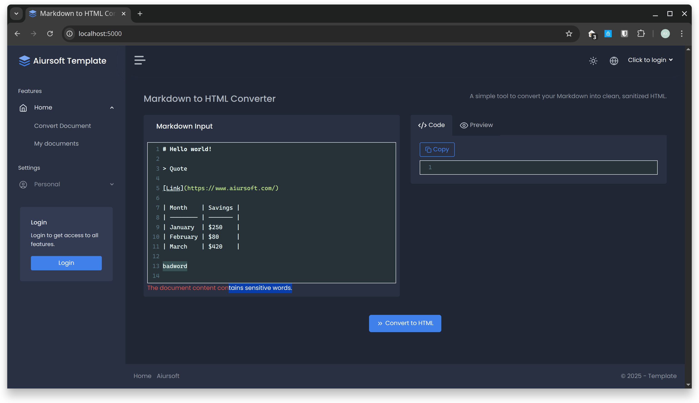

# Aiursoft Template Tutorial - Step 8 - 添加自定义验证



在前面的步骤中，我们已经广泛地使用了 ASP.NET Core 内置的验证特性，如 `[Required]` 和 `[MaxLength]`，来确保用户输入数据的基本有效性。这些特性与 `ModelState` 紧密集成，极大地简化了数据验证流程。

然而，在实际开发中，我们常常会遇到更复杂的验证需求，内置的特性无法满足。例如，我们可能需要：

* 验证用户输入的文档标题和内容是否包含不当言论或敏感词。
* 验证用户名是否在系统中已经存在。
* 验证用户输入的日期范围是否合乎逻辑。

在这一章，我们将学习如何创建自定义的验证特性（Validation Attribute），并以一个**敏感词过滤器**为例，来为我们的应用添加更高级的验证逻辑。

## Step 8.1 - 创建敏感词过滤服务

一个好的设计实践是**将业务逻辑与验证规则本身分离**。直接将敏感词列表硬编码在验证特性中是不灵活且难以维护的。因此，我们首先创建一个专门的服务来处理敏感词的检测。

在 `./src/MyOrg.MarkToHtml/Services/` 目录下，创建一个新文件 `BadWordFilterService.cs`，并添加以下代码：

```csharp title="Services/BadWordFilterService.cs"
using Aiursoft.Scanner.Abstractions;

namespace MyOrg.MarkToHtml.Services;

public class BadWordFilterService : ISingletonDependency
{
    // In a real-world application, this list might come from a database or a configuration file.
    private readonly HashSet<string> _badWords = new(StringComparer.OrdinalIgnoreCase)
    {
        "badword",
        "sensitive"
    };

    public bool ContainsBadWord(string? text)
    {
        if (string.IsNullOrWhiteSpace(text))
        {
            return false;
        }

        return _badWords.Any(badWord => text.Contains(badWord, StringComparison.OrdinalIgnoreCase));
    }
}
```

在这个服务中，我们硬编码了一个包含几个示例敏感词的列表。在真实的生产环境中，这个列表可能来自配置文件、数据库或外部API。`ContainsBadWord` 方法负责检查传入的文本是否包含列表中的任何一个词。

我们实现了 `ISingletonDependency` 接口，这意味着 Aiursoft Scanner 会自动将其注册为**单例 (Singleton)** 服务。这很合适，因为敏感词列表在应用生命周期内是固定的，无需为每个请求都重新创建。

## Step 8.2 - 创建自定义验证特性

现在我们有了业务逻辑服务，接下来就可以创建自定义验证特性了。这个特性将使用我们刚刚创建的服务来执行验证。

首先，在项目根目录下创建一个新文件夹 `Attributes`。

然后，在 `./src/MyOrg.MarkToHtml/Attributes/` 目录下，创建一个新文件 `NoBadWordsAttribute.cs`，并添加以下代码：

```csharp title="Attributes/NoBadWordsAttribute.cs"
using System.ComponentModel.DataAnnotations;
using MyOrg.MarkToHtml.Services;

namespace MyOrg.MarkToHtml.Attributes;

[AttributeUsage(AttributeTargets.Property | AttributeTargets.Field | AttributeTargets.Parameter, AllowMultiple = false)]
public class NoBadWordsAttribute : ValidationAttribute
{
    protected override ValidationResult? IsValid(object? value, ValidationContext validationContext)
    {
        // Get the service from the dependency injection container.
        var badWordFilter = validationContext.GetService(typeof(BadWordFilterService)) as BadWordFilterService;

        if (badWordFilter == null)
        {
            // This should not happen if the service is registered correctly.
            throw new InvalidOperationException("BadWordFilterService is not registered.");
        }

        if (value is not string stringValue)
        {
            // This validator only applies to strings.
            return ValidationResult.Success;
        }

        if (badWordFilter.ContainsBadWord(stringValue))
        {
            // If a bad word is found, return a validation error.
            return new ValidationResult(ErrorMessage ?? $"The field {validationContext.DisplayName} contains inappropriate content.");
        }

        // If no bad words are found, the validation is successful.
        return ValidationResult.Success;
    }
}
```

!!! tip "理解 `ValidationAttribute`"

    `ValidationAttribute` 是所有验证特性的基类。通过继承它并重写 `IsValid` 方法，我们就可以定义自己的验证规则。

    我们选择重写 `IsValid(object? value, ValidationContext validationContext)` 这个重载版本，因为它更强大。`validationContext` 参数不仅提供了关于被验证属性的上下文信息（如属性名 `DisplayName`），还能让我们访问**依赖注入容器** (`validationContext.GetService`)，从而获取到像 `BadWordFilterService` 这样的服务实例。

这段代码的逻辑很清晰：

1.  从依赖注入容器中获取 `BadWordFilterService`。
2.  检查被验证的值是否为字符串。
3.  调用服务的 `ContainsBadWord` 方法进行检查。
4.  如果检测到敏感词，则返回一个 `ValidationResult` 实例，表示验证失败。否则，返回 `ValidationResult.Success` 表示验证通过。

## Step 8.3 - 在 ViewModel 中应用新特性

现在我们已经创建了自定义验证特性，可以像使用 `[Required]` 一样，将它应用到我们的 ViewModel 中了。

打开 `./src/MyOrg.MarkToHtml/Models/HomeViewModels/IndexViewModel.cs` 文件，为 `Title` 和 `InputMarkdown` 属性添加 `[NoBadWords]` 特性：

```csharp title="Models/HomeViewModels/IndexViewModel.cs"
using System.ComponentModel.DataAnnotations;
using Aiursoft.UiStack.Layout;
using MyOrg.MarkToHtml.Attributes; // Add this using directive

namespace MyOrg.MarkToHtml.Models.HomeViewModels;

public class IndexViewModel : UiStackLayoutViewModel
{
    // ... other properties ...

    [MaxLength(100)]
    [NoBadWords(ErrorMessage = "The document title contains sensitive words.")]
    public string? Title { get; set; }

    [Required(ErrorMessage = "Please input your markdown content!")]
    [NoBadWords(ErrorMessage = "The document content contains sensitive words.")]
    public string InputMarkdown { get; set; } = // ... default value ...

    // ... other properties ...
}
```

通过添加 `[NoBadWords]`，我们告诉 ASP.NET Core 在处理表单提交时，除了执行已有的验证外，还要执行我们自定义的敏感词验证。我们还为每个特性提供了自定义的错误消息。

## Step 8.4 - 测试自定义验证

一切准备就绪！现在我们可以来测试新的验证功能了。

1.  **重新编译并运行项目**。
2.  **登录**一个账户（例如 `admin` / `admin123`）。
3.  导航到**创建文档**页面 (`/Home/Index`) 或**编辑**一个已有的文档。
4.  在**标题**或**内容**输入框中，输入我们在 `BadWordFilterService` 中定义的敏感词之一，例如 "this is a badword"。
5.  点击“Convert and save”按钮提交表单。

你会发现页面刷新了，但在输入框下方出现了我们定义的错误消息：“The document content contains sensitive words.”。

这证明了我们的自定义验证逻辑已成功触发。在 `HomeController` 的 `Index` POST 方法中，`ModelState.IsValid` 因为我们的自定义验证失败而返回 `false`，从而阻止了后续的数据库保存操作，并将用户带回了带有错误提示的表单页面。

## 结语

恭喜你完成了第八步！你现在已经掌握了一项非常强大的技能：创建与业务逻辑紧密集成的自定义验证规则。

通过将验证逻辑封装在自定义的 `ValidationAttribute` 中，并利用依赖注入来调用后端服务，你可以实现几乎任何复杂的验证需求，同时保持代码的整洁、模块化和可维护性。最重要的是这样做可以避免在代码中散布大量难以维护的 `if` 语句，从而提升代码可读性和质量。

这个模式不仅限于敏感词过滤，还可以应用于验证数据唯一性、检查业务规则、调用第三方API验证等多种场景，极大地增强了应用的健壮性。
