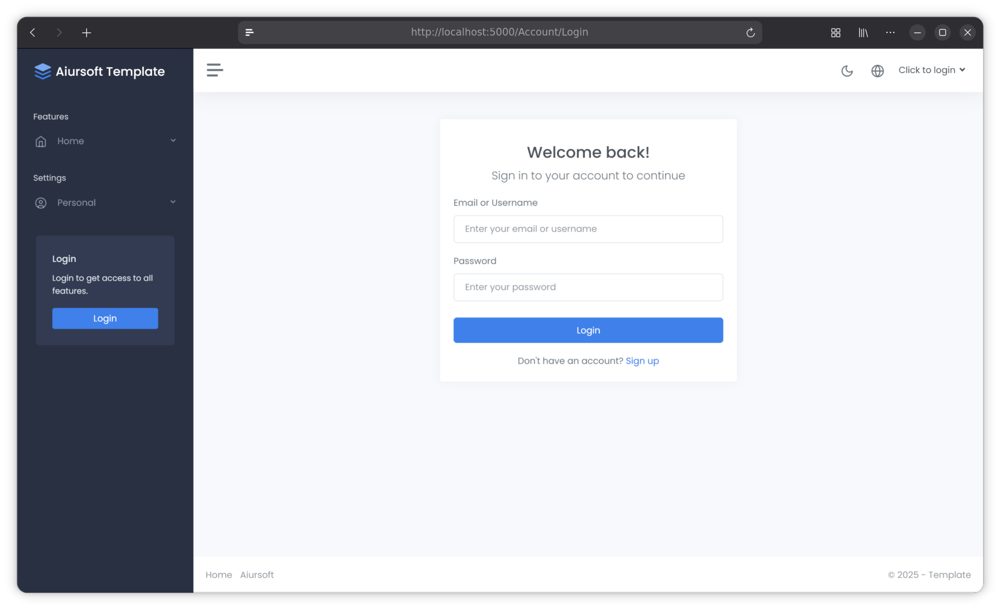

# Aiursoft Template Tutorial - Step 1 - Create New Project



## Step 1.1 Prepare Development Environment

The goal of this step is to create a brand new project. We recommend using [AnduinOS](https://www.anduinos.com) 1.3 or higher for hands-on development, as AnduinOS 1.3+ makes it very easy to install tools such as dotnet, bash, npm, git, docker, mysql, nginx, and more.

!!! tip "Aiursoft Template can run on almost all mainstream operating systems"

    If you don't want to use AnduinOS, you can also develop on any operating system that supports .NET 10.0, such as Windows, macOS, or other Linux distributions.

Before you begin, make sure you have installed `git`, `.NET 10.0 SDK`, and `docker`. On AnduinOS, you can use the following command to install these tools:

```bash title="在 AnduinOS 上安装必要的工具"
sudo apt install -y git dotnet docker.io
```

.NET 10 SDK must be installed.

```bash title="在 AnduinOS 上安装 .NET 10"
sudo apt update
sudo apt install dotnet10 -y
```

After installing the .NET 10 SDK, you can use the following command to install EF Core tools:

```bash title="安装 EF Core 工具"
dotnet tool install --global dotnet-ef
```

After installing git, you must configure your username and email:

```bash title="配置 git 用户名和邮箱"
git config --global user.name "Your Name"
git config --global user.email "YourEmail@domain.com"
```

You will need to install Node.js and npm to manage frontend dependencies. You can install them using the following command:

```bash title="在 AnduinOS 上安装 Node.js 和 npm"
curl -fsSL https://deb.nodesource.com/gpgkey/nodesource-repo.gpg.key | sudo gpg --dearmor -o /etc/apt/keyrings/nodesource.gpg --yes
NODE_MAJOR=24
echo "deb [signed-by=/etc/apt/keyrings/nodesource.gpg] https://deb.nodesource.com/node_$NODE_MAJOR.x nodistro main" | sudo tee /etc/apt/sources.list.d/nodesource.list
sudo apt update
sudo apt install nodejs -y
node -v
```

You will need a code editor. We recommend using [Visual Studio Code](https://code.visualstudio.com/) or [Jetbrains Rider](https://docs.anduinos.com/Applications/Code-Editors/Jetbrains-Rider/Jetbrains-Rider.html). You can also install Visual Studio Code using the following command:

```bash title="在 AnduinOS 上安装 Visual Studio Code"
cd ~
wget -qO- https://packages.microsoft.com/keys/microsoft.asc | gpg --dearmor > packages.microsoft.gpg
sudo install -D -o root -g root -m 644 packages.microsoft.gpg /etc/apt/keyrings/packages.microsoft.gpg
sudo sh -c 'echo "deb [arch=amd64,arm64,armhf signed-by=/etc/apt/keyrings/packages.microsoft.gpg] https://packages.microsoft.com/repos/code stable main" > /etc/apt/sources.list.d/vscode.list'
rm -f packages.microsoft.gpg
sudo apt update
sudo apt install code -y
```

After installation, you can launch Visual Studio Code by running the `code` command.

To create a new Aiursoft Template project, you need to install Voyager, the scaffolding tool for Aiursoft Template. You can install it using the following command:

```bash title="安装 Voyager"
dotnet tool install --global Aiursoft.Voyager
voyager --version
```

If you receive a prompt that the `voyager` command is not found, make sure your `~/.dotnet/tools` directory is in your `PATH` environment variable. You can use this command to temporarily resolve it:

```bash
~/.dotnet/tools/voyager --version
```

If the above process went smoothly, you should now have all the necessary tools installed and be ready to start creating your first Aiursoft Template project!

## Step 1.2 Create a New Project

!!! note "Always start from this step when creating a new project."

    This is the standard procedure for creating a new project. Whenever you want to create a new Aiursoft Template project, always start from this step.

We recommend using a unique namespace to avoid conflicts with other projects. Typically, we suggest using a format like `MyOrg.MyProject`, where `MyOrg` is your organization or company name, and `MyProject` is your project name.

Here, our template is for creating an application that converts markdown to HTML, so we'll name it `MyOrg.MarkToHtml`.

First, create a new folder to store your project:

```bash title="创建项目文件夹"
mkdir MyOrg.MarkToHtml
cd MyOrg.MarkToHtml
```

Then use voyager to initialize the project:

```bash title="使用 Voyager 创建新项目"
~/.dotnet/tools/voyager new -t web-app-all-in-one
```

!!! warning "Make sure the directory name where you run Voyager is the project name you want every time you create a project"

    For example, if you want to create a project named `MyOrg.MarkToHtml`, make sure you run the `voyager new` command in a folder named `MyOrg.MarkToHtml`. Voyager will default to using the current directory name as the project name.

You will notice the following files are generated:

```bash title="项目文件结构"
.
├── CODE_OF_CONDUCT.md
├── Dockerfile
├── .editorconfig
├── .git
├── .gitignore
├── .gitlab-ci.yml
├── install.sh
├── LICENSE
├── MyOrg.MarkToHtml.sln
├── ninja.yaml
├── nuget.config
├── README.md
├── src
│   ├── MyOrg.MarkToHtml
│   ├── MyOrg.MarkToHtml.Entities
│   ├── MyOrg.MarkToHtml.InMemory
│   ├── MyOrg.MarkToHtml.MySql
│   └── MyOrg.MarkToHtml.Sqlite
└── tests
    ├── IntegrationTests
    └── MyOrg.MarkToHtml.Tests.csproj

15 directories, 17 files
```

Not all files here may be useful to you. Below is a brief description of each file:

| File/Folder          | Description                                                                                      |
| --------------------- | ------------------------------------------------------------------------------------------------ |
| `CODE_OF_CONDUCT.md`  | Code of Conduct, this is just an example. You can safely delete it without affecting the project. |
| `Dockerfile`          | Configuration file for running the application in a Docker container. It defines how to build and run the application environment in Docker. |
| `.editorconfig`       | Code style configuration file, helps you and your team maintain consistent code style. You can modify or delete it as needed. |
| `.git`                | Git version control metadata folder. Automatically generated when creating a new project, and also helps generate an initial commit. |
| `.gitignore`          | List of files to be ignored by Git, specifying which files or folders should not be tracked by Git. Do not delete it. |
| `.gitlab-ci.yml`      | GitLab CI/CD configuration file. If you are not using GitLab for continuous integration and deployment, you can delete it. |
| `install.sh`          | A simple quick deployment script to help you quickly deploy the project on a server without Docker. You can modify or delete it as needed. |
| `LICENSE`             | License file, specifying the terms of use and distribution of the project. You can modify or delete it as needed. |
| `MyOrg.MarkToHtml.sln`| This is a Visual Studio solution file, containing all subprojects within the project. Do not delete it. |
| `ninja.yaml`          | Configuration file for nuget ninja. If you are not using nuget ninja, you can delete it. |
| `README.md`           | Project README file, containing basic information and usage instructions for the project. You can modify it as needed. |
| `nuget.config`        | NuGet package manager configuration file. If you do not need custom package sources, you can delete it. |
| `src/`                | This folder contains the project's source code. You can add or remove subprojects as needed. |
| `tests/`              | This folder contains the project's test code. You can add or remove test projects as needed. |

Next, you can open the `MyOrg.MarkToHtml.sln` solution file using Visual Studio Code or Jetbrains Rider and start writing code!

## Step 1.3 Run the Project

Before you start writing code, it's recommended that you compile and run the project to ensure everything is working properly.

First, restore the frontend dependencies. You can use the following command to install the frontend dependencies:

```bash title="安装前端依赖"
cd ./src/MyOrg.MarkToHtml/wwwroot/
npm install
```

You can use the following command to compile the project:

```bash title="编译项目"
dotnet build ./MyOrg.MarkToHtml.sln
```

If the compilation is successful, you can run the project using the following command:

```bash title="运行项目"
cd ./src/MyOrg.MarkToHtml/
dotnet run
```

By default, the application runs on `http://localhost:5000`. Now, you can open your browser to access this address and check whether the application is working properly. Normally, you will see a welcome page.

You can log in using the default account. The default account information is as follows:

* Username: `admin`
* Password: `admin123`

## Step 1.4 Configure the database used by the project (Optional)

!!! tip "This step is completely optional"

    This step is completely optional. If you want to use the default configuration—using the simplest SQLite database—you can skip this step.

By default, the application uses SQLite as the database. This is configured in the `appsettings.json` file. If you want to use a different database (such as MySQL or SQL Server), you need to modify the connection string in the `appsettings.json` file. By default, the database will be automatically created and seeded on the first startup, and you will notice that the `app.db` file is created under the `src/MyOrg.MarkToHtml/` directory.

We recommend using [DbBrowser for SQLite](https://flathub.org/en/apps/org.sqlitebrowser.sqlitebrowser) to view and manage the SQLite database, i.e., the `app.db` file. Deleting this file will reset the application's data to its initial state.

## Step 1.5 Configure the file storage used by the project (Optional)

By default, the application uses `/tmp/data` as the backend storage path in the file system. In Docker, the default storage path is `/data`.

You can modify this path in the `appsettings.json` file. By default, this directory may contain the default profile pictures.

Deleting this folder will reset the application's file storage to its initial state.

## Conclusion

Congratulations on completing the first step! You have now set up the development environment, initialized the git repository, successfully run a basic Aiursoft Template project, and understood its file structure, SQLite database, and file storage.

Next, we will continue developing this project and add more features.
