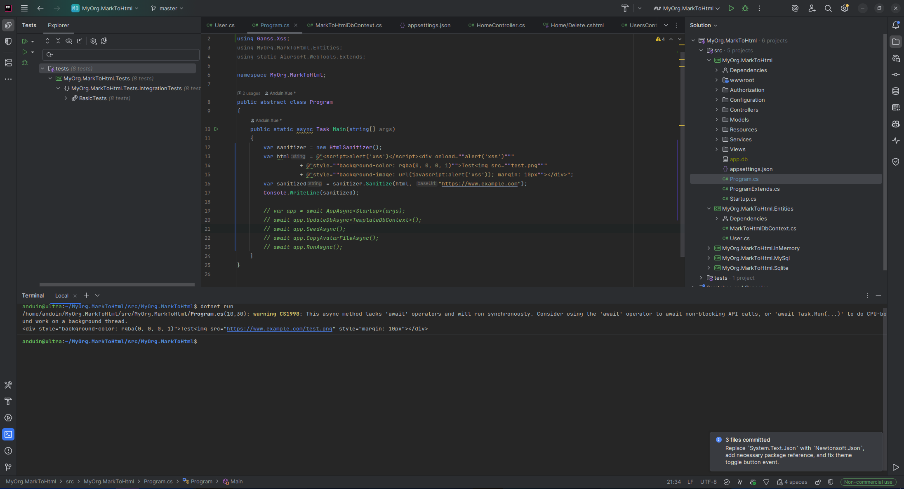

# Aiursoft Template Tutorial - Step 2 - Add and Debug Third-Party Libraries



## Step 2.1 Add Third-Party Library

Obviously, our original task is to create an application that converts markdown to HTML. For this purpose, we need a library capable of converting markdown to HTML.

In this tutorial, we choose [Markdig](https://github.com/xoofx/markdig). It is a powerful and easy-to-use markdown parser.

To install Markdig, we need to use the NuGet package manager. You can use the following command to install it:

```bash title="安装 Markdig"
cd ./src/MyOrg.MarkToHtml/
dotnet add package Markdig
```

Next, we'll install an additional library that prevents the generated HTML from being vulnerable to XSS attacks, called [HtmlSanitizer](https://github.com/mganss/HtmlSanitizer). You can install it using the following command:

```bash title="安装 HtmlSanitizer"
# cd ./src/MyOrg.MarkToHtml/
dotnet add package HtmlSanitizer
```

You will notice that after the above command is executed, references to Markdig and HtmlSanitizer have been added to the `MyOrg.MarkToHtml.csproj` file, which might look like this:

```xml title="MyOrg.MarkToHtml.csproj"
<ItemGroup>
    <PackageReference Include="HtmlSanitizer" Version="9.0.886" />
    <PackageReference Include="Markdig" Version="0.42.0" />
</ItemGroup>
```

## Step 2.2 Test the functionality of third-party libraries (optional)

!!! tip "This step is entirely optional"

    This step is entirely optional and is intended to demonstrate how to debug third-party libraries. If you trust that Markdig will work properly, you can skip this step.

Next, we need to first test whether Markdig and HtmlSanitizer can function correctly. To do this, directly modify the `./src/MyOrg.MarkToHtml/Program.cs` file, temporarily comment out the original content in the `Main` method, and temporarily add the following code for testing Markdig:

```csharp title="测试 Markdig，Program.cs"
using Aiursoft.DbTools;
using MyOrg.MarkToHtml.Entities;
using static Aiursoft.WebTools.Extends;
using Markdig;

namespace MyOrg.MarkToHtml;

public abstract class Program
{
    public static async Task Main(string[] args)
    {
        var testMarkDown = """
                           # Hello World

                           This is a sample markdown text.

                           > This is a blockquote.
                           """;
        var pipeline = new MarkdownPipelineBuilder().UseAdvancedExtensions().Build();
        var html = Markdown.ToHtml(testMarkDown, pipeline);
        Console.WriteLine(html);

        // var app = await AppAsync<Startup>(args);
        // await app.UpdateDbAsync<TemplateDbContext>();
        // await app.SeedAsync();
        // await app.CopyAvatarFileAsync();
        // await app.RunAsync();
    }
}
```

Next, we can run the project again to test whether Markdig works properly:

```bash
# cd ./src/MyOrg.MarkToHtml/
dotnet run
```

You might see output similar to the following:

```html title="Markdig 输出"
<h1 id="hello-world">Hello World</h1>
<p>This is a sample markdown text.</p>
<blockquote>
<p>This is a blockquote.</p>
</blockquote>
```

This proves that Markdig can successfully convert markdown to HTML. Next, we continue testing HtmlSanitizer.

We can modify the test code in the `Program.cs` file to include the use of HtmlSanitizer:

```csharp title="测试 HtmlSanitizer，Program.cs"
using Aiursoft.DbTools;
using Ganss.Xss;
using MyOrg.MarkToHtml.Entities;
using static Aiursoft.WebTools.Extends;

namespace MyOrg.MarkToHtml;

public abstract class Program
{
    public static async Task Main(string[] args)
    {
        var sanitizer = new HtmlSanitizer();
        var html = @"<script>alert('xss')</script><div onload=""alert('xss')"""
                   + @"style=""background-color: rgba(0, 0, 0, 1)"">Test</div>";
        var sanitized = sanitizer.Sanitize(html, "https://www.example.com");
        Console.WriteLine(sanitized);

        // var app = await AppAsync<Startup>(args);
        // await app.UpdateDbAsync<TemplateDbContext>();
        // await app.SeedAsync();
        // await app.CopyAvatarFileAsync();
        // await app.RunAsync();
    }
}
```

This time, the expected output will be:

```html title="HtmlSanitizer 输出"
<div style="background-color: rgba(0, 0, 0, 1)">Test</div>
```

It can be noticed that all potential XSS attack vectors have been removed. This demonstrates that HtmlSanitizer successfully cleans HTML.

## Step 2.3 Restore the Program.cs file

Now that our testing is complete, revert the changes made to the Program.cs file and restore the original content:

```csharp title="恢复 Program.cs"
using Aiursoft.DbTools;
using MyOrg.MarkToHtml.Entities;
using static Aiursoft.WebTools.Extends;

namespace MyOrg.MarkToHtml;

public abstract class Program
{
    public static async Task Main(string[] args)
    {
        var app = await AppAsync<Startup>(args);
        await app.UpdateDbAsync<TemplateDbContext>();
        await app.SeedAsync();
        await app.CopyAvatarFileAsync();
        await app.RunAsync();
    }
}
```

## Step 2.4 Install the frontend code editor

Considering we need to provide users with the ability to edit Markdown and preview HTML on the frontend page, we need a powerful frontend code editor. We choose [CodeMirror 5](https://codemirror.net/) as our frontend code editor.

To install CodeMirror 5, we need to use the npm package manager. You can use the following command to install it:

```bash title="安装 CodeMirror 5"
cd ./src/MyOrg.MarkToHtml/wwwroot/
npm install codemirror@5 --save
```

You will notice that after the above command is executed, a reference to CodeMirror has been added to the `./src/MyOrg.MarkToHtml/wwwroot/package.json` file, which might look something like this:

```json title="package.json"
{
  "name": "wwwroot",
  "version": "1.0.0",
  "description": "This is a server side application. This package is used to host the static files.",
  "author": "Anduin Xue",
  "license": "MIT",
  "dependencies": {
    "@aiursoft/uistack": "^1.0.8",
    "codemirror": "^5.65.20",
    "dropify": "^0.2.2"
  }
}
```

## Conclusion

Congratulations on completing Step 2! You have now successfully added and tested the third-party libraries Markdig, HtmlSanitizer, and CodeMirror. By properly utilizing Nuget, npm, and GitHub, you can easily integrate the work of others into your project and quickly expand your project's functionality.
