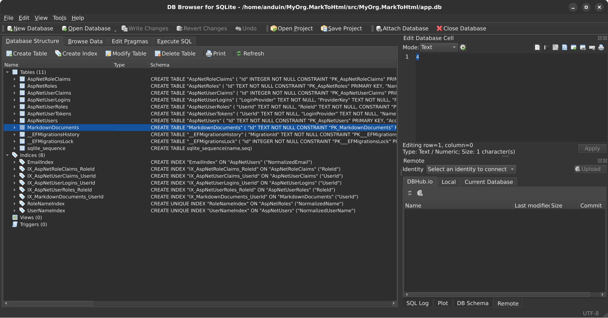

# Aiursoft Template Tutorial - Step 4 - Add a New Data Model and Modify the Database Schema



We can extend the previous example to allow users to save their Markdown documents and later re-edit or even share them. To achieve this, we need to add a new data model and modify the database schema.

Before changing the database schema, we first need to understand the database ORM tool used by Aiursoft Template: [Entity Framework Core (EF Core)](https://learn.microsoft.com/en-us/ef/core/).

## Step 4.1 Understand Entity Framework Core (Optional)

If you are very familiar with Entity Framework Core, you can skip this step.

!!! abstract "What is Entity Framework Core?"

    Entity Framework Core (EF Core) is a powerful object-relational mapping (ORM) tool that allows you to work with databases using .NET objects without having to write SQL statements directly. It supports multiple databases, including SQLite, MySQL, SQL Server, PostgreSQL, and more.

For example, its syntax is similar to:

```csharp title="EF Core 查询示例"
var books = await dbContext.Books
    .Where(b => b.Author == "Anduin Xue")
    .OrderBy(b => b.PublishedDate)
    .Skip(10)
    .Take(10)
    .ToListAsync();
```

This will query the books with the author "Anduin Xue" from the `Books` table, sort them by publication date, skip the first 10 records, take the next 10 records, and convert the result into a list. Its SQL might look like:

```sql title="对应的 SQL 查询"
SELECT * FROM Books
WHERE Author = 'Anduin Xue'
ORDER BY PublishedDate
LIMIT 10 OFFSET 10;
```

However, considering that we might modify the structure of some entity classes—such as adding new properties, removing old ones, or changing property types—it is necessary to keep the database structure synchronized with the entity classes. To achieve this, we need to use EF Core's migration (Migration) feature.

In this example, we will create a new table called `MarkdownDocuments` to store users' markdown documents. However, this table does not currently exist in the real database. Therefore, we need to create a migration to instruct EF Core how to create this table. A migration contains information about changes to the database schema. When the application starts, it automatically compares the version of the database table structure with the latest migration version and runs any necessary migrations automatically. This ensures that the database structure remains synchronized with the entity classes.

!!! warning "Do not forget to create a migration after modifying entity classes!"

    If you forget to create a migration or if the migration fails to run, the application will still run, but the executed SQL may not correctly perform the intended operations in the database, potentially leading to runtime exceptions. Therefore, you should always create a new migration whenever you modify an entity class.

## Step 4.2 Create a New Data Model

Next, we will use Entity Framework Core to create a new data model class called `MarkdownDocument`, which will be used to store users' markdown documents. This data model will be stored in the table `MarkdownDocuments`.

To create this data model, directly modify the `./src/MyOrg.MarkToHtml.Entities/User.cs` file:

Add the necessary using statements:

```csharp title="添加 using 语句，User.cs"
using System.ComponentModel.DataAnnotations.Schema;
using System.Diagnostics.CodeAnalysis;
using Newtonsoft.Json;
```

Add a new class `MarkdownDocuments` to represent all markdown documents owned by the user.

```csharp title="添加 MarkdownDocument 类，User.cs"
public class User : IdentityUser
{
    // ... Existing properties ...
}

// New entity for storing markdown documents
public class MarkdownDocument
{
    [Key]
    public Guid Id { get; set; }

    [MaxLength(100)]
    public string? Title { get; set; }

    [MaxLength(65535)]
    public string? Content { get; set; }

    public DateTime CreationTime { get; init; } = DateTime.UtcNow;

    [StringLength(64)]
    public required string UserId { get; set; }

    [ForeignKey(nameof(UserId))]
    [NotNull]
    public User? User { get; set; }
}
```

In the above example, our class `MarkdownDocument` contains the following properties:

* `Id`: The unique identifier of the document, using the GUID type.
* `Title`: The title of the document, up to 100 characters.
* `Content`: The content of the document, up to 65,535 characters.
* `CreationTime`: The creation time of the document, using UTC time.
* `UserId`: The ID of the user who owns the document, using string type, with a length of 64 characters.
* `User`: Navigation property indicating the user to whom the document belongs. Here, `UserId` is the foreign key, referencing the primary key of the `User` entity.

!!! info "Relational Database Relationships"

    Tables in relational databases are typically associated through foreign keys. In the example above, the `MarkdownDocument` entity establishes a one-to-many relationship with the `User` entity via the `UserId` property. That is, one user can own multiple documents, while each document can belong to only one user.

We use several `Attributes` here, such as `[Key]`, `[MaxLength]`, `[StringLength]`, `[ForeignKey]`, and so on. These `Attributes` inform Entity Framework Core how to map this class to a database table. Meanwhile, `[NotNull]` and `[JsonIgnore]` are used to prevent circular reference issues when attempting JSON serialization in the Controller.

Additionally, we modify the User class above to add the following property:

```csharp title="为 User 类添加 CreatedDocuments 属性"
[JsonIgnore]
[InverseProperty(nameof(MarkdownDocument.User))]
public IEnumerable<MarkdownDocument> CreatedDocuments { get; set; } = new List<MarkdownDocument>();
```

In the end, this file might look like this:

```csharp title="完整的 User.cs"
using System.ComponentModel.DataAnnotations;
using System.ComponentModel.DataAnnotations.Schema;
using System.Diagnostics.CodeAnalysis;
using Newtonsoft.Json;
using Microsoft.AspNetCore.Identity;

namespace MyOrg.MarkToHtml.Entities;

public class User : IdentityUser
{
    public const string DefaultAvatarPath = "Workspace/avatar/default-avatar.jpg";

    [MaxLength(30)]
    [MinLength(2)]
    public required string DisplayName { get; set; }

    [MaxLength(150)]
    [MinLength(2)]
    public string AvatarRelativePath { get; set; } = DefaultAvatarPath;

    public DateTime CreationTime { get; init; } = DateTime.UtcNow;

    [JsonIgnore]
    [InverseProperty(nameof(MarkdownDocument.User))]
    public IEnumerable<MarkdownDocument> CreatedDocuments { get; set; } = new List<MarkdownDocument>();
}

public class MarkdownDocument
{
    [Key]
    public Guid Id { get; set; }

    [MaxLength(100)]
    public string? Title { get; set; }

    [MaxLength(65535)]
    public string? Content { get; set; }

    public DateTime CreationTime { get; init; } = DateTime.UtcNow;

    [StringLength(64)]
    public required string UserId { get; set; }

    [ForeignKey(nameof(UserId))]
    [NotNull]
    public User? User { get; set; }
}
```

Thus, we have completed the creation of the data model.

Finally, to clearly indicate that we need a new table, edit the file `./src/MyOrg.MarkToHtml.Entities/MarkToHtmlDbContext.cs` and add the following property to `TemplateDbContext`:

```csharp title="为 TemplateDbContext 添加 DbSet 属性"
public DbSet<MarkdownDocument> MarkdownDocuments => Set<MarkdownDocument>();
```

When we use `TemplateDbContext` as the database context class, Entity Framework Core automatically recognizes the `MarkdownDocuments` property and maps it to the `MarkdownDocuments` table in the database. This allows us to perform CRUD operations by working with `dbContext.MarkdownDocuments`, which will automatically translate into the corresponding SQL statements.

The final file might look like this:

```csharp title="完整的 MarkToHtmlDbContext.cs"
using Aiursoft.DbTools;
using Microsoft.AspNetCore.Identity.EntityFrameworkCore;
using Microsoft.EntityFrameworkCore;

namespace MyOrg.MarkToHtml.Entities;

public abstract class TemplateDbContext(DbContextOptions options) : IdentityDbContext<User>(options), ICanMigrate
{
    public virtual  Task MigrateAsync(CancellationToken cancellationToken) =>
        Database.MigrateAsync(cancellationToken);

    public virtual  Task<bool> CanConnectAsync() =>
        Database.CanConnectAsync();

    public DbSet<MarkdownDocument> MarkdownDocuments => Set<MarkdownDocument>();
}
```

Thus, we have completed the creation of the data model. However, the table does not yet exist in the database itself. Therefore, running the program directly now would result in an error. We need to create a migration to tell EF Core how to create this table.

## Step 4.3 Create Migration and Update Database

Aiursoft Template supports multiple databases, including SQLite, MySQL, InMemory, and more. Users can also extend support to other databases, such as `PostgreSQL`, `SQL Server`, etc. Here, we will create migrations only for the default SQLite and MySQL. The InMemory database does not require migrations because it is temporary and recreated every time the application starts.

!!! tip "Migration is a noun; it does not mean immediate database changes"

    A Migration is a noun that represents changes to the database schema. We create a migration to inform EF Core how to alter the database structure. When the application starts, it automatically compares the version of the database schema with the latest migration version and runs any missing migrations automatically. This ensures the database schema stays synchronized with the entity classes.

To create a migration, we need to use the Entity Framework Core command-line tool `dotnet ef`. If you haven't installed it yet, you can use the following command to install:

```bash title="安装 dotnet ef 工具"
dotnet tool install --global dotnet-ef
```

### Step 4.3.1 Create Migration for SQLite

Next, we need to create migrations for both SQLite and MySQL. When creating a migration for SQLite, ensure that `ConnectionStrings.DbType` in `./src/MyOrg.MarkToHtml/appsettings.json` is set to `Sqlite`, and that `DefaultConnection` points to a SQLite database file, for example:

```json title="修改 appsettings.json"
{
  "ConnectionStrings": {
    "AllowCache": "True",
    "DbType": "Sqlite",
    "DefaultConnection": "DataSource=app.db;Cache=Shared"
  },
  // ... other settings ...
}
```

Then, run the following command to create the migration:

```bash title="为 SQLite 创建迁移"
cd ./src/MyOrg.MarkToHtml.Sqlite/
dotnet ef migrations add AddMarkdownDocumentsTable --context "SqliteContext" -s ../MyOrg.MarkToHtml/MyOrg.MarkToHtml.csproj
```

!!! note "The above command will not change any database schema!"

    This command only creates a migration file that tells EF Core how to create the `MarkdownDocuments` table. It does not actually change the database schema. To actually apply the migration, the application will automatically apply all pending migrations when it starts.

You will notice output similar to:

```bash title="创建迁移的输出"
Done. To undo this action, use 'ef migrations remove'
```

At the same time, a new migration file will be generated under the `./src/MyOrg.MarkToHtml.Sqlite/Migrations/` directory, named something like `20231010123456_AddMarkdownDocumentsTable.cs`. Its content might look like:

```csharp title="生成的迁移文件"
using System;
using Microsoft.EntityFrameworkCore.Migrations;

#nullable disable

namespace MyOrg.MarkToHtml.Sqlite.Migrations
{
    /// <inheritdoc />
    public partial class AddMarkdownDocumentsTable : Migration
    {
        /// <inheritdoc />
        protected override void Up(MigrationBuilder migrationBuilder)
        {
            migrationBuilder.CreateTable(
                name: "MarkdownDocuments",
                columns: table => new
                {
                    Id = table.Column<Guid>(type: "TEXT", nullable: false),
                    Title = table.Column<string>(type: "TEXT", maxLength: 100, nullable: true),
                    Content = table.Column<string>(type: "TEXT", maxLength: 65535, nullable: true),
                    CreationTime = table.Column<DateTime>(type: "TEXT", nullable: false),
                    UserId = table.Column<string>(type: "TEXT", maxLength: 64, nullable: false)
                },
                constraints: table =>
                {
                    table.PrimaryKey("PK_MarkdownDocuments", x => x.Id);
                    table.ForeignKey(
                        name: "FK_MarkdownDocuments_AspNetUsers_UserId",
                        column: x => x.UserId,
                        principalTable: "AspNetUsers",
                        principalColumn: "Id",
                        onDelete: ReferentialAction.Cascade);
                });

            migrationBuilder.CreateIndex(
                name: "IX_MarkdownDocuments_UserId",
                table: "MarkdownDocuments",
                column: "UserId");
        }

        /// <inheritdoc />
        protected override void Down(MigrationBuilder migrationBuilder)
        {
            migrationBuilder.DropTable(
                name: "MarkdownDocuments");
        }
    }
}
```

We need to carefully Review the changes above. When this new migration runs, it will create a new table `MarkdownDocuments` and include all columns and constraints defined in our data model, including the foreign key constraints we defined. The `onDelete: ReferentialAction.Cascade` indicates that when a user is deleted, the associated documents will be automatically deleted as well. This is in line with our expectations.

!!! danger "Be sure to carefully Review the migration file to ensure it meets expectations"

    Migration files are auto-generated, but they may not always align with our expectations. For example, sometimes we rename a column, but EF Core might treat it as a new column, discarding the old column's data and creating a new empty column. This can be catastrophic for a production system.
    
    Therefore, after creating each migration, we should carefully Review the generated migration file to ensure it meets our expectations. If any issues are found, we can manually modify the model file or the migration file, or delete the migration and recreate it.

The `Down` method is used to roll back the migration, which means dropping the `MarkdownDocuments` table. This is as expected, so we can proceed.

### Step 4.3.2 Create Migration for MySQL

Next, we need to create a migration for MySQL. When creating a migration for MySQL, ensure that `./src/MyOrg.MarkToHtml.MySQL/appsettings.json` has `ConnectionStrings.DbType` set to `MySQL`, and that `DefaultConnection` points to a MySQL database. The file can be modified to start like this:

```json title="修改 MySQL 的 appsettings.json"
{
  "ConnectionStrings": {
    "AllowCache": "True",
    "DbType": "MySql",
    "DefaultConnection": "Server=localhost;Database=template;Uid=template;Pwd=template_password;"
  },
  // ... other settings ...
}
```

Next, to create a migration, we must start a real MySQL. We can use Docker to quickly start a MySQL instance:

```bash title="使用 Docker 启动 MySQL"
sudo docker run -d --name db -e MYSQL_RANDOM_ROOT_PASSWORD=true -e MYSQL_DATABASE=template -e MYSQL_USER=template -e MYSQL_PASSWORD=template_password -p 3306:3306 mysql
```

!!! info "Creating a migration requires a connection to the database"

    Although creating a migration does not alter the database schema, it requires a connection to the database so that EF Core can read the database's metadata and generate the correct migration code. Therefore, ensure your MySQL instance is running and that the connection string is accurate.

This meets our application's connection string requirements. At this point, we can use the following command to create a migration:

```bash title="为 MySQL 创建迁移"
cd ./src/MyOrg.MarkToHtml.MySql/ # 务必确保你在这个目录下
dotnet ef migrations add AddMarkdownDocumentsTable --context "MySqlContext" -s ../MyOrg.MarkToHtml/MyOrg.MarkToHtml.csproj
```

Similarly, a new migration file will be generated under the `./src/MyOrg.MarkToHtml.MySQL/Migrations/` directory, named something like `20231010123456_AddMarkdownDocumentsTable.cs`. Carefully review its content to ensure it meets your expectations, then proceed.

### Step 4.3.3 Cleanup: Remove Database, Rollback appsettings.json (Optional)

Note: If you encounter errors when creating the migration, such as being unable to connect to the database or missing certain types, it may be because your MySQL server is not running properly, or you forgot to update the connection string in the `appsettings.json` file. Make sure your MySQL server is running and the connection string is correct.

!!! note "If you plan to continue using MySQL for debugging, you can skip this step"

    After completing the previous steps, you might want to continue using MySQL for debugging. In this case, you can skip the cleanup steps below and directly run the application.

Note: After creating the MySQL migration, if you no longer need this MySQL instance, you can stop and remove it using the following command:

```bash title="停止并删除 MySQL 容器"
sudo docker stop db
sudo docker rm db
```

Meanwhile, for easier local debugging, it is recommended to revert the `ConnectionStrings.DbType` setting in the `appsettings.json` file back to `Sqlite`, and set `DefaultConnection` to point to a SQLite database file, for example:

```json title="回滚 appsettings.json"
{
  "ConnectionStrings": {
    "AllowCache": "True",
    "DbType": "Sqlite",
    "DefaultConnection": "DataSource=app.db;Cache=Shared"
  },
  // ... other settings ...
}
```

Every time you modify any entity class, you should repeat the steps in 4.3.1 and 4.3.2 to create new migrations. If you support additional databases, you should also create migrations for them.

!!! warning "After resetting the database or deleting users from the database, you must log out all currently logged-in users!"

    If you reset the database or delete users from the database, be sure to log out the currently logged-in user. Aiursoft Template's authentication issues a signed Token in the Cookie. If a user is deleted—such as when switching databases or resetting the database—the Token remains valid, but the user no longer exists. In this case, the user needs to log in again to obtain a new Token. Otherwise, exceptions will occur when accessing data.

    You can use the following technique to revoke the login status of all users and force them to re-login. Delete:

    * Local debugging: `~/.aspnet/DataProtection-Keys` directory
    * Docker environment: `/data/aspnet/DataProtection-Keys` directory

## Step 4.4 Run the application and verify database auto-migration (optional)

!!! tip "This step is optional"

    This step is optional. In production environments, migrations run automatically when the application starts.

Now that we have created the migrations, we need to run the application so it can automatically apply these migrations and update the database schema.

Before proceeding, you can first read the `./src/MyOrg.MarkToHtml/Startup.cs` file to understand how the application is configured to use the database. Locate the following code and do not modify it:

```csharp title="Startup.cs 中的关键数据库配置代码"
var (connectionString, dbType, allowCache) = configuration.GetDbSettings();
services.AddSwitchableRelationalDatabase(
    dbType: EntryExtends.IsInUnitTests() ? "InMemory": dbType,
    connectionString: connectionString,
    supportedDbs:
    [
        new MySqlSupportedDb(allowCache: allowCache, splitQuery: false),
        new SqliteSupportedDb(allowCache: allowCache, splitQuery: true),
        new InMemorySupportedDb()
    ]);
```

The code above is the core code for configuring the database support for this application. It selects which database to use based on the `ConnectionStrings.DbType` in the configuration file, and connects to the database using the `ConnectionStrings.DefaultConnection`.

The `allowCache` setting indicates whether to allow caching the query results of the database in memory to improve performance. For a single instance, this value should typically be set to `True` to achieve significant performance improvements. However, for deployments with multiple instances, this value should be set to `False` to avoid issues with cache inconsistency.

We also notice that in the unit test environment, the database type is forcibly set to `InMemory` to avoid dependencies on a real database.

Next, we directly run the application using the command line:

```bash
cd ./src/MyOrg.MarkToHtml/
dotnet run
```

During this run, you will notice the following output (note: it only appears on the first run):

```bash title="程序输出"
info: Microsoft.EntityFrameworkCore.Database.Command[20101]
      Executed DbCommand (1ms) [Parameters=[], CommandType='Text', CommandTimeout='30']
      SELECT "MigrationId", "ProductVersion"
      FROM "__EFMigrationsHistory"
      ORDER BY "MigrationId";
info: Microsoft.EntityFrameworkCore.Migrations[20402]
      Applying migration '20250924144553_AddMarkdownDocumentsTable'.
info: Microsoft.EntityFrameworkCore.Database.Command[20101]
      Executed DbCommand (0ms) [Parameters=[], CommandType='Text', CommandTimeout='30']
      CREATE TABLE "MarkdownDocuments" (
          "Id" TEXT NOT NULL CONSTRAINT "PK_MarkdownDocuments" PRIMARY KEY,
          "Title" TEXT NULL,
          "Content" TEXT NULL,
          "CreationTime" TEXT NOT NULL,
          "UserId" TEXT NOT NULL,
          CONSTRAINT "FK_MarkdownDocuments_AspNetUsers_UserId" FOREIGN KEY ("UserId") REFERENCES "AspNetUsers" ("Id") ON DELETE CASCADE
      );
info: Microsoft.EntityFrameworkCore.Database.Command[20101]
      Executed DbCommand (0ms) [Parameters=[], CommandType='Text', CommandTimeout='30']
      CREATE INDEX "IX_MarkdownDocuments_UserId" ON "MarkdownDocuments" ("UserId");
info: Microsoft.EntityFrameworkCore.Database.Command[20101]
      Executed DbCommand (0ms) [Parameters=[], CommandType='Text', CommandTimeout='30']
      INSERT INTO "__EFMigrationsHistory" ("MigrationId", "ProductVersion")
      VALUES ('20250924144553_AddMarkdownDocumentsTable', '9.0.9');
info: Microsoft.EntityFrameworkCore.Database.Command[20101]
      Executed DbCommand (5ms) [Parameters=[], CommandType='Text', CommandTimeout='30']
      DELETE FROM "__EFMigrationsLock";
info: MyOrg.MarkToHtml.Entities.TemplateDbContext[0]
      Migrated database associated with context TemplateDbContext
```

As you can see, the application automatically detected that the database schema is inconsistent with the latest migration version, so it automatically applied the migration we just created, creating the `MarkdownDocuments` table. It will start directly on subsequent runs without reapplying the migration.

## Conclusion

Congratulations on completing Step 4! You have now successfully added a new data model and modified the database schema. By properly using Entity Framework Core's migration feature, you can easily manage changes to the database schema without worrying about writing SQL statements manually or dealing with inconsistencies between the database schema and entity classes. You can even switch flexibly between different databases without repeatedly recompiling the application.
