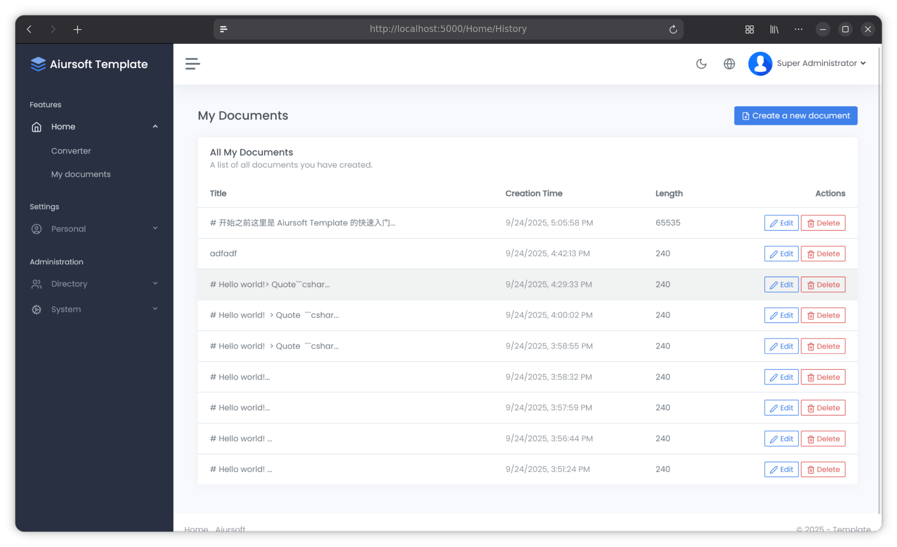

# Aiursoft Template Tutorial - Step 5 - Save Data to Database



Next, we will continue expanding the previous example to allow users to save their markdown documents and later re-edit or even share them. To achieve this, we need to modify the controller and views so that users can create, view, edit, and delete their documents.

## Step 5.1 Save and Update User Documents

First, we need to modify the `./src/MyOrg.MarkToHtml/Controllers/HomeController.cs` file and add the necessary using statements:

```csharp title="HomeController.cs 的 using 语句"
using System.ComponentModel.DataAnnotations;
using Aiursoft.CSTools.Tools;
using MyOrg.MarkToHtml.Models.HomeViewModels;
using MyOrg.MarkToHtml.Services;
using Aiursoft.UiStack.Navigation;
using Microsoft.AspNetCore.Authorization;
using Microsoft.AspNetCore.Identity;
using Microsoft.AspNetCore.Mvc;
using Microsoft.EntityFrameworkCore;
using MyOrg.MarkToHtml.Entities;
```

Then we adjust its constructor to support logging, database, and user manager:

```csharp title="HomeController.cs 的构造方法"
public class HomeController(
    ILogger<HomeController> logger,
    UserManager<User> userManager,
    TemplateDbContext context,
    MarkToHtmlService mtohService) : Controller
```

Next, we refactor the `Index` method. For unauthenticated users, we directly render HTML to keep the core functionality unchanged. For authenticated users, we directly add or update their documents in the database, then hand over to the specific `Edit` method for rendering.

Modify the `Index` method to:

```csharp title="HomeController.cs 重构的 Index 的 POST 方法"
[HttpPost]
[ValidateAntiForgeryToken]
public async Task<IActionResult> Index(IndexViewModel model)
{
    if (!ModelState.IsValid)
    {
        return this.StackView(model);
    }

    var userId = userManager.GetUserId(User);
    if (User.Identity?.IsAuthenticated == true && !string.IsNullOrWhiteSpace(userId))
    {
        // If the user is authenticated, this action only saves the document in the database. And it's `edit` action to render it.
        // And go to the edit page.
        logger.LogTrace("Authenticated user submitted a document with ID: '{Id}'. Save it to the database.",
            model.DocumentId);
        var documentInDb = await context.MarkdownDocuments
            .FirstOrDefaultAsync(d => d.Id == model.DocumentId && d.UserId == userId);
        var isExistingDocument = documentInDb != null;
        if (documentInDb != null)
        {
            logger.LogInformation("Updating the document with ID: '{Id}'.", model.DocumentId);
            documentInDb.Content = model.InputMarkdown.SafeSubstring(65535);
            documentInDb.Title = model.Title;
        }
        else
        {
            logger.LogInformation("Creating a new document with ID: '{Id}'.", model.DocumentId);
            model.DocumentId = Guid.NewGuid();
            var newDocument = new MarkdownDocument
            {
                Id = model.DocumentId,
                Content = model.InputMarkdown.SafeSubstring(65535),
                Title = model.InputMarkdown.SafeSubstring(40),
                UserId = userId
            };
            context.MarkdownDocuments.Add(newDocument);
        }

        await context.SaveChangesAsync();
        return RedirectToAction(nameof(Edit), new { id = model.DocumentId, saved = isExistingDocument });
    }
    else
    {
        // If the user is not authenticated, just show the result.
        logger.LogInformation(
            "An anonymous user submitted a document with ID: '{Id}'. It was not saved to the database.",
            model.DocumentId);
        model.OutputHtml = mtohService.ConvertMarkdownToHtml(model.InputMarkdown);
        return this.StackView(model);
    }
}
```

### Step 5.1.1 Update View Model

Of course, after completing the above modifications, you'll notice several errors, including `model.DocumentId`, `model.Title` not found, etc. Don't worry, we'll immediately update the `IndexViewModel`.

Edit the file `./src/MyOrg.MarkToHtml/Models/HomeViewModels/IndexViewModel.cs` and add the necessary properties:

```csharp title="IndexViewModel.cs"
[Required(ErrorMessage = "Something went wrong, please try again later.")]
public Guid DocumentId { get; set; } = Guid.NewGuid();

public bool IsEditing { get; init; }

[MaxLength(100)]
public string? Title { get; set; }

public bool SavedSuccessfully { get; set; }
```

### Step 5.1.2 Understand Save and Update Logic (Optional)

Read the server-side code, where the core logic is:

```csharp title="HomeController.cs 的 Index 方法"
var documentInDb = await context.MarkdownDocuments
    .FirstOrDefaultAsync(d => d.Id == model.DocumentId && d.UserId == userId);
var isExistingDocument = documentInDb != null;
if (documentInDb != null)
{
    logger.LogInformation("Updating the document with ID: '{Id}'.", model.DocumentId);
    documentInDb.Content = model.InputMarkdown.SafeSubstring(65535);
    documentInDb.Title = model.Title;
}
else
{
    logger.LogInformation("Creating a new document with ID: '{Id}'.", model.DocumentId);
    model.DocumentId = Guid.NewGuid();
    var newDocument = new MarkdownDocument
    {
        Id = model.DocumentId,
        Content = model.InputMarkdown.SafeSubstring(65535),
        Title = model.InputMarkdown.SafeSubstring(40),
        UserId = userId
    };
    context.MarkdownDocuments.Add(newDocument);
}
```

For unauthenticated users, we directly render the content as HTML to keep the core functionality unchanged. For authenticated users, we need to support saving and updating their documents. Therefore, during the first submission, we can save the document into the database and establish the association between DocumentId and UserId. Afterward, when the user submits again, we can locate the corresponding document using DocumentId and UserId, and then update its content and title.

Our code is:

```text
用户的 DocumentId 如果不存在或不属于这个用户，那么不会信任用户提交的 DocumentId，而是重新生成一个新的 ID 然后插入数据库。这样可以防止用户恶意提交别人的 DocumentId 来修改别人的文档。

而如果用户提交的 DocumentId 存在并且属于当前用户，那么就只更新这个文档的内容和标题。具体的 Markdown 渲染过程则交给了 `Edit` 方法来处理。现在，我们创建 `Edit` 方法。
```

## Step 5.2 Create the page for editing documents

### Step 5.2.1 Create the Edit method

In the `./src/MyOrg.MarkToHtml/Controllers/HomeController.cs` file, add the following code:

```csharp title="HomeController.cs 的 Edit 方法"
[Authorize]
public async Task<IActionResult> Edit([Required][FromRoute] Guid id, [FromQuery] bool? saved = false)
{
    var userId = userManager.GetUserId(User);
    var document = await context.MarkdownDocuments.FirstOrDefaultAsync(d => d.Id == id && d.UserId == userId);

    if (document == null)
    {
        return NotFound("The document was not found or you do not have permission to edit it.");
    }

    var model = new IndexViewModel
    {
        DocumentId = document.Id,
        Title = document.Title,
        InputMarkdown = document.Content ?? string.Empty,
        OutputHtml = mtohService.ConvertMarkdownToHtml(document.Content ?? string.Empty),
        IsEditing = true,
        SavedSuccessfully = saved ?? false
    };

    return this.StackView(model: model, viewName: nameof(Index)); // Reuse the Index view for editing.
}
```

In the above code, we use the `[Authorize]` attribute to ensure that only authenticated users can access this method.

We query the corresponding document from the database based on the incoming `id` parameter. If the document is not found, or if the document does not belong to the current user, we return a 404 error.

> ASP.NET Core automatically binds route parameters to method parameters. If a parameter uses the `[FromRoute]` attribute, it indicates that the parameter comes from the route. The `id` parameter, in this case, comes from the `{id}` part of the URL. By default, its routing follows the controller's routing rules, such as `/Home/Edit/{id}`. This means that if a user visits `/Home/Edit/1234`, the `id` parameter will be bound to `1234`.

Our previous `Index` method can already save documents for authenticated users into the database and redirect to the `Edit` method to render the document after saving. Therefore, we can reuse the `Index` view to display the edit page.

### Step 5.2.2 Adjust the Index View

Considering that creation and editing share the same view, we add an `IsEditing` property in the `IndexViewModel` to distinguish between the current creation or editing state. We also add a `SavedSuccessfully` property to display a success message on the edit page.

For example, in edit mode, in addition to allowing the user to edit the document, we can also allow them to edit the document's title. We can add an input field in the view for editing the title. We also add a hidden input control on the edit page to carry the `DocumentId` when submitting. The `DocumentId` is used to identify the user's document. For each new GET request, we generate a new ID each time. To ensure that this ID remains unchanged during repeated edit submissions, we need to submit it as a hidden field in the view.

This way, we can build a very ideal user experience: users can create new documents, and on the edit page, they can see the current document's title and content and modify them. On the first submission, a new document is created and a new `DocumentId` is generated. On each subsequent edit submission, the `DocumentId` is carried along so that the server-side can identify which document it is and update its content and title accordingly.

Modify the `./src/MyOrg.MarkToHtml/Views/Home/Index.cshtml` file, and add the following code above the Markdown input area on the left:

```html title="Index.cshtml 调整其 Markdown 输入区域"
@* Left Column: Markdown Input *@
<div class="col-lg-6 d-flex">
    <div class="card flex-fill">
        <div class="card-header">
            <h5 class="card-title mb-0">
                <i class="align-middle" data-lucide="markdown">&nbsp;</i>
                @Localizer["Markdown Input"]
            </h5>
        </div>
        <div class="card-body p-2">
            @* Add this block for editing title if in editing mode *@
            @if (Model.IsEditing)
            {
                <input type="hidden" asp-for="DocumentId" />
                <div class="mb-3">
                    <label asp-for="Title" class="form-label">@Localizer["Document Title (optional)"]</label>
                    <input asp-for="Title" class="form-control form-control-lg" placeholder="@Localizer["Document Title (optional)"]"/>
                    <span asp-validation-for="Title" class="text-danger"></span>
                </div>
            }

            <textarea asp-for="InputMarkdown" class="form-control" id="markdown-editor"
                        placeholder="@Localizer["Type your Markdown here..."]"></textarea>
            <span asp-validation-for="InputMarkdown" class="text-danger"></span>
        </div>
    </div>
</div>
```

!!! tip "<input type="hidden" /> usage"

    The `<input type="hidden" />` tag is used to store data in a form that doesn't need to be directly edited by the user but must be submitted to the server. Here, we use it to store `DocumentId` so that the server can identify which document this is when the form is submitted.

    ```html title="Index.cshtml"
    @if (Model.IsEditing)
    {
        <input type="hidden" asp-for="DocumentId" />
        ...
    }
    ```

    In the above example, if `Model.IsEditing` is true, indicating that the current mode is edit mode, we render a hidden input field bound to the `DocumentId` property. Since we must determine which document is being edited in edit mode, we need to submit `DocumentId` to the server along with the form.

This way, in edit mode, users can see a title input box where they can add a title to their document.

Additionally, we add a message box at the top of the form to display a success message upon successful save. Add the following code to the `./src/MyOrg.MarkToHtml/Views/Home/Index.cshtml` file, immediately before the `<form>` tag:

```html title="Index.cshtml 显示保存成功的提示"
... Other code ...
</div>

@if (Model.SavedSuccessfully)
{
    <div class="alert alert-success alert-dismissible" role="alert">
        <button type="button" class="btn-close" data-bs-dismiss="alert" aria-label="Close"></button>
        <div class="d-flex">
            <div class="alert-icon pe-3">
                <i class="align-middle" data-lucide="alert-triangle"></i>
            </div>
            <div class="alert-message">
                <strong>@Localizer["Success!"]</strong>
                @Localizer["Document updated successfully."]
            </div>
        </div>
    </div>
}

<form asp-action="Index" method="post" id="markdown-form">
... Other code ...
```

Thus, if the user is redirected back after saving from the edit page, they will see a green alert box informing them that the document has been successfully saved.

### Step 5.2.3 Test the Feature

!!! note "You can now run the application and test the functionality."

    Now you can run the application, register a new user, and test the create and edit document features. You should be able to create new documents and edit their titles and content.

    After each edit, the path in the address bar will change to a format like `/Home/Edit/{DocumentId}`, indicating that you are editing an existing document.

    At the same time, check the `MarkdownDocuments` table in the database; you should see that the documents you created and edited have been saved into the database.

    This way, every time a submission is made, the `DocumentId` is submitted to the server. Otherwise, each user submission would generate a new ID, preventing updates to previous documents and resulting in endless creation of new documents.

    Of course, the core feature—viewing one's own document list—has not yet been implemented. We will implement this in the next step.

## Step 5.3 Create the User Document List Page

The user document list page will allow users to view their document history and select a document for editing or deletion.

In the file `./src/MyOrg.MarkToHtml/Controllers/HomeController.cs`, add the following code:

```csharp title="HomeController.cs"
[Authorize]
[RenderInNavBar(
    NavGroupName = "Features",
    NavGroupOrder = 1,
    CascadedLinksGroupName = "Home",
    CascadedLinksIcon = "history",
    CascadedLinksOrder = 2,
    LinkText = "My documents",
    LinkOrder = 2)]
public async Task<IActionResult> History()
{
    var userId = userManager.GetUserId(User);
    var documents = await context.MarkdownDocuments
        .Where(d => d.UserId == userId)
        .OrderByDescending(d => d.CreationTime)
        .ToListAsync();

    var model = new HistoryViewModel
    {
        MyDocuments = documents
    };
    return this.StackView(model);
}
```

Its function is to query all documents of the current user from the database and sort them in descending order by creation time. Then, these documents are passed to the view for rendering.

The `[RenderInNavBar]` attribute is used to render this method in the navigation bar. This allows users to access their document list through the navigation bar.

Create the file `./src/MyOrg.MarkToHtml/Models/HomeViewModels/HistoryViewModel.cs` and add the following code:

```csharp title="HistoryViewModel.cs"
using Aiursoft.UiStack.Layout;
using MyOrg.MarkToHtml.Entities;

namespace MyOrg.MarkToHtml.Models.HomeViewModels;

public class HistoryViewModel : UiStackLayoutViewModel
{
    public HistoryViewModel()
    {
        PageTitle = "My Documents History";
    }

    public IEnumerable<MarkdownDocument> MyDocuments { get; set; } = new List<MarkdownDocument>();
}
```

Create the file `./src/MyOrg.MarkToHtml/Views/Home/History.cshtml` and add the following code:

```html title="History.cshtml"
@using Aiursoft.WebTools
@model MyOrg.MarkToHtml.Models.HomeViewModels.HistoryViewModel
@inject IViewLocalizer Localizer

<style>
    .clickable-row {
        cursor: pointer;
    }
</style>

<div class="row mb-2 mb-xl-3">
    <div class="col-auto d-none d-sm-block">
        <h3>@Localizer["My Documents"]</h3>
    </div>

    <div class="col-auto ms-auto mt-n1">
        <a asp-controller="Home" asp-action="Index" class="btn btn-primary">
            <i class="align-middle" data-lucide="file-plus"></i> @Localizer["Create a new document"]
        </a>
    </div>
</div>

<div class="card">
    <div class="card-header">
        <h5 class="card-title">@Localizer["All My Documents"]</h5>
        <h6 class="card-subtitle text-muted">@Localizer["A list of all documents you have created."]</h6>
    </div>
    <div class="table-responsive">
        <table class="table table-hover mb-0">
            <thead>
            <tr>
                <th>@Localizer["Title"]</th>
                <th>@Localizer["Creation Time"]</th>
                <th>@Localizer["Length"]</th>
                <th class="text-end">@Localizer["Actions"]</th>
            </tr>
            </thead>
            <tbody>
            @foreach (var doc in Model.MyDocuments)
            {
                <tr class="clickable-row" data-href="@Url.Action("Edit", new { id = doc.Id })">
                    <td>
                        @if (string.IsNullOrWhiteSpace(doc.Title))
                        {
                            <label class="text-muted">(no title)</label>
                        }
                        else
                        {
                            @doc.Title
                        }
                    </td>
                    <td>
                        <label class="text-muted" data-utc-time="@doc.CreationTime.ToHtmlDateTime()"></label>
                    </td>
                    <td>@(doc.Content?.Length ?? 0)</td>
                    <td class="text-end">
                        <a asp-action="Edit" asp-route-id="@doc.Id" class="btn btn-sm btn-outline-primary">
                            <i class="align-middle" data-lucide="edit-2"></i> @Localizer["Edit"]
                        </a>
                        <a asp-action="Delete" asp-route-id="@doc.Id" class="btn btn-sm btn-outline-danger">
                            <i class="align-middle" data-lucide="trash-2"></i> @Localizer["Delete"]
                        </a>
                    </td>
                </tr>
            }
            </tbody>
        </table>
    </div>
</div>

@* ReSharper disable once Razor.SectionNotResolved *@
@section scripts {
    <script>
        document.addEventListener("DOMContentLoaded", function () {
            const rows = document.querySelectorAll(".clickable-row");
            rows.forEach(row => {
                row.addEventListener("click", function (event) {
                    const target = event.target;
                    // Prevent navigation if a link or button was clicked inside the row
                    if (!target.matches('a, a *, button, button *')) {
                        window.location.href = row.dataset.href;
                    }
                });
            });
        });
    </script>
}
```

This view uses a table to display all documents of the user. Each row shows the document's title, creation time, content length, and action buttons (edit and delete). Clicking on a row navigates to the edit page.

Note that we use a trick here: the `data-utc-time` attribute stores the UTC time. The JavaScript provided by Aiursoft Template automatically converts it to the user's local time and displays it. Do you remember how we defined the `CreationTime` property when designing the entity? The code back then was:

```csharp title="MarkdownDocument 的 CreationTime 属性"
public DateTime CreationTime { get; init; } = DateTime.UtcNow;
```

Therefore, when this entity is created, the UTC time at that moment is already stored in the database. Converting to the local time zone is handled by JavaScript on the user's device. This ensures that regardless of the user's time zone, the displayed time is always in their local time.

Finally, to help users easily return to their document list from the edit page, we add a back button to the left of the submit button in the `./src/MyOrg.MarkToHtml/Views/Home/Index.cshtml` file. Additionally, for authenticated users, we emphasize that the convert button has a save function. The modification is as follows:

```html title="Index.cshtml 给提交按钮添加返回按钮"
    @* Submit Button Row *@
    <div class="row mt-3">
        <div class="col text-center">
            @* Add the back button *@
            @if ((User.Identity?.IsAuthenticated ?? false) && Model.IsEditing)
            {
                <a asp-action="History" class="btn btn-outline-secondary btn-lg mr-2">
                    <i class="align-middle" data-lucide="file-text">&nbsp;</i>
                    @Localizer["My Documents"]
                </a>
            }

            <button type="submit" class="btn btn-primary btn-lg">
                @if (User.Identity?.IsAuthenticated ?? false)
                {
                    <i class="align-middle" data-lucide="check-circle">&nbsp;</i>
                    @Localizer["Convert and save"]
                }
                else
                {
                    <i class="align-middle" data-lucide="chevrons-right">&nbsp;</i>
                    @Localizer["Convert to HTML"]
                }
            </button>
        </div>
    </div>
```

Now, there will be no more errors. You can run the application in anonymous mode, where you can only create and view HTML. After logging in, you can create, edit, and view your own document list.

> The default user is `admin`, and the default password is `admin123`.

Of course, we haven't implemented the document deletion feature yet. We will implement this in the next step.

## Step 5.4 Implement the Document Deletion Feature

After completing the creation, editing, and listing features, deletion naturally becomes the final feature to implement. By now, you should be proficient in using Entity Framework Core to manipulate data in the database. The document deletion feature is no exception. You can try implementing it yourself, or refer to the code below.

In the file `./src/MyOrg.MarkToHtml/Controllers/HomeController.cs`, add the following code:

```csharp title="HomeController.cs 的 Delete 方法"
// GET: /Home/Delete/{guid}
[Authorize]
public async Task<IActionResult> Delete(Guid? id)
{
    if (id == null)
    {
        return NotFound();
    }

    var userId = userManager.GetUserId(User);
    var document = await context.MarkdownDocuments
        .FirstOrDefaultAsync(d => d.Id == id && d.UserId == userId);

    if (document == null)
    {
        // Document not found or user does not have permission.
        return NotFound();
    }

    return this.StackView(new DeleteViewModel
    {
        Document = document
    });
}

// POST: /Home/Delete/{guid}
[HttpPost, ActionName("Delete")]
[ValidateAntiForgeryToken]
[Authorize]
public async Task<IActionResult> DeleteConfirmed(Guid id)
{
    var userId = userManager.GetUserId(User);
    var document = await context.MarkdownDocuments
        .FirstOrDefaultAsync(d => d.Id == id && d.UserId == userId);

    if (document == null)
    {
        return NotFound();
    }

    context.MarkdownDocuments.Remove(document);
    await context.SaveChangesAsync();

    logger.LogInformation("Document with ID: '{Id}' was deleted by user: '{UserId}'.", id, userId);

    return RedirectToAction(nameof(History));
}
```

Also create the `./src/MyOrg.MarkToHtml/Models/HomeViewModels/DeleteViewModel.cs` file and add the following code:

```csharp title="DeleteViewModel.cs"
using Aiursoft.UiStack.Layout;
using MyOrg.MarkToHtml.Entities;

namespace MyOrg.MarkToHtml.Models.HomeViewModels;

public class DeleteViewModel : UiStackLayoutViewModel
{
    public DeleteViewModel()
    {
        PageTitle = "Delete Document";
    }

    // This property will hold the document to be deleted, so the view can display its details.
    public MarkdownDocument Document { get; set; } = null!;
}
```

Create the `./src/MyOrg.MarkToHtml/Views/Home/Delete.cshtml` file and add the following code:

```html title="Delete.cshtml"
@using Aiursoft.WebTools
@model MyOrg.MarkToHtml.Models.HomeViewModels.DeleteViewModel
@inject IViewLocalizer Localizer

<h1 class="h3 mb-3">@Localizer["Delete Document"]</h1>

<div class="row justify-content-center">
    <div class="col-lg-10 col-xl-8">
        <div class="card">
            <div class="card-header text-center">
                <i class="align-middle text-danger" data-lucide="shield-alert" style="width: 48px; height: 48px;"></i>
            </div>
            <div class="card-body">
                <div class="text-center">
                    <h2 class="h4 card-title fw-bold">@Localizer["Are you sure?"]</h2>
                    <p class="mb-3 text-muted">@Localizer["This action is irreversible. You are about to permanently delete the following document:"]</p>
                </div>

                <div class="list-group list-group-flush my-4">
                    <div class="list-group-item">
                        <div class="row">
                            <strong class="col-sm-3">@Localizer["Title"]</strong>
                            <div class="col-sm-9">
                                @if (string.IsNullOrWhiteSpace(Model.Document.Title))
                                {
                                    <label class="text-muted">(no title)</label>
                                }
                                else
                                {
                                    @Model.Document.Title
                                }
                            </div>
                        </div>
                    </div>
                    <div class="list-group-item">
                        <div class="row">
                            <strong class="col-sm-3">@Localizer["Creation Time"]</strong>
                            <div class="col-sm-9">
                                <label data-utc-time="@Model.Document.CreationTime.ToHtmlDateTime()" class="text-monospace"></label>
                            </div>
                        </div>
                    </div>
                </div>

                <div class="text-center">
                    <form asp-action="Delete" class="d-inline-block">
                        <input type="hidden" asp-for="@Model.Document.Id" />
                        <button type="submit" class="btn btn-danger">
                            <i class="align-middle me-2" data-lucide="trash-2"></i> @Localizer["Yes, delete this document"]
                        </button>
                    </form>
                    <a asp-action="History" class="btn btn-light">@Localizer["Cancel"]</a>
                </div>
            </div>
        </div>
    </div>
</div>
```

This view displays a confirmation page for deletion, listing the title and creation time of the documents to be deleted, along with confirm and cancel buttons.

## Conclusion

Congratulations on completing Step 5! You have now successfully implemented a full CRUD (Create, Read, Update, Delete) functionality, allowing users to create, edit, view, and delete their Markdown documents.

By properly using Entity Framework Core, you can easily manipulate data in the database without worrying about manually writing SQL statements or dealing with inconsistencies between the database schema and entity classes.

Throughout this process, we cleverly shared the same view for both creation and editing, reducing code duplication and improving code maintainability. Additionally, we handled anonymous users and authenticated users differently, ensuring that anonymous users can use the system anonymously while authenticated users enjoy additional features.

Now run the application and try creating, editing, viewing, and deleting your documents to experience the full functionality!
