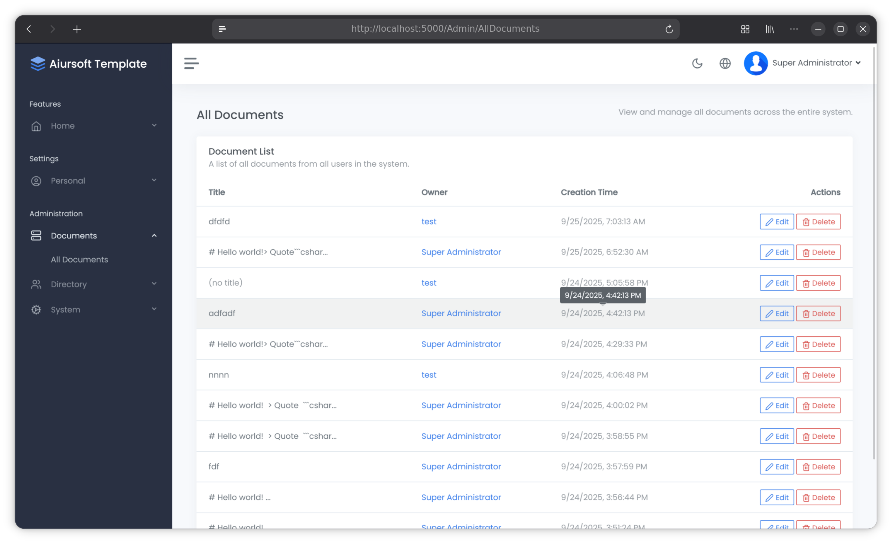

# Aiursoft Template Tutorial - Step 6 - Admin Dashboard and New Permissions



As a site administrator, you might want a dedicated admin dashboard to manage users and content. You might also want special permission settings, such as changing the owner of a document or granting higher privileges to certain users. In this step, we'll implement these features.

Therefore, in this section, we'll discuss the design of the permission system and implement a simple admin dashboard.

## Step 6.1 Understand the Aiursoft Template Permission System (Optional)

Before proceeding, we need to understand that the Aiursoft Template permission system is role-based. Each user can have multiple roles, and each role can have multiple claims.

Here, the relationship between `User` and `Role` is many-to-many, and the relationship between `Role` and `Claim` is also many-to-many.

`User` and `Role` are stored in the database. When the application starts for the first time, it creates a default `Admin` role and a permission group named `Administrators`.

Now, let's examine this core code. Open the file `./src/MyOrg.MarkToHtml/ProgramExtends.cs` and locate the `SeedAsync` method:

```csharp title="ProgramExtensions.cs 无需要修改"
var role = await roleManager.FindByNameAsync("Administrators");
if (role == null)
{
    role = new IdentityRole("Administrators");
    await roleManager.CreateAsync(role);
}

var existingClaims = await roleManager.GetClaimsAsync(role);
var existingClaimValues = existingClaims
    .Where(c => c.Type == AppPermissions.Type)
    .Select(c => c.Value)
    .ToHashSet();

foreach (var permission in AppPermissions.GetAllPermissions())
{
    if (!existingClaimValues.Contains(permission.Key))
    {
        var claim = new Claim(AppPermissions.Type, permission.Key);
        await roleManager.AddClaimAsync(role, claim);
    }
}

if (!await db.Users.AnyAsync(u => u.UserName == "admin"))
{
    var user = new User
    {
        UserName = "admin",
        DisplayName = "Super Administrator",
        Email = "admin@default.com",
    };
    _ = await userManager.CreateAsync(user, "admin123");
    await userManager.AddToRoleAsync(user, "Administrators");
}
```

The above code will execute when the application runs for the first time. It ensures the existence of the `Administrators` role and assigns all permissions to it at startup. It also ensures that a user with the username `admin` exists and is added to the `Administrators` role.

!!! info "The `Administrators` role has no special significance"

    After the first startup, the `Administrators` role has no special significance. It is simply a regular role, with the only difference being that it is granted all permissions. You can create other roles and assign them different permissions, or delete this automatically created role.

    There should be no business logic that requires a user to belong to the `Administrators` role in order to perform certain actions. The permission system is entirely controlled by `Claim` permissions, not by `Role`.

Unlike `User` and `Role`, `Claim` is not stored directly in the database, but rather defined in code. You can find all permission definitions in the file `./src/MyOrg.MarkToHtml/Authorization/AppPermissions.cs`.

We can also modify the above file to add new permissions.

!!! note "Newly added `Claim` permissions are not automatically assigned to any `Role`"

    If you add new permissions, you must manually assign them to a `Role`, otherwise no user will have that permission.

## Step 6.2 Design the Permission System

First, we need to determine which permissions we require. In this example, we will design three very high-level permissions to allow specific users to perform some sensitive operations:

* View documents of all users
* Edit any user's document arbitrarily
* Delete any user's document

!!! tip "Do basic features need permission design?"

    You might wonder whether basic features (e.g., creating, editing, deleting one's own documents) also need permission design. In our case, we allow all users (even anonymous users) to create documents, so use cases like these do not require permissions.

Modify the file `./src/MyOrg.MarkToHtml/Authorization/AppPermissionNames.cs` to add the new permissions:

```csharp title="AppPermissionNames.cs 新增权限"
// Document Management
public const string CanReadAllDocuments = nameof(CanReadAllDocuments);
public const string CanDeleteAnyDocument = nameof(CanDeleteAnyDocument);
public const string CanEditAnyDocument = nameof(CanEditAnyDocument);
```

After modification, this file should look like this:

```csharp title="AppPermissionNames.cs 完整代码"
namespace MyOrg.MarkToHtml.Authorization;

/// <summary>
/// Defines all permission keys as constants. This is the single source of truth.
/// </summary>
public static class AppPermissionNames
{
    // User Management
    public const string CanReadUsers = nameof(CanReadUsers);
    public const string CanDeleteUsers = nameof(CanDeleteUsers);
    public const string CanAddUsers = nameof(CanAddUsers);
    public const string CanEditUsers = nameof(CanEditUsers);
    public const string CanAssignRoleToUser = nameof(CanAssignRoleToUser);

    // Role Management
    public const string CanReadRoles = nameof(CanReadRoles);
    public const string CanDeleteRoles = nameof(CanDeleteRoles);
    public const string CanAddRoles = nameof(CanAddRoles);
    public const string CanEditRoles = nameof(CanEditRoles);

    // System Management
    public const string CanViewSystemContext = nameof(CanViewSystemContext);
    public const string CanRebootThisApp = nameof(CanRebootThisApp);

    // Document Management
    public const string CanReadAllDocuments = nameof(CanReadAllDocuments);
    public const string CanDeleteAnyDocument = nameof(CanDeleteAnyDocument);
    public const string CanEditAnyDocument = nameof(CanEditAnyDocument);
}
```

Next, modify the file `./src/MyOrg.MarkToHtml/Authorization/AppPermissions.cs` and add the new permission to the permission list:

```csharp title="AppPermissions.cs 新增三个权限"
new(AppPermissionNames.CanReadAllDocuments,
    localizer["Read All Documents"],
    localizer["Allows viewing all documents in the system, regardless of ownership."]),
new(AppPermissionNames.CanDeleteAnyDocument,
    localizer["Delete Any Document"],
    localizer["Allows deletion of any document, regardless of ownership."]),
new(AppPermissionNames.CanEditAnyDocument,
    localizer["Edit Any Document"],
    localizer["Allows editing of any document, regardless of ownership."]),
```

The `PermissionDescriptor` constructed here contains three parameters:

* Key: The unique identifier of the permission (string)
* Name: The name of the permission (localized string)
* Description: The description of the permission (localized string)

Whenever a new permission is added, all three parameters should be fully filled out to describe its functionality.

## Step 6.3 Assign the New Permission to the Administrators Role

Next, we need to assign the newly added permission to the `Administrators` role. No code changes are required—simply start the application.

!!! tip "Why do we need to manually assign the permission this time?"

    Although the program creates the `Administrators` role and assigns all permissions during the first startup, if you add a new permission after the program has already run once, the program will not automatically assign these new permissions to the `Administrators` role.

We need to manually go to the `Roles` page, find the `Administrators` role, and then click the `Edit this Role` button.

On the role editing page, locate the newly added permission, check it, and then click the `Save Changes` button to save the changes.

## Step 6.4 Create an Admin Dashboard

Next, we will create a simple admin dashboard that allows administrators to view all users' documents.

### Step 6.4.1 Create the ViewModel

First, create four key ViewModels:

Create a new folder `./src/MyOrg.MarkToHtml/Models/AdminViewModels/` to store ViewModel files related to the admin dashboard.

In the `./src/MyOrg.MarkToHtml/Models/AdminViewModels/` directory, create four files with the following contents:

ViewModel for viewing all documents `AllDocumentsViewModel.cs`:

```csharp title="AllDocumentsViewModel.cs"
using Aiursoft.UiStack.Layout;
using MyOrg.MarkToHtml.Entities;

namespace MyOrg.MarkToHtml.Models.AdminViewModels;

public class AllDocumentsViewModel : UiStackLayoutViewModel
{
    public required List<MarkdownDocument> AllDocuments { get; set; }
}
```

ViewModel `UserDocumentsViewModel.cs` for viewing all documents of a specific user:

```csharp title="UserDocumentsViewModel.cs"
using Aiursoft.UiStack.Layout;
using MyOrg.MarkToHtml.Entities;

namespace MyOrg.MarkToHtml.Models.AdminViewModels;

public class UserDocumentsViewModel : UiStackLayoutViewModel
{
    public required User User { get; set; }
    public required List<MarkdownDocument> UserDocuments { get; set; }
}
```

ViewModel for editing documents `EditDocumentViewModel.cs`:

```csharp title="EditDocumentViewModel.cs"
using System.ComponentModel.DataAnnotations;
using Aiursoft.UiStack.Layout;
using Microsoft.AspNetCore.Mvc.Rendering;

namespace MyOrg.MarkToHtml.Models.AdminViewModels;

public class EditDocumentViewModel : UiStackLayoutViewModel
{
    public Guid DocumentId { get; set; }

    [MaxLength(100)]
    public string? Title { get; set; }

    [Required(ErrorMessage = "Please input your markdown content!")]
    [MaxLength(65535)]
    [Display(Name = "Markdown Content")]
    public string InputMarkdown { get; set; } = string.Empty;

    [Required(ErrorMessage = "Please select the owner of this document!")]
    [Display(Name = "Owner")]
    public string SelectedUserId { get; set; } = string.Empty;

    public List<SelectListItem> AllUsers { get; set; } = new();

    public bool SavedSuccessfully { get; set; }
}
```

ViewModel for deleting documents `DeleteDocumentViewModel.cs`:

```csharp title="DeleteDocumentViewModel.cs"
using Aiursoft.UiStack.Layout;
using MyOrg.MarkToHtml.Entities;

namespace MyOrg.MarkToHtml.Models.AdminViewModels;

public class DeleteDocumentViewModel : UiStackLayoutViewModel
{
    public required MarkdownDocument Document { get; set; }
}
```

### Step 6.4.2 Create AdminController

Next, create a new controller file `AdminController.cs` under the `./src/MyOrg.MarkToHtml/Controllers` directory:

```csharp title="AdminController.cs"
using Aiursoft.CSTools.Tools;
using MyOrg.MarkToHtml.Authorization;
using MyOrg.MarkToHtml.Entities;
using MyOrg.MarkToHtml.Services;
using Aiursoft.UiStack.Navigation;
using Microsoft.AspNetCore.Mvc;
using Microsoft.EntityFrameworkCore;
using Microsoft.AspNetCore.Authorization;
using Microsoft.AspNetCore.Identity;
using Microsoft.AspNetCore.Mvc.Rendering;
using Microsoft.Extensions.Localization;
using MyOrg.MarkToHtml.Models.AdminViewModels;

namespace MyOrg.MarkToHtml.Controllers;

/// <summary>
/// This controller is used for administrative actions related to documents.
/// </summary>
[Authorize]
public class AdminController(
    IStringLocalizer<AdminController> localizer,
    UserManager<User> userManager,
    TemplateDbContext context)
    : Controller
{
    /// <summary>
    /// Displays a list of all markdown documents in the system.
    /// This action requires the 'CanReadAllDocuments' permission.
    /// </summary>
    [Authorize(Policy = AppPermissionNames.CanReadAllDocuments)]
    [RenderInNavBar(
        NavGroupName = "Administration",
        NavGroupOrder = 9999,
        CascadedLinksGroupName = "Documents",
        CascadedLinksIcon = "server",
        CascadedLinksOrder = 1,
        LinkText = "All Documents",
        LinkOrder = 1)]
    public async Task<IActionResult> AllDocuments()
    {
        var allDocuments = await context.MarkdownDocuments
            .Include(d => d.User)
            .OrderByDescending(d => d.CreationTime)
            .ToListAsync();

        return this.StackView(new AllDocumentsViewModel
        {
            AllDocuments = allDocuments
        });
    }

    /// <summary>
    /// Displays a list of markdown documents for a specific user.
    /// This action requires the 'CanReadAllDocuments' permission.
    /// </summary>
    [Authorize(Policy = AppPermissionNames.CanReadAllDocuments)]
    public async Task<IActionResult> UserDocuments([FromRoute] string? id)
    {
        if (string.IsNullOrWhiteSpace(id))
        {
            return NotFound("User ID is required.");
        }

        var user = await userManager.FindByIdAsync(id);
        if (user == null)
        {
            return NotFound("User not found.");
        }

        var documents = await context.MarkdownDocuments
            .Where(d => d.UserId == id)
            .OrderByDescending(d => d.CreationTime)
            .ToListAsync();

        var model = new UserDocumentsViewModel
        {
            User = user,
            UserDocuments = documents
        };

        return this.StackView(model);
    }

    /// <summary>
    /// Allows an administrator to edit any document, including its owner.
    /// This action requires the 'CanEditAnyDocument' permission.
    /// </summary>
    [Authorize(Policy = AppPermissionNames.CanEditAnyDocument)]
    public async Task<IActionResult> EditDocument([FromRoute] Guid id, [FromQuery] bool? saved = false)
    {
        var document = await context.MarkdownDocuments
            .FirstOrDefaultAsync(d => d.Id == id);

        if (document == null)
        {
            return NotFound("Document not found.");
        }

        var allUsers = await userManager.Users
            .OrderBy(u => u.UserName)
            .ToListAsync();

        var model = new EditDocumentViewModel
        {
            DocumentId = document.Id,
            Title = document.Title,
            InputMarkdown = document.Content ?? string.Empty,
            SelectedUserId = document.UserId,
            AllUsers = allUsers.Select(user => new SelectListItem
            {
                Value = user.Id,
                Text = user.UserName,
                Selected = user.Id == document.UserId
            }).ToList(),
            SavedSuccessfully = saved ?? false
        };

        return this.StackView(model);
    }

    /// <summary>
    /// Saves the changes to a document from an administrator, including the owner.
    /// This action requires the 'CanEditAnyDocument' permission.
    /// </summary>
    [HttpPost]
    [ValidateAntiForgeryToken]
    [Authorize(Policy = AppPermissionNames.CanEditAnyDocument)]
    public async Task<IActionResult> EditDocument(EditDocumentViewModel model)
    {
        var newOwner = await userManager.FindByIdAsync(model.SelectedUserId);
        if (!ModelState.IsValid || newOwner == null)
        {
            if (newOwner == null)
            {
                ModelState.AddModelError(nameof(model.SelectedUserId), localizer["The selected new owner does not exist."]);
            }
            var allUsers = await userManager.Users.OrderBy(u => u.UserName).ToListAsync();
            model.AllUsers = allUsers.Select(user => new SelectListItem
            {
                Value = user.Id,
                Text = user.UserName,
                Selected = user.Id == model.SelectedUserId
            }).ToList();
            return this.StackView(model);
        }

        var documentInDb = await context.MarkdownDocuments.FirstOrDefaultAsync(d => d.Id == model.DocumentId);
        if (documentInDb == null)
        {
            return NotFound("Document not found.");
        }
        documentInDb.Content = model.InputMarkdown.SafeSubstring(65535);
        documentInDb.Title = model.Title;
        documentInDb.UserId = model.SelectedUserId;

        await context.SaveChangesAsync();
        return RedirectToAction(nameof(EditDocument), new { id = model.DocumentId, saved = true });
    }

    /// <summary>
    /// Displays a confirmation page before an administrator deletes a document.
    /// This action requires the 'CanDeleteAnyDocument' permission.
    /// </summary>
    [Authorize(Policy = AppPermissionNames.CanDeleteAnyDocument)]
    public async Task<IActionResult> DeleteDocument([FromRoute] Guid id)
    {
        var document = await context.MarkdownDocuments
            .Include(d => d.User)
            .FirstOrDefaultAsync(d => d.Id == id);

        if (document == null)
        {
            return NotFound("Document not found.");
        }

        return this.StackView(new DeleteDocumentViewModel
        {
            Document = document
        });
    }

    /// <summary>
    /// Deletes a document from the database.
    /// This action requires the 'CanDeleteAnyDocument' permission.
    /// </summary>
    [HttpPost, ActionName("DeleteDocument")]
    [ValidateAntiForgeryToken]
    [Authorize(Policy = AppPermissionNames.CanDeleteAnyDocument)]
    public async Task<IActionResult> DeleteDocumentConfirmed([FromRoute] Guid id)
    {
        var document = await context.MarkdownDocuments.FirstOrDefaultAsync(d => d.Id == id);
        if (document == null)
        {
            return NotFound("Document not found.");
        }

        context.MarkdownDocuments.Remove(document);
        await context.SaveChangesAsync();

        return RedirectToAction(nameof(AllDocuments));
    }
}
```

The above controller contains five main actions:

* `AllDocuments`: Displays all documents in the system.
* `UserDocuments`: Displays all documents belonging to a specific user.
* `EditDocument`: Allows administrators to edit any document, including changing the document's owner.
* `DeleteDocument`: Displays a confirmation page for deleting a document.
* `DeleteDocumentConfirmed`: Executes the document deletion operation.

In the example above, we used the trick `[Authorize(Policy = AppPermissionNames.CanReadAllDocuments)]` to secure each action of the controller, ensuring that only users with the appropriate permissions can access these features.

!!! tip "Authorize Attribute"

    The `Authorize` attribute can be applied to a controller class or individual action methods. It accepts a `Policy` parameter specifying the required permission. You can also use the `Roles` parameter to specify required roles, but in our design, we prefer using permissions via `Claim` to control access.

!!! warning "Logged-in users must re-login after permissions are granted to take effect"

    Since permissions are stored in the user's authentication ticket, which is in the browser's Cookies, if you assign new permissions to a user after they have already logged in, they must re-login to obtain these new permissions.

    Similarly, if you revoke permissions from a user, they must re-login to lose those permissions. This can introduce some security risks.

    In emergency situations, you can revoke the login status of all users, forcing them to re-login to receive the latest permissions. This can be done by deleting:

    * Local debugging: `~/.aspnet/DataProtection-Keys` directory
    * Docker environment: `/data/aspnet/DataProtection-Keys` directory

    respectively.

### Step 6.4.3 Create Views

Next, we need to create views for the controller actions above.

Create four files under the `./src/MyOrg.MarkToHtml/Views/Admin/` directory, with the following contents:

View for displaying all documents `AllDocuments.cshtml`:

```html title="AllDocuments.cshtml"
@using Aiursoft.WebTools
@using Microsoft.AspNetCore.Authorization
@using MyOrg.MarkToHtml.Authorization
@model MyOrg.MarkToHtml.Models.AdminViewModels.AllDocumentsViewModel
@inject IViewLocalizer Localizer
@inject IAuthorizationService AuthorizationService

@{
    var canEditAnyDocument = (await AuthorizationService.AuthorizeAsync(User, AppPermissionNames.CanEditAnyDocument)).Succeeded;
    var canDeleteAnyDocument = (await AuthorizationService.AuthorizeAsync(User, AppPermissionNames.CanDeleteAnyDocument)).Succeeded;
}

<style>
    .clickable-row {
        cursor: pointer;
    }
</style>

<div class="row mb-2 mb-xl-3">
    <div class="col-auto d-none d-sm-block">
        <h3>@Localizer["All Documents"]</h3>
    </div>
    <div class="col-auto ms-auto text-end mt-n1">
        <p class="mb-0 text-muted">@Localizer["View and manage all documents across the entire system."]</p>
    </div>
</div>

<div class="card">
    <div class="card-header">
        <h5 class="card-title">@Localizer["Document List"]</h5>
        <h6 class="card-subtitle text-muted">@Localizer["A list of all documents from all users in the system."]</h6>
    </div>
    @if (!Model.AllDocuments.Any())
    {
        <div class="card-body">
            <div class="alert alert-info mb-0" role="alert">
                @Localizer["No documents found in the system."]
            </div>
        </div>
    }
    else
    {
        <div class="table-responsive">
            <table class="table table-hover mb-0">
                <thead>
                    <tr>
                        <th scope="col">@Localizer["Title"]</th>
                        <th scope="col">@Localizer["Owner"]</th>
                        <th scope="col">@Localizer["Creation Time"]</th>
                        <th scope="col" class="text-end">@Localizer["Actions"]</th>
                    </tr>
                </thead>
                <tbody>
                    @foreach (var doc in Model.AllDocuments)
                    {
                        // Use the edit action for the clickable row, if the user has permission.
                        var rowHref = canEditAnyDocument ? Url.Action("EditDocument", new { id = doc.Id }) : null;
                        <tr class="@(rowHref != null ? "clickable-row" : "")" data-href="@rowHref">
                            <td>
                                @if (string.IsNullOrWhiteSpace(doc.Title))
                                {
                                    <span class="text-muted">@Localizer["(no title)"]</span>
                                }
                                else
                                {
                                    @doc.Title
                                }
                            </td>
                            <td>
                                <a asp-action="UserDocuments" asp-route-id="@doc.UserId">
                                    @doc.User.DisplayName
                                </a>
                            </td>
                            <td>
                                <label class="text-muted" data-utc-time="@doc.CreationTime.ToHtmlDateTime()"></label>
                            </td>
                            <td class="text-end">
                                @if (canEditAnyDocument)
                                {
                                    <a asp-action="EditDocument" asp-route-id="@doc.Id" class="btn btn-sm btn-outline-primary">
                                        <i class="align-middle" data-lucide="edit-2"></i> @Localizer["Edit"]
                                    </a>
                                }
                                @if (canDeleteAnyDocument)
                                {
                                    <a asp-action="DeleteDocument" asp-route-id="@doc.Id" class="btn btn-sm btn-outline-danger">
                                        <i class="align-middle" data-lucide="trash-2"></i> @Localizer["Delete"]
                                    </a>
                                }
                            </td>
                        </tr>
                    }
                </tbody>
            </table>
        </div>
    }
</div>

@* ReSharper disable once Razor.SectionNotResolved *@
@section scripts {
    <script>
        document.addEventListener("DOMContentLoaded", function () {
            const rows = document.querySelectorAll(".clickable-row");
            rows.forEach(row => {
                // Ensure the row has a href to go to
                if (row.dataset.href) {
                    row.addEventListener("click", function (event) {
                        const target = event.target;
                        // Prevent navigation if a link or button was clicked inside the row
                        if (!target.matches('a, a *, button, button *')) {
                            window.location.href = row.dataset.href;
                        }
                    });
                }
            });
        });
    </script>
}
```

In the above example, we use the `IAuthorizationService` service to check user permissions in order to determine whether the user has permission to edit or delete the document.

Using this technique, we can dynamically display or hide certain feature buttons based on user permissions.

Similarly, based on this technique, we can also add similar permission checks to other views. This includes the view used to display all documents of a specific user, `UserDocuments.cshtml`:

```html title="UserDocuments.cshtml"
@using Aiursoft.WebTools
@using Microsoft.AspNetCore.Authorization
@using MyOrg.MarkToHtml.Authorization
@using MyOrg.MarkToHtml.Services
@model MyOrg.MarkToHtml.Models.AdminViewModels.UserDocumentsViewModel
@inject IViewLocalizer Localizer
@inject IAuthorizationService AuthorizationService
@inject StorageService StorageService

@{
    var canEditAnyDocument = (await AuthorizationService.AuthorizeAsync(User, AppPermissionNames.CanEditAnyDocument)).Succeeded;
    var canDeleteAnyDocument = (await AuthorizationService.AuthorizeAsync(User, AppPermissionNames.CanDeleteAnyDocument)).Succeeded;
}

<!--suppress CssUnusedSymbol -->
<style>
    .clickable-row {
        cursor: pointer;
    }
</style>

<div class="row mb-2 mb-xl-3">
    <div class="col-auto d-none d-sm-block">
        <h3>@Localizer["Documents by"] @Model.User.DisplayName</h3>
    </div>
    <div class="col-auto ms-auto text-end mt-n1">
        <a asp-action="AllDocuments" class="btn btn-light">
            <i class="align-middle" data-lucide="arrow-left"></i> @Localizer["Back to All Documents"]
        </a>
    </div>
</div>

<div class="row">
    @* Left Column: User Profile Details *@
    <div class="col-md-4 col-xl-3">
        <div class="card mb-3">
            <div class="card-header">
                <h5 class="card-title mb-0">@Localizer["Profile Details"]</h5>
            </div>
            <div class="card-body text-center">
                <a href="@StorageService.RelativePathToInternetUrl(Model.User.AvatarRelativePath)" target="_blank" rel="noopener noreferrer">
                    
                </a>
                <h5 class="card-title mb-0">@Model.User.DisplayName</h5>
                <div class="text-muted mb-2">@Model.User.Email</div>
            </div>
            <div class="list-group list-group-flush">
                <div class="list-group-item">
                    <div class="row">
                        <strong class="col-sm-6">@Localizer["Username"]</strong>
                        <div class="col-sm-6 text-sm-end">@@@Model.User.UserName</div>
                    </div>
                </div>
                <div class="list-group-item">
                    <div class="row">
                        <strong class="col-sm-6">@Localizer["Total Docs"]</strong>
                        <div class="col-sm-6 text-sm-end">@Model.UserDocuments.Count()</div>
                    </div>
                </div>
            </div>
        </div>
    </div>

    @* Right Column: User's Document List *@
    <div class="col-md-8 col-xl-9">
        <div class="card">
            <div class="card-header">
                <h5 class="card-title">@Localizer["Document List"]</h5>
                <h6 class="card-subtitle text-muted">@Localizer["A list of all documents created by this user."]</h6>
            </div>
            @if (!Model.UserDocuments.Any())
            {
                <div class="card-body">
                    <div class="alert alert-info mb-0" role="alert">
                        @Localizer["This user has not created any documents yet."]
                    </div>
                </div>
            }
            else
            {
                <div class="table-responsive">
                    <table class="table table-hover mb-0">
                        <thead>
                            <tr>
                                <th scope="col">@Localizer["Title"]</th>
                                <th scope="col">@Localizer["Creation Time"]</th>
                                <th scope="col" class="text-end">@Localizer["Actions"]</th>
                            </tr>
                        </thead>
                        <tbody>
                            @foreach (var doc in Model.UserDocuments)
                            {
                                var rowHref = canEditAnyDocument ? Url.Action("EditDocument", new { id = doc.Id }) : null;
                                <tr class="@(rowHref != null ? "clickable-row" : "")" data-href="@rowHref">
                                    <td>
                                        @if (string.IsNullOrWhiteSpace(doc.Title))
                                        {
                                            <span class="text-muted">@Localizer["(no title)"]</span>
                                        }
                                        else
                                        {
                                            @doc.Title
                                        }
                                    </td>
                                    <td>
                                        <label class="text-muted" data-utc-time="@doc.CreationTime.ToHtmlDateTime()"></label>
                                    </td>
                                    <td class="text-end">
                                        @if (canEditAnyDocument)
                                        {
                                            <a asp-action="EditDocument" asp-route-id="@doc.Id" class="btn btn-sm btn-outline-primary">
                                                <i class="align-middle" data-lucide="edit-2"></i> @Localizer["Edit"]
                                            </a>
                                        }
                                        @if (canDeleteAnyDocument)
                                        {
                                            <a asp-action="DeleteDocument" asp-route-id="@doc.Id" class="btn btn-sm btn-outline-danger">
                                                <i class="align-middle" data-lucide="trash-2"></i> @Localizer["Delete"]
                                            </a>
                                        }
                                    </td>
                                </tr>
                            }
                        </tbody>
                    </table>
                </div>
            }
        </div>
    </div>
</div>

@* ReSharper disable once Razor.SectionNotResolved *@
@section scripts {
    <script>
        document.addEventListener("DOMContentLoaded", function () {
            const rows = document.querySelectorAll(".clickable-row");
            rows.forEach(row => {
                if (row.dataset.href) {
                    row.addEventListener("click", function (event) {
                        const target = event.target;
                        if (!target.matches('a, a *, button, button *')) {
                            window.location.href = row.dataset.href;
                        }
                    });
                }
            });
        });
    </script>
}
```

The view `EditDocument.cshtml` for editing documents.

Here, we can directly copy from the previously developed `Home/Index.cshtml`, and make some modifications by removing the unnecessary code used for rendering HTML previews.

```html title="EditDocument.cshtml"
@using MyOrg.MarkToHtml.Controllers
@using MyOrg.MarkToHtml.Authorization
@using Microsoft.AspNetCore.Authorization
@model MyOrg.MarkToHtml.Models.AdminViewModels.EditDocumentViewModel
@inject IViewLocalizer Localizer
@inject IAuthorizationService AuthorizationService
@{
    var canDeleteAnyDocument = (await AuthorizationService.AuthorizeAsync(User, AppPermissionNames.CanDeleteAnyDocument)).Succeeded;
}

<div class="row mb-2 mb-xl-3">
    <div class="col-auto d-none d-sm-block">
        <h3>@Localizer["Edit Document"]</h3>
        <p class="mb-0 text-muted">@Localizer["Modify document content, title, and owner."]</p>
    </div>
    <div class="col-auto ms-auto text-end mt-n1">
            <a asp-action="DeleteDocument" asp-route-id="@Model.DocumentId" class="btn btn-danger">
                @if (canDeleteAnyDocument)
                {
                    <i class="align-middle" data-lucide="trash-2"></i> @Localizer["Delete"]
                }
            </a>
    </div>
</div>

@if (Model.SavedSuccessfully)
{
    <div class="alert alert-success alert-dismissible" role="alert">
        <button type="button" class="btn-close" data-bs-dismiss="alert" aria-label="Close"></button>
        <div class="d-flex">
            <div class="alert-icon pe-3">
                <i class="align-middle" data-lucide="alert-triangle"></i>
            </div>
            <div class="alert-message">
                <strong>@Localizer["Success!"]</strong>
                @Localizer["Document updated successfully."]
            </div>
        </div>
    </div>
}

<form asp-action="EditDocument" method="post">
    <input type="hidden" asp-for="DocumentId" />

    <div class="card">
        <div class="card-header">
            <h5 class="card-title mb-0">
                <i class="align-middle" data-lucide="file-pen-line">&nbsp;</i>
                @Localizer["Document Details"]
            </h5>
        </div>
        <div class="card-body">
            <div class="mb-3">
                <label asp-for="Title" class="form-label">@Localizer["Document Title (optional)"]</label>
                <input asp-for="Title" class="form-control form-control-lg" placeholder="@Localizer["Enter the document title"]" />
                <span asp-validation-for="Title" class="text-danger"></span>
            </div>

            <div class="mb-3">
                <label asp-for="SelectedUserId" class="form-label"></label>
                <select asp-for="SelectedUserId" asp-items="@Model.AllUsers" class="form-select form-select-lg">
                    <option value="">@Localizer["-- Select an Owner --"]</option>
                </select>
                <span asp-validation-for="SelectedUserId" class="text-danger"></span>
            </div>

            <div class="mb-3">
                <label asp-for="InputMarkdown" class="form-label">@Localizer["Markdown Content"]</label>
                <textarea asp-for="InputMarkdown" class="form-control" id="markdown-editor"
                          placeholder="@Localizer["Type your Markdown here..."]"></textarea>
                <span asp-validation-for="InputMarkdown" class="text-danger"></span>
            </div>
        </div>
    </div>

    <div class="row mt-3">
        <div class="col text-center">
            <a asp-action="AllDocuments" class="btn btn-outline-secondary btn-lg me-2">
                <i class="align-middle" data-lucide="arrow-left">&nbsp;</i>
                @Localizer["Back to List"]
            </a>

            <button type="submit" class="btn btn-primary btn-lg">
                <i class="align-middle" data-lucide="save">&nbsp;</i>
                @Localizer["Save Changes"]
            </button>
        </div>
    </div>
</form>

@{
    var isDarkMode = Context.Request.Cookies[ThemeController.ThemeCookieKey] == true.ToString();
    var theme = isDarkMode ? "material" : "eclipse";
}

@* ReSharper disable once Razor.SectionNotResolved *@
@section styles {
    <link rel="stylesheet" href="~/node_modules/codemirror/lib/codemirror.css" />
    <link rel="stylesheet" href="~/node_modules/codemirror/theme/@(theme).css" />
    <style>
        .CodeMirror {
            border: 1px solid #dee2e6;
            height: 60vh;
        }
    </style>
}

@* ReSharper disable once Razor.SectionNotResolved *@
@section scripts {
    <script src="~/node_modules/codemirror/lib/codemirror.js"></script>
    <script src="~/node_modules/codemirror/mode/markdown/markdown.js"></script>
    <script>
        document.addEventListener("DOMContentLoaded", function () {
            // --- jQuery Validation Setup ---
            if ($.validator) {
                $.validator.setDefaults({
                    ignore: []
                });
            }

            // --- CodeMirror Initialization ---
            if (typeof CodeMirror !== 'undefined') {
                const editorElement = document.getElementById('markdown-editor');
                if (editorElement && !editorElement.CodeMirror) {
                    const markdownEditorInstance = CodeMirror.fromTextArea(editorElement, {
                        lineNumbers: true,
                        mode: 'markdown',
                        theme: '@(theme)',
                        viewportMargin: Infinity
                    });

                    markdownEditorInstance.on('change', function() {
                        markdownEditorInstance.save();
                    });
                }
            }
        });
    </script>
}
```

as well as the view `DeleteDocument.cshtml` for deleting documents. This is now pure manual work. The content is almost entirely standard, static HTML code. Consider using some AI tools to generate this code.

```html title="DeleteDocument.cshtml"
@using Aiursoft.WebTools
@model MyOrg.MarkToHtml.Models.AdminViewModels.DeleteDocumentViewModel
@inject IViewLocalizer Localizer

<h1 class="h3 mb-3">@Localizer["Delete Document"]</h1>

<div class="row justify-content-center">
    <div class="col-lg-10 col-xl-8">
        <div class="card">
            <div class="card-header text-center">
                <i class="align-middle text-danger" data-lucide="shield-alert" style="width: 48px; height: 48px;"></i>
            </div>
            <div class="card-body">
                <div class="text-center">
                    <h2 class="h4 card-title fw-bold">@Localizer["Are you sure?"]</h2>
                    <p class="mb-3 text-muted">@Localizer["This action is irreversible. You are about to permanently delete the following document:"]</p>
                </div>

                <div class="list-group list-group-flush my-4">
                    <div class="list-group-item">
                        <div class="row">
                            <strong class="col-sm-3">@Localizer["Title"]</strong>
                            <div class="col-sm-9">
                                @if (string.IsNullOrWhiteSpace(Model.Document.Title))
                                {
                                    <span class="text-muted">@Localizer["(no title)"]</span>
                                }
                                else
                                {
                                    @Model.Document.Title
                                }
                            </div>
                        </div>
                    </div>
                    <div class="list-group-item">
                        <div class="row">
                            <strong class="col-sm-3">@Localizer["Owner"]</strong>
                            <div class="col-sm-9">
                                @Model.Document.User.DisplayName
                                <span class="text-muted">(@@@Model.Document.User.UserName)</span>
                            </div>
                        </div>
                    </div>
                    <div class="list-group-item">
                        <div class="row">
                            <strong class="col-sm-3">@Localizer["Creation Time"]</strong>
                            <div class="col-sm-9">
                                <label data-utc-time="@Model.Document.CreationTime.ToHtmlDateTime()" class="text-monospace"></label>
                            </div>
                        </div>
                    </div>
                </div>

                <div class="text-center">
                    <form asp-action="DeleteDocument" class="d-inline-block">
                        <input type="hidden" asp-for="@Model.Document.Id" />
                        <button type="submit" class="btn btn-danger">
                            <i class="align-middle me-2" data-lucide="trash-2"></i> @Localizer["Yes, delete this document"]
                        </button>
                    </form>
                    <a asp-action="AllDocuments" class="btn btn-light">@Localizer["Cancel"]</a>
                </div>
            </div>
        </div>
    </div>
</div>
```

## Step 6.5 Test Admin Dashboard

Now, everything is set up. Restart the application, log in with the admin account, and ensure the current user has the three newly added permissions: `CanReadAllDocuments`, `CanEditAnyDocument`, and `CanDeleteAnyDocument`.

Then log out and log back in to ensure the permissions take effect.

After logging in, you should see a new "Administration" menu in the navigation bar. Click it, then select "All Documents".

You will see a page displaying all documents. You can click on a user's name to view all documents belonging to that user. You can also click the "Edit" button to edit any document, or click the "Delete" button to delete a document.

## Conclusion

Congratulations! You have successfully added a powerful admin dashboard to your application, allowing administrators to view, edit, and delete documents from all users.

In this chapter, we learned the basics of RBAC permission management, created the necessary permissions and roles, and implemented a complete admin interface.

With thoughtful permission design, we can effectively protect sensitive operations in the application while also providing administrators with powerful management tools.
