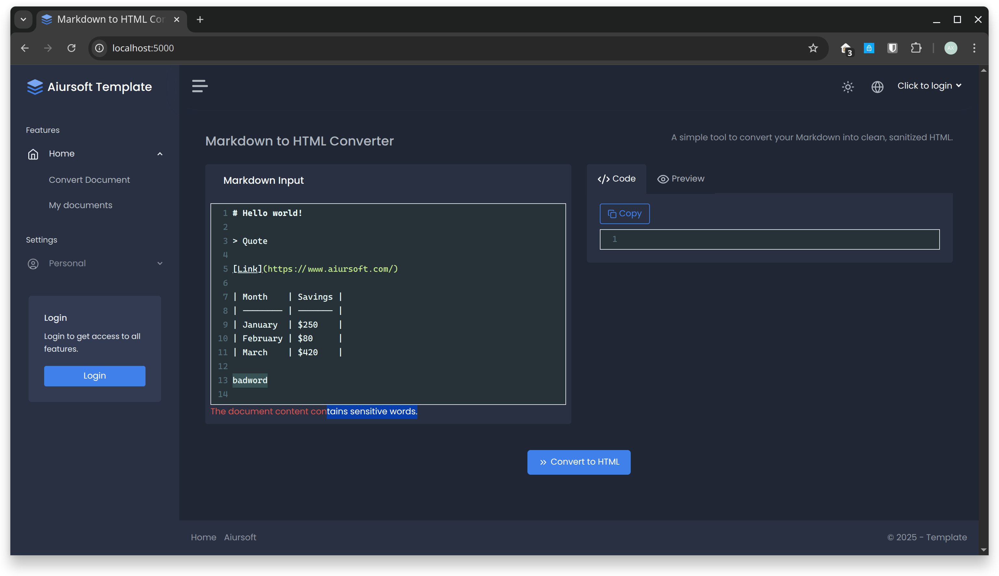

# Aiursoft Template Tutorial - Step 8 - Add Custom Validation



In previous steps, we have extensively used built-in ASP.NET Core validation attributes, such as `[Required]` and `[MaxLength]`, to ensure the basic validity of user input data. These attributes are tightly integrated with `ModelState`, greatly simplifying the data validation process.

However, in real-world development, we often encounter more complex validation requirements that cannot be met by built-in attributes. For example, we might need to:

* Validate whether the document title and content submitted by the user contain inappropriate language or sensitive words.
* Validate whether a username already exists in the system.
* Validate whether the date range entered by the user makes logical sense.

In this chapter, we will learn how to create custom validation attributes and use a **sensitive word filter** as an example to add more advanced validation logic to our application.

## Step 8.1 - Create a Bad Word Filter Service

A good design practice is to **separate business logic from validation rules themselves**. Hard-coding a list of sensitive words directly into the validation attribute is inflexible and difficult to maintain. Therefore, we first create a dedicated service to handle sensitive word detection.

In the `./src/MyOrg.MarkToHtml/Services/` directory, create a new file named `BadWordFilterService.cs` and add the following code:

```csharp title="Services/BadWordFilterService.cs"
using Aiursoft.Scanner.Abstractions;

namespace MyOrg.MarkToHtml.Services;

public class BadWordFilterService : ISingletonDependency
{
    // In a real-world application, this list might come from a database or a configuration file.
    private readonly HashSet<string> _badWords = new(StringComparer.OrdinalIgnoreCase)
    {
        "badword",
        "sensitive"
    };

    public bool ContainsBadWord(string? text)
    {
        if (string.IsNullOrWhiteSpace(text))
        {
            return false;
        }

        return _badWords.Any(badWord => text.Contains(badWord, StringComparison.OrdinalIgnoreCase));
    }
}
```

In this service, we hardcode a list containing several example sensitive words. In a real production environment, this list might come from a configuration file, database, or external API. The `ContainsBadWord` method is responsible for checking whether the incoming text contains any of the words in the list.

We implement the `ISingletonDependency` interface, which means Aiursoft Scanner will automatically register it as a **singleton** service. This is appropriate because the sensitive word list is fixed throughout the application's lifecycle and does not need to be recreated for each request.

## Step 8.2 - Create a Custom Validation Attribute

Now that we have the business logic service, we can proceed to create a custom validation attribute. This attribute will use the service we just created to perform validation.

First, create a new folder named `Attributes` at the project root directory.

Then, create a new file `NoBadWordsAttribute.cs` under the `./src/MyOrg.MarkToHtml/Attributes/` directory and add the following code:

```csharp title="Attributes/NoBadWordsAttribute.cs"
using System.ComponentModel.DataAnnotations;
using MyOrg.MarkToHtml.Services;

namespace MyOrg.MarkToHtml.Attributes;

[AttributeUsage(AttributeTargets.Property | AttributeTargets.Field | AttributeTargets.Parameter, AllowMultiple = false)]
public class NoBadWordsAttribute : ValidationAttribute
{
    protected override ValidationResult? IsValid(object? value, ValidationContext validationContext)
    {
        // Get the service from the dependency injection container.
        var badWordFilter = validationContext.GetService(typeof(BadWordFilterService)) as BadWordFilterService;

        if (badWordFilter == null)
        {
            // This should not happen if the service is registered correctly.
            throw new InvalidOperationException("BadWordFilterService is not registered.");
        }

        if (value is not string stringValue)
        {
            // This validator only applies to strings.
            return ValidationResult.Success;
        }

        if (badWordFilter.ContainsBadWord(stringValue))
        {
            // If a bad word is found, return a validation error.
            return new ValidationResult(ErrorMessage ?? $"The field {validationContext.DisplayName} contains inappropriate content.");
        }

        // If no bad words are found, the validation is successful.
        return ValidationResult.Success;
    }
}
```

!!! tip "Understanding `ValidationAttribute`"

    `ValidationAttribute` is the base class for all validation attributes. By inheriting from it and overriding the `IsValid` method, we can define our own validation rules.

    We choose to override the `IsValid(object? value, ValidationContext validationContext)` overload because it is more powerful. The `validationContext` parameter not only provides contextual information about the validated property (such as the property name `DisplayName`), but also allows us to access the **dependency injection container** (`validationContext.GetService`), enabling us to retrieve service instances like `BadWordFilterService`.

    The logic of this code is straightforward:

    1. Retrieve `BadWordFilterService` from the dependency injection container.
    2. Check if the value being validated is a string.
    3. Call the service's `ContainsBadWord` method for inspection.
    4. If a sensitive word is detected, return a `ValidationResult` instance indicating validation failure. Otherwise, return `ValidationResult.Success` to indicate validation passed.

## Step 8.3 - Apply the New Attribute in ViewModel

Now that we have created the custom validation attribute, we can apply it to our ViewModel just like we would use `[Required]`.

Open the file `./src/MyOrg.MarkToHtml/Models/HomeViewModels/IndexViewModel.cs`, and add the `[NoBadWords]` attribute to the `Title` and `InputMarkdown` properties:

```csharp title="Models/HomeViewModels/IndexViewModel.cs"
using System.ComponentModel.DataAnnotations;
using Aiursoft.UiStack.Layout;
using MyOrg.MarkToHtml.Attributes; // Add this using directive

namespace MyOrg.MarkToHtml.Models.HomeViewModels;

public class IndexViewModel : UiStackLayoutViewModel
{
    // ... other properties ...

    [MaxLength(100)]
    [NoBadWords(ErrorMessage = "The document title contains sensitive words.")]
    public string? Title { get; set; }

    [Required(ErrorMessage = "Please input your markdown content!")]
    [NoBadWords(ErrorMessage = "The document content contains sensitive words.")]
    public string InputMarkdown { get; set; } = // ... default value ...

    // ... other properties ...
}
```

By adding `[NoBadWords]`, we tell ASP.NET Core to perform our custom sensitive word validation in addition to the existing validations when processing form submissions. We've also provided custom error messages for each attribute.

## Step 8.4 - Test Custom Validation

Everything is ready! Now we can test the new validation feature.

1. **Rebuild and run the project**.
2. **Log in** to an account (e.g., `admin` / `admin123`).
3. Navigate to the **Create Document** page (`/Home/Index`) or **edit** an existing document.
4. In the **Title** or **Content** input box, enter one of the sensitive words we defined in `BadWordFilterService`, such as "this is a badword".
5. Click the "Convert and save" button to submit the form.

You'll notice the page refreshes, and below the input field, our defined error message appears: "The document content contains sensitive words."

This confirms that our custom validation logic has been successfully triggered. In the `HomeController`'s `Index` POST method, `ModelState.IsValid` returns `false` due to our custom validation failure, thus preventing the subsequent database save operation and redirecting the user back to the form page with the error message displayed.

## Conclusion

Congratulations on completing Step 8! You've now mastered a powerful skill: creating custom validation rules tightly integrated with business logic.

By encapsulating validation logic within a custom `ValidationAttribute` and leveraging dependency injection to call backend services, you can implement nearly any complex validation requirement while keeping your code clean, modular, and maintainable. Most importantly, this approach helps avoid scattering large amounts of hard-to-maintain `if` statements throughout your code, significantly improving code readability and quality.

This pattern is not limited to sensitive word filtering—it can also be applied to validating data uniqueness, checking business rules, calling third-party API validations, and many other scenarios, greatly enhancing your application's robustness.
